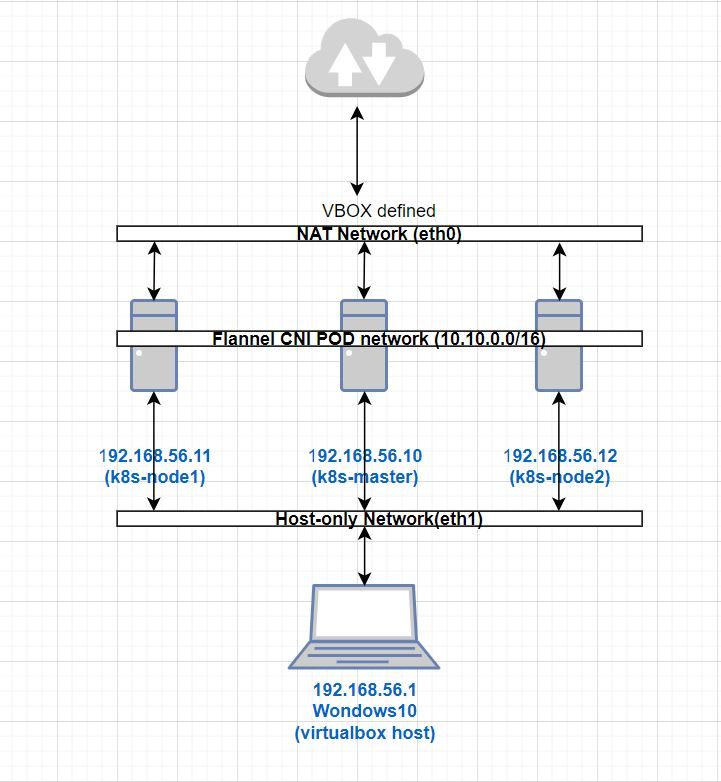
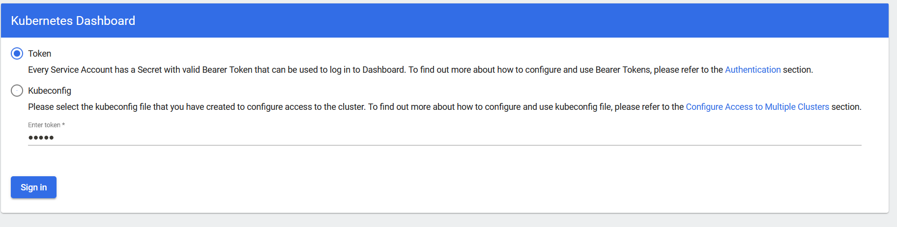
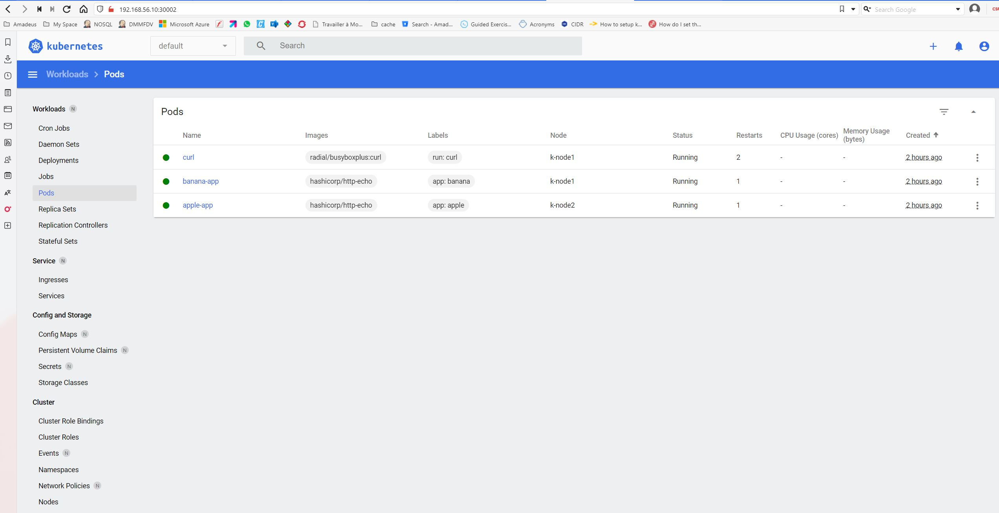

# Kubernetes 3 Nodes Cluster installation



## Prerequisites
### Software Installation 
On the Windows Laptop, our host system, we need the following required software already installed.

* Latest Virtualbox 
* Latest Vagrant
* Latest kubectl command line executable
* Latest GIT version control system

## Vagrant Project clone

The project need to be cloned on the host Windows10 machine

```
$ git clone https://github.com/cgiacomini/vagrant-kubernetes.git
$ cd vagrant-Kubernetes
$ tree
.
|-- READ.ME
|-- Vagrantfile
|-- config
|   `-- hosts
|-- doc
|-- examples
`-- scripts
    |-- common.sh
    |-- master.sh
    `-- node.sh
```

## Configuration
Right now there are a couple of manual intervention to do before starting up Vagrant deployment.

* config/id_rsa.pub : After installation we could ssh on one of the nodes by using the usual command "vagrant ssh <node>"
  Apart from that during installation a centos user is also created created because I would like to be able
  to access the nodes using that account.  For that to work we need to copy a valid id_rsa.pub in side the config directory.
  The id_rsa.pub file will be copied on all nodes.
  
* config/hosts : this file will be appended to the nodes /etc/hosts file.
  We can change in this file the nodes names and IP address with those we intend to use

* Vagrantfile:  this file also contains nodes names and IP address that need to be changes accordingly to 
  the changes in config/hosts 

## Deployment

To start the deployment we simply run the following commands

```
# Cluster Deployment
$ vagrant up
...
 
# Retrieve Kube config file
$ makdir ~/.kube
$ scp centos@192.168.56.10:.kube/config ~/.kube/config
 
$ kubectl cluster-info
Kubernetes control plane is running at https://192.168.56.10:6443
CoreDNS is running at https://192.168.56.10:6443/api/v1/namespaces/kube-system/services/kube-dns:dns/proxy
 
To further debug and diagnose cluster problems, use 'kubectl cluster-info dump'.
 
$ kubectl get nodes -o wide
NAME       STATUS   ROLES                  AGE    VERSION   INTERNAL-IP     EXTERNAL-IP   OS-IMAGE         KERNEL-VERSION                CONTAINER-RUNTIME
k-master   Ready    control-plane,master   132m   v1.23.1   192.168.56.10   <none>        CentOS Linux 8   4.18.0-348.2.1.el8_5.x86_64   docker://20.10.12
k-node1    Ready    <none>                 126m   v1.23.1   192.168.56.11   <none>        CentOS Linux 8   4.18.0-348.2.1.el8_5.x86_64   docker://20.10.12
k-node2    Ready    <none>                 119m   v1.23.1   192.168.56.12   <none>        CentOS Linux 8   4.18.0-348.2.1.el8_5.x86_64   docker://20.10.12

 
$ kubectl get pods -o wide -A
NAMESPACE              NAME                                        READY   STATUS      RESTARTS   AGE    IP              NODE       NOMINATED NODE   READINESS GATES
kube-system            coredns-64897985d-s2jtc                     1/1     Running     0          132m   10.10.0.2       k-master   <none>           <none>
kube-system            coredns-64897985d-xw26d                     1/1     Running     0          132m   10.10.0.5       k-master   <none>           <none>
kube-system            etcd-k-master                               1/1     Running     0          132m   192.168.56.10   k-master   <none>           <none>
kube-system            kube-apiserver-k-master                     1/1     Running     0          132m   192.168.56.10   k-master   <none>           <none>
kube-system            kube-controller-manager-k-master            1/1     Running     0          132m   192.168.56.10   k-master   <none>           <none>
kube-system            kube-flannel-ds-cp4sh                       1/1     Running     0          132m   192.168.56.10   k-master   <none>           <none>
kube-system            kube-flannel-ds-nv7k2                       1/1     Running     0          119m   192.168.56.12   k-node2    <none>           <none>
kube-system            kube-flannel-ds-pgnsb                       1/1     Running     0          126m   192.168.56.11   k-node1    <none>           <none>
kube-system            kube-proxy-9v4rt                            1/1     Running     0          119m   192.168.56.12   k-node2    <none>           <none>
kube-system            kube-proxy-frgsl                            1/1     Running     0          132m   192.168.56.10   k-master   <none>           <none>
kube-system            kube-proxy-sm9t8                            1/1     Running     0          126m   192.168.56.11   k-node1    <none>           <none>
kube-system            kube-scheduler-k-master                     1/1     Running     0          132m   192.168.56.10   k-master   <none>           <none>
kubernetes-dashboard   dashboard-metrics-scraper-d8b54b9c5-jrg8b   1/1     Running     0          132m   10.10.0.4       k-master   <none>           <none>
kubernetes-dashboard   kubernetes-dashboard-867c49dc4f-bjxxs       1/1     Running     0          132m   10.10.0.3       k-master   <none>           <none>
```
**Note**:

The cluster deployed uses Flannel as CNI container Network Interface 
For simplicity Kubernates dashboard is forced, by the deployment scripts, to run on the  master node.
So whenever we need to access he dahsboard, for example, we just target the master node.
The dashboard service have been patched to be of type NodePort with nodePort=30002.

To access the Kubernetes dashboard then we need first to obtain the token: 

```
$ kubectl -n kubernetes-dashboard describe secret $(kubectl -n kubernetes-dashboard get secret | grep admin-user | awk '{print $1}')
Name:         admin-user-token-4qp9v
Namespace:    kubernetes-dashboard
Labels:       <none>
Annotations:  kubernetes.io/service-account.name: admin-user
              kubernetes.io/service-account.uid: 458cbe50-190d-4d5a-b1ec-9b1cd4226339
  
Type:  kubernetes.io/service-account-token
  
Data
====
ca.crt:     1099 bytes
namespace:  20 bytes
token:      eyJhbGciOiJSUzI1NiIsImtpZCI6ImJIUkNBbTZfTjdNMlRXb2ljUmdlb3o2b0tIMDN3a.....
```
Open the UI on the browser at this address : https://192.168.56.10:30002
and in the login popup window just paste the token obtained with the above command


## Testing *coredns* 
One thing we should be make sure is the coredns works corectly when it comes to make services name resolutions
For that we deploy a couple of simple applictions that should be scheduled on two different workers.

**apple.yaml**
```
apiVersion: apps/v1
kind: Deployment
metadata:
  name: apple
spec:
  replicas: 1
  selector:
    matchLabels:
      app: apple
  template:
    metadata:
      labels:
        app: apple
    spec:
      containers:
      - name: apple-app
        image: hashicorp/http-echo
        args:
          - "-text=apple"
---

kind: Service
apiVersion: v1
metadata:
  name: apple-service
spec:
  selector:
    app: apple
  ports:
  - protocol: TCP
    port: 5678
    targetPort: 5678
    name: http

```

**banana.yaml**
```
apiVersion: apps/v1
kind: Deployment
metadata:
  name: banana
spec:
  replicas: 1
  selector:
    matchLabels:
      app: banana
  template:
    metadata:
      labels:
        app: banana
    spec:
      containers:
      - name: banana-app
        image: hashicorp/http-echo
        args:
          - "-text=banana"
---

kind: Service
apiVersion: v1
metadata:
  name: banana-service
spec:
  selector:
    app: banana
  ports:
  - protocol: TCP
    port: 5678
    targetPort: 5678
    name: http
```

Deploy the two simple applications

```
# Deploy apple
$ kubectl apply -f apple.yaml
deployment.apps/apple created
service/apple-service created

# Deploy banana
$ kubectl apply -f banana.yaml
deployment.apps/banana created
service/banana-service created


# Verify applications are on differend worker nodes
$ kubectl get pods -A -o wide
NAMESPACE              NAME                                        READY   STATUS    RESTARTS   AGE    IP              NODE       NOMINATED NODE   READINESS GATES
default                apple-app                                   1/1     Running   0          26s    10.10.2.2       k-node2    <none>           <none>
default                banana-app                                  1/1     Running   0          22s    10.10.1.2       k-node1    <none>           <none>
kube-system            coredns-64897985d-45ll6                     1/1     Running   0          13m    10.10.0.5       k-master   <none>           <none>
kube-system            coredns-64897985d-lc6vj                     1/1     Running   0          13m    10.10.0.4       k-master   <none>           <none>
kube-system            etcd-k-master                               1/1     Running   0          14m    192.168.56.10   k-master   <none>           <none>
kube-system            kube-apiserver-k-master                     1/1     Running   0          14m    192.168.56.10   k-master   <none>           <none>
kube-system            kube-controller-manager-k-master            1/1     Running   0          14m    192.168.56.10   k-master   <none>           <none>
kube-system            kube-flannel-ds-7lkr4                       1/1     Running   0          118s   192.168.56.12   k-node2    <none>           <none>
kube-system            kube-flannel-ds-fsmxh                       1/1     Running   0          13m    192.168.56.10   k-master   <none>           <none>
kube-system            kube-flannel-ds-t8ht2                       1/1     Running   0          8m3s   192.168.56.11   k-node1    <none>           <none>
kube-system            kube-proxy-95wlw                            1/1     Running   0          118s   192.168.56.12   k-node2    <none>           <none>
kube-system            kube-proxy-bdttd                            1/1     Running   0          13m    192.168.56.10   k-master   <none>           <none>
kube-system            kube-proxy-ft4kj                            1/1     Running   0          8m3s   192.168.56.11   k-node1    <none>           <none>
kube-system            kube-scheduler-k-master                     1/1     Running   0          14m    192.168.56.10   k-master   <none>           <none>
kubernetes-dashboard   dashboard-metrics-scraper-d8b54b9c5-jtrvt   1/1     Running   0          13m    10.10.0.3       k-master   <none>           <none>
kubernetes-dashboard   kubernetes-dashboard-867c49dc4f-2svdc       1/1     Running   0          13m    10.10.0.2       k-master   <none>           <none>

# Test service name resolution 
$ kubectl run curl --image=radial/busyboxplus:curl -i --tty
If you don't see a command prompt, try pressing enter.
[ root@curl:/ ]$ 

# check banana-service
[ root@curl:/ ]$ nslookup banana-service
Server:    10.96.0.10
Address 1: 10.96.0.10 kube-dns.kube-system.svc.cluster.local

Name:      banana-service
Address 1: 10.101.72.79 banana-service.default.svc.cluster.local


# check apple-service
[ root@curl:/ ]$ nslookup apple-service
Server:    10.96.0.10
Address 1: 10.96.0.10 kube-dns.kube-system.svc.cluster.local

Name:      apple-service
Address 1: 10.108.56.226 apple-service.default.svc.cluster.local

```

## Testing *Flannel* pod to pod communication
One thing we have to make sure is that Conatainer Network Interface (CNI) works as expected.
From within a pod deployed on a cluster node we should be able to communicate with another pod
deployed on another node.

Here we now have apple on knode2, bnana on k-node1 and curl pod on k-node1.
We should be able from curl pod on k-node1 to query apple on knode2.

**Note**
	All pods when deployed have variables related to all services created before the pod. 
        This explain the below env commmand that show banana and apple services info.

```
$ kubectl get pods -A -o wide
NAMESPACE              NAME                                        READY   STATUS    RESTARTS       AGE    IP              NODE       NOMINATED NODE   READINESS GATES
default                apple-app                                   1/1     Running   0              104m   10.10.2.2       k-node2    <none>           <none>
default                banana-app                                  1/1     Running   0              104m   10.10.1.2       k-node1    <none>           <none>
default                curl                                        1/1     Running   1 (102m ago)   103m   10.10.1.3       k-node1    <none>           <none>
kube-system            coredns-64897985d-45ll6                     1/1     Running   0              117m   10.10.0.5       k-master   <none>           <none>
kube-system            coredns-64897985d-lc6vj                     1/1     Running   0              117m   10.10.0.4       k-master   <none>           <none>
kube-system            etcd-k-master                               1/1     Running   0              117m   192.168.56.10   k-master   <none>           <none>
kube-system            kube-apiserver-k-master                     1/1     Running   0              117m   192.168.56.10   k-master   <none>           <none>
kube-system            kube-controller-manager-k-master            1/1     Running   0              117m   192.168.56.10   k-master   <none>           <none>
kube-system            kube-flannel-ds-7lkr4                       1/1     Running   0              105m   192.168.56.12   k-node2    <none>           <none>
kube-system            kube-flannel-ds-fsmxh                       1/1     Running   0              117m   192.168.56.10   k-master   <none>           <none>
kube-system            kube-flannel-ds-t8ht2                       1/1     Running   0              111m   192.168.56.11   k-node1    <none>           <none>
kube-system            kube-proxy-95wlw                            1/1     Running   0              105m   192.168.56.12   k-node2    <none>           <none>
kube-system            kube-proxy-bdttd                            1/1     Running   0              117m   192.168.56.10   k-master   <none>           <none>
kube-system            kube-proxy-ft4kj                            1/1     Running   0              111m   192.168.56.11   k-node1    <none>           <none>
kube-system            kube-scheduler-k-master                     1/1     Running   0              118m   192.168.56.10   k-master   <none>           <none>
kubernetes-dashboard   dashboard-metrics-scraper-d8b54b9c5-jtrvt   1/1     Running   0              117m   10.10.0.3       k-master   <none>           <none>
kubernetes-dashboard   kubernetes-dashboard-867c49dc4f-2svdc       1/1     Running   0              117m   10.10.0.2       k-master   <none>           <none>


# Connet to the curl POD 
$ kubectl exec curl  -it -- /bin/sh
[ root@curl:/ ]$

# Test with IPs
$ env | grep BANANA
BANANA_SERVICE_SERVICE_HOST=10.101.72.79
BANANA_SERVICE_SERVICE_PORT=5678
BANANA_SERVICE_PORT=tcp://10.101.72.79:5678
BANANA_SERVICE_PORT_5678_TCP_ADDR=10.101.72.79
BANANA_SERVICE_PORT_5678_TCP_PORT=5678
BANANA_SERVICE_PORT_5678_TCP_PROTO=tcp
BANANA_SERVICE_PORT_5678_TCP=tcp://10.101.72.79:5678

$curl http://$BANANA_SERVICE_SERVICE_HOST:$BANANA_SERVICE_SERVICE_PORT
banana

$ env | grep APPLE
APPLE_SERVICE_PORT_5678_TCP_ADDR=10.108.56.226
APPLE_SERVICE_PORT_5678_TCP_PORT=5678
APPLE_SERVICE_PORT_5678_TCP_PROTO=tcp
APPLE_SERVICE_PORT_5678_TCP=tcp://10.108.56.226:5678
APPLE_SERVICE_SERVICE_HOST=10.108.56.226
APPLE_SERVICE_SERVICE_PORT=5678
APPLE_SERVICE_PORT=tcp://10.108.56.226:5678

$ curl http://$APPLE_SERVICE_SERVICE_HOST:$APPLE_SERVICE_SERVICE_PORT
apple


# Test now with  service name to invalve also coredns
$ curl http://banana-service:5678
banana

$ curl http://apple-service:5678
apple
```

## Testing NGINX Ingress Controller
**Note**:
* On virtualox we do not have a loadbalancer installed so the ingress controller service is not assigned an external IP address.
* During the cluster deployment we have forced the NGINX Ingress Controller service to run on the master node.
* We also assigned to the ingress controller service an externalIP, the master node IP.

```
$ kubectl get svc -n ingress-nginx
NAME                                 TYPE        CLUSTER-IP       EXTERNAL-IP     PORT(S)                      AGE
ingress-nginx-controller             NodePort    10.101.230.149   192.168.56.10   80:31259/TCP,443:30739/TCP   15h
ingress-nginx-controller-admission   ClusterIP   10.99.197.151    <none>          443/TCP                      15h
```

### Create the ingress for our deployed applications
**fruits-ingeress.yaml**
```
apiVersion: networking.k8s.io/v1
kind: Ingress
metadata:
  name: fruits-ingress
spec:
  ingressClassName: nginx
  rules:
  - host: fruits.singleton.net
    http:
      paths:
      - path: /apple
        pathType: Prefix
        backend:
          service:
            name: "apple-service"
            port:
              number: 5678
      - path: /banana
        pathType: Prefix
        backend:
          service:
            name: "banana-service"
            port:
              number: 5678
```
### Deploy the ingress
```
$ kubectl apply -f fruits.ingress.yaml
ingress.networking.k8s.io/fruits-ingress created

# Wait a couple of minutes to be sure that the created ingress get assigned an external IP address
$ kubectl get ingress -A
NAMESPACE   NAME             CLASS   HOSTS                  ADDRESS         PORTS     AGE
default     fruits-ingress   nginx   fruits.singleton.net   192.168.56.10   80        84s
```

## Target the application via the ingress
Two possibilities here to make things works. 
* The easiest one is to use the ***curl --resolve*** functionality for FQDN resolution.
  This force ***curl*** to use the ingress controller to resolve the IP address when requesting fruits.singleton.net over port 80.
  The ingress controller has been configured to run on the k-master node as the cluster entry point.
```
# Target the application POD using http (port 80)
$ curl http://fruits.singleton.net/apple --resolve fruits.singleton.net:80:192.168.56.10
apple

$  curl http://fruits.singleton.net/banana --resolve fruits.singleton.net:80:192.168.56.10
banana

# Target apple application POD using https (port 443)
curl https://fruits.singleton.net:443/apple --resolve fruits.singleton.net:443:192.168.56.10 --insecure
apple

# Target banana application POD using https (port 443)
curl https://fruits.singleton.net:443/banana --resolve fruits.singleton.net:443:80:192.168.56.10 --insecure
banana

```

* The second aproach requires to change **/etc/hosts** system file to add **fruits.singleton.net** FQDN to point to
the k-master node where the ingress controller is running.

```
    192.168.56.10  k-master.singleton.net k-master
    192.168.56.11  k-node1.singleton.net k-node1
    192.168.56.12  k-node2.singleton.net k-node2
    192.168.56.10  fruits.singleton.net

```
The Following now should also work
```
# Target the application POD using http (port 80)
$ curl http://fruits.singleton.net/apple 
apple

$  curl http://fruits.singleton.net/banana
banana

# Target apple application POD using https (port 443)
curl https://fruits.singleton.net:443/apple --insecure
apple

# Target banana application POD using https (port 443)
curl https://fruits.singleton.net:443/banana --insecure
banana

```

# Dashboard access

In order to access the Kubernetes Dashboard from our workstation, a NodePort  service has been created during the cluster deployment,
as well as an admin user account  with full privileges to modify the cluster.
The dashboard have been configured to force its deployment on the k-master node.
Verify that kubernetes-dashboard service is present

```
$ kubectl get services -A
NAMESPACE              NAME                        TYPE        CLUSTER-IP       EXTERNAL-IP   PORT(S)                  AGE
default                apple-service               ClusterIP   10.108.56.226    <none>        5678/TCP                 162m
default                banana-service              ClusterIP   10.101.72.79     <none>        5678/TCP                 162m
default                kubernetes                  ClusterIP   10.96.0.1        <none>        443/TCP                  176m
kube-system            kube-dns                    ClusterIP   10.96.0.10       <none>        53/UDP,53/TCP,9153/TCP   176m
kubernetes-dashboard   dashboard-metrics-scraper   ClusterIP   10.105.114.243   <none>        8000/TCP                 175m
kubernetes-dashboard   kubernetes-dashboard        NodePort    10.106.168.28    <none>        443:30002/TCP            175m
```

We can access the dashboard UI then using the followin URL : **https://192.168.56.10:30002**
Before doing so we need first to obtain a token we will use to login to the UI.

```
# Obtain a valid token for the admin-user
$ kubectl -n kubernetes-dashboard describe secret $(kubectl -n kubernetes-dashboard get secret | grep admin-user | awk '{print $1}')
Name:         admin-user-token-4qp9v
Namespace:    kubernetes-dashboard
Labels:       <none>
Annotations:  kubernetes.io/service-account.name: admin-user
              kubernetes.io/service-account.uid: 458cbe50-190d-4d5a-b1ec-9b1cd4226339
 
Type:  kubernetes.io/service-account-token
 
Data
====
ca.crt:     1099 bytes
namespace:  20 bytes
token:      eyJhbGciOiJSUzI1NiIsImtpZCI6ImJIUkNBbTZfTjdNMlRXb2ljUmdlb3o2b0tIMDN3a.....
```



Paste the optained token to access the UI





