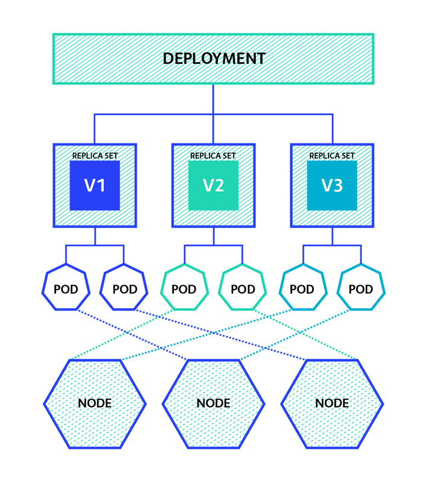

# Deployment

Deployments to take care of scalability, update strategy, history of PODs.

# Deployment Scalability
* Implemented through ReplicaSets
* From inside the deployment ***spec.replicas*** parameter is used to indicate the number of desired replicas
* To manage scalability we can use as command example : *kubectl scale deployment my-deployment --replicas=4* to scale the currently running replicas.
* ***ReplicaSet*** is an object in Kubernetes. The primary objective of replicaset is to define the number of replicas that will run for any type of pod. 
  It is used to guarantee a stable number of PODs always running.




## Example 1
***001-redis-deploy.yaml***
```
---
apiVersion: apps/v1
kind: Deployment
metadata:
  name: redis
  labels:
    app: redis
spec:
  selector:
    matchLabels:
      app: redis
  replicas:
  template:
    metadata:
      labels:
        app: redis
    spec:
      containers:
      - name : redis
        image: redis:alpine
        ports:
        - containerPort: 6379
          name: redis

```

## Example 1 Deployment
```
 Deploy redis using deployment
$ kubectl create -f 001-redis-deploy.yaml
deployment.apps/redis created
 
# Check deployement status
$ kubectl get deployments
NAME    READY   UP-TO-DATE   AVAILABLE   AGE
redis   1/1     1            1           3m43s
 
# Checks running Pods
$ kubectl get pods
NAME                          READY   STATUS      RESTARTS   AGE
redis-7d757c948f-sdbf4        1/1     Running     0          63s
 
# Check ReplicaSet
$ kubectl get rs
NAME               DESIRED   CURRENT   READY   AGE
redis-7d757c948f   1         1         1       1m
```

# Labels, Selectors and Annotations
* ***Label*** is an identifier that can be used as a key/value pair for further identification of Kubernetes resources.
  Labels in fact are very important to connect Kubernetes resources one to another.
  Labels can also be used for locating resources at a later stage using the selector.
* ***Selector*** command line option can be use to search for items that have a specific label set.
  ex: kubectl get Pods --selector='run=httpd'
* ***Annotations*** are used to provide detailed metadata in an object, cannot be used in queries,
  they just provides additional information about an object.
  ex: information about licenses, maintainers, and much more.


## Example 2 - Manually setting labels
***002-nginx-deployment.yaml***
```
apiVersion: apps/v1
kind: Deployment
metadata:
  annotations:
    deployment.kubernetes.io/revision: "1"
  labels:
    k8s-app: nginx-run
  name: nginx-run
  namespace: training
  resourceVersion: "38342"
spec:
  progressDeadlineSeconds: 600
  replicas: 1
  revisionHistoryLimit: 10
  selector:
    matchLabels:
      k8s-app: nginx-run
  strategy:
    rollingUpdate:
      maxSurge: 25%
      maxUnavailable: 25%
    type: RollingUpdate
  template:
    metadata:
      creationTimestamp: null
      labels:
        k8s-app: nginx-run
      name: nginx-run
    spec:
      containers:
      - image: nginx:latest
        imagePullPolicy: Always
        name: nginx-run
        resources: {}
        securityContext:
          privileged: false
        terminationMessagePath: /dev/termination-log
        terminationMessagePolicy: File
      dnsPolicy: ClusterFirst
      restartPolicy: Always
      schedulerName: default-scheduler
      securityContext: {}
      terminationGracePeriodSeconds: 30
```

```
# Deploy nginx-run
$ kubectl create -f  002-nginx-deployment.yaml
deployment.apps/nginx-run created
 
# Check deployment
$ kubectl get deployments
NAME        READY   UP-TO-DATE   AVAILABLE   AGE
nginx-run   1/1     1            1           11s
redis       1/1     1            1           38m
 
# Check nginx-run deployment label has the label as specified in the 002-nginx-deployment.yaml file
$ kubectl get deployments --show-labels
NAME        READY   UP-TO-DATE   AVAILABLE   AGE   LABELS
nginx-run   1/1     1            1           56s   k8s-app=nginx-run
redis       1/1     1            1           39m   app=redis,nl=spook
 
# The deployment description also contains the labels
# The selector is also set to the given label so we can retrieve the object when using --selector
$ kubectl describe deployment nginx-run
Name:                   nginx-run
Namespace:              default
CreationTimestamp:      Wed, 01 Sep 2021 11:27:18 +0200
Labels:                 k8s-app=nginx-run
Annotations:            deployment.kubernetes.io/revision: 1
Selector:               k8s-app=nginx-run
Replicas:               1 desired | 1 updated | 1 total | 1 available | 0 unavailable
StrategyType:           RollingUpdate
MinReadySeconds:        0
RollingUpdateStrategy:  25% max unavailable, 25% max surge
Pod Template:
  Labels:  k8s-app=nginx-run
  Containers:
   nginx-run:
    Image:        nginx:latest
    Port:         <none>
    Host Port:    <none>
    Environment:  <none>
    Mounts:       <none>
  Volumes:        <none>
Conditions:
  Type           Status  Reason
  ----           ------  ------
  Available      True    MinimumReplicasAvailable
  Progressing    True    NewReplicaSetAvailable
OldReplicaSets:  <none>
NewReplicaSet:   nginx-run-779bcb85bd (1/1 replicas created)
Events:
  Type    Reason             Age   From                   Message
  ----    ------             ----  ----                   -------
  Normal  ScalingReplicaSet  59s   deployment-controller  Scaled up replica set nginx-run-779bcb85bd to 1
```

Kubernetes deployment through the replica set makes sure that the desired amount of PODs is available, by monitoring Pods that match the label.
If we manually remove a POD label, for example, Kubernetes will recreate the POD with the specific label as given in the deployment YAML file

```
# Get the Pods labels
$ kubectl get pod --show-labels
NAME                         READY   STATUS    RESTARTS   AGE   LABELS
nginx-run-779bcb85bd-84lqq   1/1     Running   0          11m   k8s-app=nginx-run,pod-template-hash=779bcb85bd
 
# Remove the label k8s-app from the nginx-run-779bcb85bd-84lqq Pod
$ kubectl label pod nginx-run-779bcb85bd-84lqq k8s-app-
pod/nginx-run-779bcb85bd-84lqq labeled
 
# We see Kubernetes re-creates a Pod with the required label. The old modified pod still run

$ kubectl get pod --show-labels
NAME                         READY   STATUS              RESTARTS   AGE   LABELS
nginx-run-779bcb85bd-84lqq   1/1     Running             0          12m   pod-template-hash=779bcb85bd
nginx-run-779bcb85bd-fzk5c   0/1     ContainerCreating   0          3s    k8s-app=nginx-run,pod-template-hash=779bcb85bd
 
$ kubectl get pod --show-labels
NAME                         READY   STATUS    RESTARTS   AGE   LABELS
nginx-run-779bcb85bd-84lqq   1/1     Running   0          12m   pod-template-hash=779bcb85bd
nginx-run-779bcb85bd-fzk5c   1/1     Running   0          7s    k8s-app=nginx-run,pod-template-hash=779bcb85bd
```

# Deployment History
* Major changes in the deployment cause the recreation of a new ReplicaSet that uses the new proprieties that has changed.
* The old ReplicaSet is kept but the number of Pods is set to 0.
* This make easy to undo the changes if needed by using: kubectl rollout history of a specific deployment.
* So when making a change, this change is applied as a rolling update and the changed version is deployed.
  And after that has been confirmed as successful, the old version is taken offline because we cannot just take all the pods offline and start from new pods. We need to guarantee continuity of service.
* When a deployment changes, the pods are immediately updated and that happens according to the update strategy.
  There are two update strategies:
    * ***Recreate***: In recreate, all pods are killed and new pods are created. This will lead to temporary unavailability of an application.
    * ***Rolling updates***: Updates pods one at a time to guarantee the availability of the application and that is the preferred approach.
    So the rolling update options are used to guarantee a certain minimal and a maximal amount of pods to be always available. 
    There's two options:
        * ***maxUnavailable***: determines the maximum number of pods that are upgraded (then unavailable)  at the same time. 
        * ***maxSurge***: is the number of pods that are allowed to run beyond the desired number of pods specified in a replica to guarantee minimal availability
* Use kubectl rollout undo to undo a previous change

## Using rollout history
```
# Check nginx-run deployment rollout history. here one revision only that is because nothing has changed in deployment.
$ kubectl rollout history deployment nginx-run
deployment.apps/nginx-run
REVISION  CHANGE-CAUSE
1         <none>
```

## Example 3 -  Rollout History
Deploy and old version of nginx that we want later update

***003-rolling-nginx.yaml***
```
---
apiVersion: apps/v1
kind: Deployment
metadata:
  name: rolling-nginx
spec:
  replicas: 4
  strategy:
    type: RollingUpdate
    rollingUpdate:
      maxSurge: 2
      maxUnavailable: 1
  selector:
    matchLabels:
      app: rolling-nginx
  template:
    metadata:
      name: rolling-nginx
      labels:
        app: rolling-nginx
    spec:
      containers:
      - name: nginx
        image: nginx:1.9
```

Deploy an old version of nginx and rollout example

```
$ kubectl create -f 003-rolling-nginx.yaml
deployment.apps/rolling-nginx created
 
$ kubectl get pods
NAME                             READY   STATUS    RESTARTS   AGE
rolling-nginx-658778d99d-4w5ll   1/1     Running   0          29s
rolling-nginx-658778d99d-dvm9r   1/1     Running   0          29s
rolling-nginx-658778d99d-knhsr   1/1     Running   0          29s
rolling-nginx-658778d99d-l6t65   1/1     Running   0          29s
 
$ kubectl get deployments
NAME            READY   UP-TO-DATE   AVAILABLE   AGE
rolling-nginx   4/4     4            4           33s
 
# We only have one rollout history
$ kubectl rollout history deployment rolling-nginx
deployment.apps/rolling-nginx
REVISION  CHANGE-CAUSE
1         <none>
 
# Now we edit deployment-nginx to modify the nginx version to a newer one. ( - image: nginx:1.15 )
# Once modified and saved the new deployment is updated and rollout
$ kubectl edit deployment rolling-nginx
deployment.apps/rolling-nginx edited
 
# Check the rollout history and e see the a second revision
$ kubectl rollout history deployment rolling-nginx
deployment.apps/rolling-nginx
REVISION  CHANGE-CAUSE
1         <none>
2         <none>
 
# Check the deployed version is the new one
$ kubectl describe deployment rolling-nginx
Name:                   rolling-nginx
Namespace:              default
CreationTimestamp:      Wed, 01 Sep 2021 15:26:06 +0200
Labels:                 <none>
Annotations:            deployment.kubernetes.io/revision: 2
Selector:               app=rolling-nginx
Replicas:               4 desired | 4 updated | 4 total | 4 available | 0 unavailable
StrategyType:           RollingUpdate
MinReadySeconds:        0
RollingUpdateStrategy:  1 max unavailable, 2 max surge
Pod Template:
  Labels:  app=rolling-nginx
  Containers:
   nginx:
    Image:        nginx:1.15
    Port:         <none>
    Host Port:    <none>
    Environment:  <none>
    Mounts:       <none>
  Volumes:        <none>
Conditions:
  Type           Status  Reason
  ----           ------  ------
  Available      True    MinimumReplicasAvailable
  Progressing    True    NewReplicaSetAvailable
OldReplicaSets:  <none>
NewReplicaSet:   rolling-nginx-5cdc6f8d95 (4/4 replicas created)
Events:
  Type    Reason             Age    From                   Message
  ----    ------             ----   ----                   -------
  Normal  ScalingReplicaSet  11m    deployment-controller  Scaled up replica set rolling-nginx-658778d99d to 4
...
...
 
# Check what is in the two revision history
# In revision 1 we have nginx:1.9
$ kubectl rollout history deployment rolling-nginx --revision=1
deployment.apps/rolling-nginx with revision #1
Pod Template:
  Labels:       app=rolling-nginx
        pod-template-hash=658778d99d
  Containers:
   nginx:
    Image:      nginx:1.9
    Port:       <none>
    Host Port:  <none>
    Environment:        <none>
    Mounts:     <none>
  Volumes:      <none>
 
# In revision 2 we have nginx:1.15
$ kubectl rollout history deployment rolling-nginx --revision=2
deployment.apps/rolling-nginx with revision #2
Pod Template:
  Labels:       app=rolling-nginx
        pod-template-hash=5cdc6f8d95
  Containers:
   nginx:
    Image:      nginx:1.15
    Port:       <none>
    Host Port:  <none>
    Environment:        <none>
    Mounts:     <none>
  Volumes:      <none>
```

Now we check what happen to the ReplicaSet.

One is active with 4 replicas (the one with nginx 1.15) while the other one with nginx 1.9,  has been switched off and has no Pods running

```
$ kubectl get replicaset -o wide
NAME                       DESIRED   CURRENT   READY   AGE   CONTAINERS   IMAGES       SELECTOR
rolling-nginx-5cdc6f8d95   4         4         4       11m   nginx        nginx:1.15   app=rolling-nginx,pod-template-hash=5cdc6f8d95
rolling-nginx-658778d99d   0         0         0       19m   nginx        nginx:1.9    app=rolling-nginx,pod-template-hash=658778d99d
This make easy to undo the update 

# rollout to revision 1
$ kubectl rollout undo deployment rolling-nginx --to-revision=1
deployment.apps/rolling-nginx rolled back
 
# see that the previous ReplicaSet is now active :
$ kubectl get replicaset -o wide
NAME                       DESIRED   CURRENT   READY   AGE   CONTAINERS   IMAGES       SELECTOR
rolling-nginx-5cdc6f8d95   0         0         0       16m   nginx        nginx:1.15   app=rolling-nginx,pod-template-hash=5cdc6f8d95
rolling-nginx-658778d99d   4         4         4       24m   nginx        nginx:1.9    app=rolling-nginx,pod-template-hash=658778d99d

```
# Create deployment YAML file quickly
The best way is to use kubectl itself in dry-run mode as for the example here.
Then you can modify it easily. 

```
$ kubectl create deployment my-test-deployment --image nginx --port 8000 --replicas=3 --dry-run=client -o yaml
apiVersion: apps/v1
kind: Deployment
metadata:
  creationTimestamp: null
  labels:
    app: my-test-deployment
  name: my-test-deployment
spec:
  replicas: 3
  selector:
    matchLabels:
      app: my-test-deployment
  strategy: {}
  template:
    metadata:
      creationTimestamp: null
      labels:
        app: my-test-deployment
    spec:
      containers:
      - image: nginx
        name: nginx
        ports:
        - containerPort: 8000
        resources: {}
status: {}
```
## Deployment Alternatives

Most of the time applications are deployed using Deployments. There are two two others kind if Deployments:

1. ***DemonSet***  : A DaemonSet is a Deployment that starts one Pod instance on every node in the cluster. 
               When a node is added to the cluster the Daemon set deployment start the required PODs on that node too.
2. ***StatefulSets*** : StatefulSets are valuable for applications that require:
  * Stable, unique network identifiers.
  * Stable, persistent storage.
  * Ordered, graceful deployment and scaling.
  * Ordered, automated rolling updates.
                                        

## Example 4 -  Daemon Set Deployment
***004-daemonset.yaml***
```
---
apiVersion: apps/v1
kind: DaemonSet
metadata:
  name: nginxdaemon
  namespace: training
  labels:
    k8s-app: nginxdaemon
spec:
   selector:
     matchLabels:
       name: nginxdaemon
   template:
      metadata:
        labels:
          name: nginxdaemon
      spec:
        containers:
        - name: nginx
          image: nginx

```

We see that two pods are running, on on each worker node:

```
$ kubectl get ds,pod -o wide
NAME                         DESIRED   CURRENT   READY   UP-TO-DATE   AVAILABLE   NODE SELECTOR   AGE     CONTAINERS   IMAGES   SELECTOR
daemonset.apps/nginxdaemon   2         2         2       2            2           <none>          2m21s   nginx        nginx    name=nginxdaemon

NAME                    READY   STATUS    RESTARTS   AGE     IP           NODE        NOMINATED NODE   READINESS GATES
pod/nginxdaemon-77fv5   1/1     Running   0          2m21s   10.10.1.44   k8s-node1   <none>           <none>
pod/nginxdaemon-t5pnm   1/1     Running   0          2m21s   10.10.2.55   k8s-node2   <none>           <none>
```

