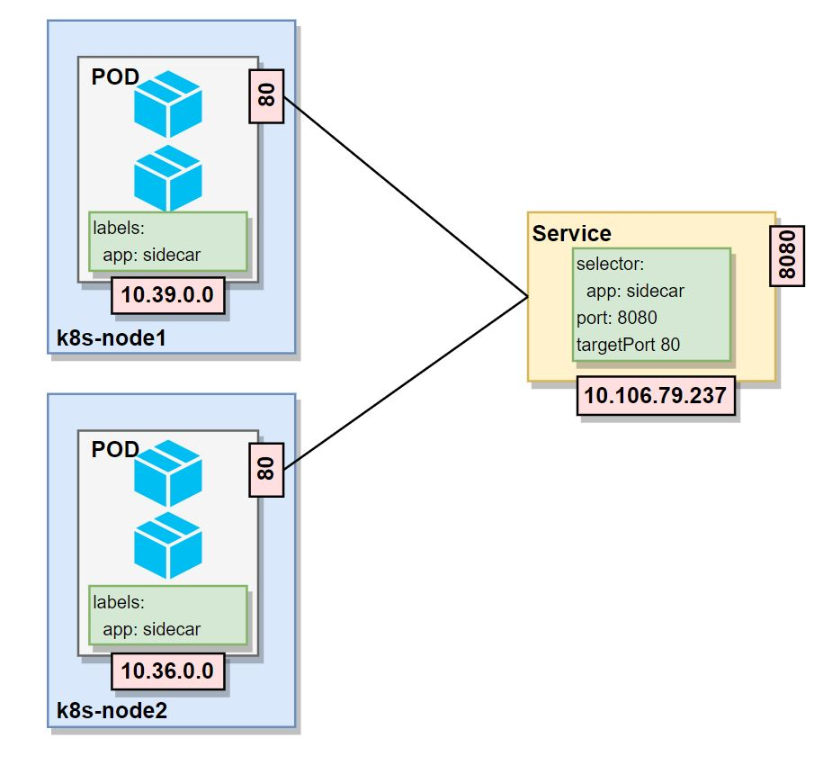
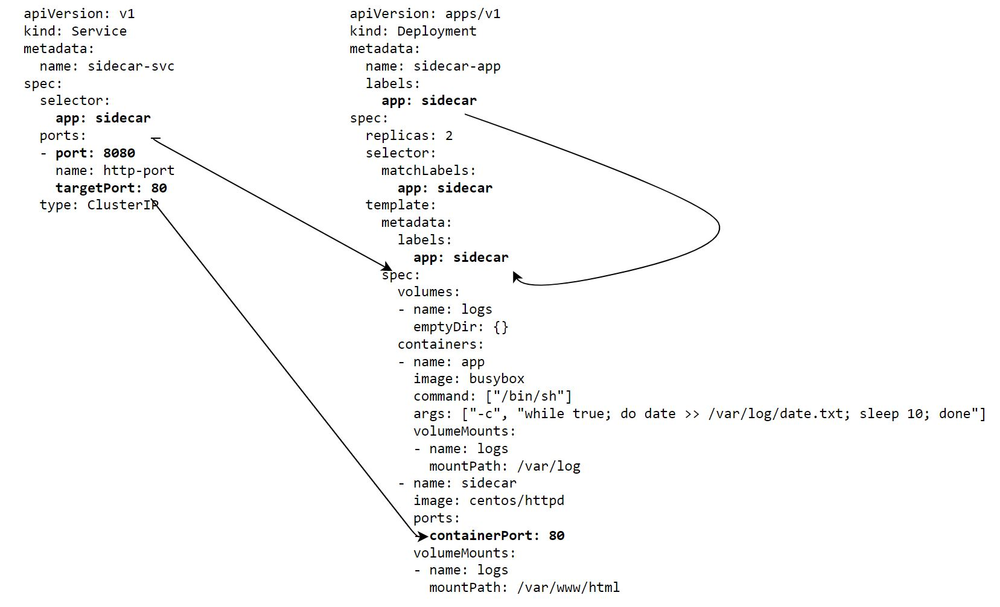

# ClusterIP & Headless -Services (Internal Services)

1.1. PODs and Cluster Networks 
* The Kubernetes nodes are assigned a range of PODs IP address of the POD network. 
* When a POD is scheduled to run on a specific node, a POD IP within the assigned range is given to the created POD.

## POD assigned IPs ranges
```
# Get node1 assigned POD IPs range
$ kubectl get node k8s-node1 -o jsonpath='{.spec.podCIDR}'
10.244.1.0/24
 
# Get node2 assigned POD IPs rang
$ kubectl get node k8s-node2 -o jsonpath='{.spec.podCIDR}'
10.244.2.0/24
 
# Get master node assigned POD IPs rang
$ kubectl get node k8s-master -o jsonpath='{.spec.podCIDR}'
10.244.0.0/24
 
# Get services ClusterIPs CIDR and the POD subnet
$ kubectl describe configmap kubeadm-config -n kube-system |grep Subnet
podSubnet: 10.244.0.0/16
serviceSubnet: 10.96.0.0/12
````


* PODs's **labels**_ (key-value pairs) are used by services to identify the pods to forward requests to
* PODs's containers_ **exposed ports**_ are used by services to identify to which port the request should be sent to.
* Services **selectors** are used to identify the pods with the given labels and to which should forward the requests to.
* Service **port** define the port exposed by the service and **targetPort** define the PODs target port to which the requests will be sent to.


## Deploy ClusterId service
```
# Deploy sidecar
$ kubectl create -f sidecar.yml
deployment.apps/sidecar-app created
 
Deploy sidecar service
$ kubectl create -f sidecar-svc.yml
service/sidecar-svc created
 
# Verify the PODs deployment and their POD IP address
$ kubectl get pods -o wide
NAME                           READY   STATUS    RESTARTS        AGE   IP          NODE                      NOMINATED NODE   READINESS GATES
sidecar-app-6f58cd9946-2wvmk   2/2     Running   0               37s   10.39.0.0   k8s-node1.singleton.net   <none>           <none>
sidecar-app-6f58cd9946-tbvkp   2/2     Running   0               37s   10.36.0.0   k8s-node2.singleton.net   <none>           <none>
 
# Verify pods labels key-pairs
$ kubectl get pods --show-labels ( app=sidecar )
NAME                           READY   STATUS    RESTARTS      AGE     LABELS
dnsutils                       1/1     Running   9 (10m ago)   41h     <none>
sidecar-app-6f58cd9946-2wvmk   2/2     Running   0             7m32s   app=sidecar,pod-template-hash=6f58cd9946
sidecar-app-6f58cd9946-tbvkp   2/2     Running   0             7m32s   app=sidecar,pod-template-hash=6f58cd9946
 
# Verify ports on which the containers listen to
$ kubectl get pods --selector=app=sidecar -o  jsonpath='{@.items[*].spec.containers[*].ports}'
[{"containerPort":80,"protocol":"TCP"}] [{"containerPort":80,"protocol":"TCP"}]
 
# Verify sidecar service selector key-pair ( app=sidecar ) and port ( 8080 )
$ kubectl get services -o wide
NAME          TYPE        CLUSTER-IP    EXTERNAL-IP   PORT(S)    AGE     SELECTOR
sidecar-svc   ClusterIP   10.97.98.36   <none>        8080/TCP   26s     app=sidecar
 
# Verify sidecar service endpoints (POD IP addresses)  and target ports (80)
$ kubectl get endpoints
NAME          ENDPOINTS                   AGE
sidecar-svc   10.36.0.0:80,10.39.0.0:80   37s
```
## Accessing sidecar-app from from another POD within the cluster
There are two way to do this 
* Environment Variables
* DNS

### Using Environment Variables
To access the sidecar-app application's endpoints, targeted by the sidecar-svc service, we can use the services ClusterIP address and Port,  in this case :  10.97.98.36:8080
**Each POD created *AFTER* a service creation is seeded with the environment variables giving information related to the services.**

***POD Services Env vars***
```
# Deploy a busybox POD having a curl command
$ kubectl run curl --image=radial/busyboxplus:curl -i --tty
[ root@curl:/ ]$ env | grep SVC
SIDECAR_SVC_SERVICE_HOST=10.97.98.36
SIDECAR_SVC_PORT_8080_TCP_ADDR=10.97.98.36
SIDECAR_SVC_PORT_8080_TCP_PORT=8080
SIDECAR_SVC_PORT_8080_TCP_PROTO=tcp
SIDECAR_SVC_PORT=tcp://10.97.98.36:8080
SIDECAR_SVC_SERVICE_PORT=8080
SIDECAR_SVC_PORT_8080_TCP=tcp://10.97.98.36:8080
SIDECAR_SVC_SERVICE_PORT_HTTP_PORT=8080
EXAMPLE_SERVICE_SVC_PORT_8080_TCP_ADDR=10.97.206.62
EXAMPLE_SERVICE_SVC_SERVICE_HOST=10.97.206.62
EXAMPLE_SERVICE_SVC_PORT_8080_TCP_PORT=8080
EXAMPLE_SERVICE_SVC_PORT_8080_TCP_PROTO=tcp
```
The environment variables names are all in the format 
* ***<service-name>_SERVICE_SVC_HOST*** 
and 
* ***<service-name>_SERVICE_SVC_PORT***

Base on these information we can try to access our application POD 

***Access aplication POD using environment variables***
```
# Deploy a busybox POD having a curl command
$ kubectl run curl --image=radial/busyboxplus:curl -i --tty
If you don't see a command prompt, try pressing enter.
[ root@curl:/ ]$
[ root@curl:/ ]$ curl http://$SIDECAR_SVC_SERVICE_HOST:$SIDECAR_SVC_SERVICE_PORT/date.txt
Mon Sep 13 12:36:38 UTC 2021
Mon Sep 13 12:36:48 UTC 2021
Mon Sep 13 12:36:58 UTC 2021
Mon Sep 13 12:37:08 UTC 2021
Mon Sep 13 12:37:18 UTC 2021
```
### Using DNS

* By default most Kubernetes clusters automatically configure an internal DNS service to provide a lightweight mechanism for service discovery.
    * Before Kubernetes version 1.11, the Kubernetes DNS service was based on kube-dns.
    * Version 1.11 introduced **CoreDNS** to address some security and stability concerns with kube-dns.
    * Both implementations work in a similar manner:
        * Exposed Services automatically register with the Kubernetes internal DNS
        * With services exposing themselves on dynamic ports, resolving service names can be challenging, that is why we have the Kubernetes DNS service.
        * DNS service is updated every time a new service is added. DNS lookup within one POD to any exposed service happens automatically.
        * kubelet sets each new pod’s /etc/resolv.conf nameserver option to the cluster IP of the kube-dns service, with appropriate search options to allow for shorter hostnames to be used:

We can use the Kubernetes built-in DNS server (CoreDNS) which maintains DNS records for each Service.
When deploying services, Kubernetes assigns a DNS name to it. This name can be used by other components in the cluster to
communicate with the service and the upstream pods behind.
The names follow this naming convention:

```
<service-name>.<service-namespace>.svc.<cluster-domain-name>
```
For each pod that will be connected to a service  a DNS record will as well be created. 
The pods records have the following naming convention:
```
<pod-ip>.<service-name>.<service-namespace>.svc.<cluster-domain-name>
```

***Access aplication POD using environment variables***
```
# Deploy a busybox POD having a curl and nslookup commands
$ kubectl run curl --image=radial/busyboxplus:curl -i --tty  ( or "kubectl exec curl -it --tty   -- /bin/sh" if already running )
If you don't see a command prompt, try pressing enter.
[ root@curl:/ ]$ # Verify that the service name can be resolved
[ root@curl:/ ]$ nslookup sidecar-svc
[ root@curl:/ ]$ Server: 10.96.0.10
Address 1: 10.96.0.10 kube-dns.kube-system.svc.cluster.local
Name: sidecar-svc.default
Address 1: 10.97.98.36 sidecar-svc.default.svc.cluster.local
 
# Access the application POD via the service name
[ root@curl:/ ]$ curl http://sidecar-svc.default.svc.cluster.local:8080/date.txt
Mon Sep 13 12:36:38 UTC 2021
Mon Sep 13 12:36:48 UTC 2021
Mon Sep 13 12:36:58 UTC 2021
Mon Sep 13 12:37:08 UTC 2021
Mon Sep 13 12:37:18 UTC 2021
 
[ root@curl:/ ]$ curl http://sidecar-svc:8080/date.txt
Mon Sep 13 12:36:38 UTC 2021
Mon Sep 13 12:36:48 UTC 2021
Mon Sep 13 12:36:58 UTC 2021
Mon Sep 13 12:37:08 UTC 2021
Mon Sep 13 12:37:18 UTC 2021
 
# Get service end-points (the PODS IPs)
$ kubectl get ep
NAME                  ENDPOINTS                                AGE
example-service-svc   <none>                                   23h
kubernetes            192.168.56.10:6443                       3d23h
sidecar-svc           10.36.0.0:80,10.36.0.1:80,10.39.0.1:80   21h
 
# Get DNS name for the POD on POD IP 10.36.0.0 -> 10-36-0-0.sidecar-svc.default.svc.cluster.local
$ kubectl exec -it curl  -- nslookup  10.36.0.0
Server:    10.96.0.10
Address 1: 10.96.0.10 kube-dns.kube-system.svc.cluster.local
 
Name:      10.36.0.0
Address 1: 10.36.0.0 10-36-0-0.sidecar-svc.default.svc.cluster.local
 
# Verify POD to POD communication by accessing the POD within the curl POD and using the DNS name
curl http://10.36.0.0.sidecar-svc.training.svc.cluster.local/date.txt
Mon Sep 13 12:36:38 UTC 2021
Mon Sep 13 12:36:48 UTC 2021
Mon Sep 13 12:36:58 UTC 2021
Mon Sep 13 12:37:08 UTC 2021
Mon Sep 13 12:37:18 UTC 2021
```
## Headless Services
In some situations it is desired to be able to retrieve the IP addresses of all the pods that are connected to a certain service.
For example,  when pods are stateful, like a deployed databases and the client want to communicate to one of the PODs selectively, or when pods need to communicate each other.
In such situation PODs replicas are not identical, they have their individual state and characteristics.
For example on Couchbase we can address N1QL queries only to those Couchbase cluster nodes that has n1ql service,
or in case of MYSQL where a new worker node need to connect to one another worker to synchronize.

In this situations we need to be able to communicate to a specific POD directly, but how we can do that?
We could query the API call to the Kubernetes API server to return a list of PODs and their IP addresses , but that would be inefficient.

Here is where the headless service come to handy.

To avoid requests being load-balanced behind one single IP address of the services, we can explicitly specifying *ClusterIP* property to be equal *"None”*.

As seen before Kubernetes also create a DNS record for each POD behind a specific service and we can use nslookup to discover PODs IP addresses.
Usually when we perform a nslookup  for a service Kubernetes return the single IP address of the service ( the service's ClusterIP address).
However we can tell Kubernetes we do not need a cluster IP address for the service  explicitly specifying ClusterIP property to be equal "None”.
This way Kubernetes won’t allocate any IP address to the service but still create DNS records for the service and each endpoint;
when doing a nslookup of the service,  ***Kubernetes will return the POD's IP address instead.***

### Deply Headless Service
```
# Deploy the application
$ kubectl create -f sidecar.yml
deployment.apps/sidecar-app created
 
# Check the application is deployed
$ Kubectl get pods
NAMESPACE     NAME                                               READY   STATUS    RESTARTS         AGE
default       curl                                               1/1     Running   3 (115m ago)     19d
default       sidecar-app-6f58cd9946-8zdkl                       2/2     Running   0                2m39s
default       sidecar-app-6f58cd9946-cvbc7                       2/2     Running   0                2m38s
default       sidecar-app-6f58cd9946-mq6jc                       2/2     Running   0                2m38s
...
 
# Create the headless service (ClusterIP: None)
$ kubectl create -f sidecar-svc-headles.yml
service/sidecar-svc-headless created
 
# Check the service has no ClusterIP
$ kubectl get services
NAME                   TYPE        CLUSTER-IP       EXTERNAL-IP   PORT(S)    AGE
sidecar-svc-headless   ClusterIP   None             <none>        8080/TCP   8s
...
 
# Get PODs IPs by viewing the service endpoints
$ kubectl get endpoints sidecar-svc-headless
NAME                   ENDPOINTS                                AGE
sidecar-svc-headless   10.36.0.0:80,10.36.0.1:80,10.39.0.1:80   19m
 
# Using CoreDNS to retrieve the PODs IPs by nslookup the service name
$ kubectl exec -it curl /bin/sh
[ root@curl:/ ]$ nslookup sidecar-svc-headless
 
Server: 10.96.0.10
Address 1: 10.96.0.10 kube-dns.kube-system.svc.cluster.local
 
Name: sidecar-svc-headless
Address 1: 10.36.0.1 10-36-0-1.sidecar-svc-headless.default.svc.cluster.local
Address 2: 10.39.0.1 10-39-0-1.sidecar-svc-headless.default.svc.cluster.local
Address 3: 10.36.0.0 10-36-0-0.sidecar-svc-headless.default.svc.cluster.local
sidecar-svc-headless.yaml
```
