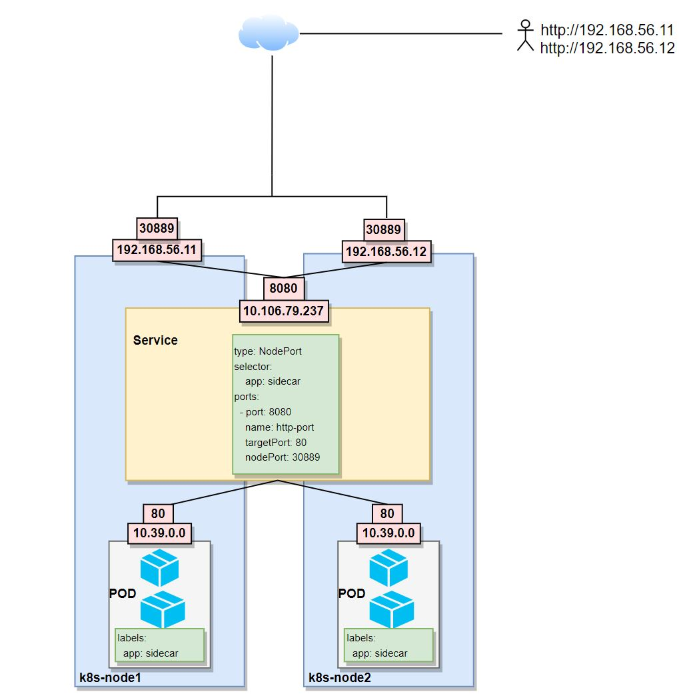
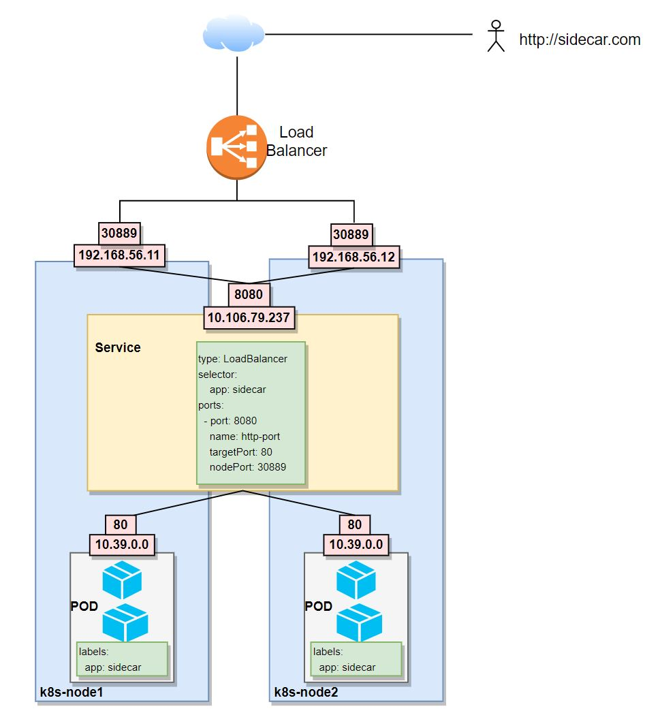
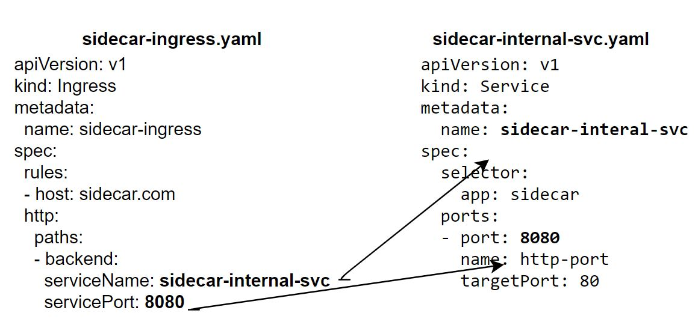

# LoadBalancer Service & Ingress
##  Load Balancer Service
* The service become accessible through a cloud provider Load Balancer ( openstack, gcp, azure, aws etc)
* When we create a LoadBalancer services NodePort and ClusterIP   are created automatically by Kubernetes and reachable only through the cloud provider Load Balancer.
* LoadBalancer Service is an extension of the NodePort Service




## Example

***sidecar-svc-lb.yaml***
```
apiVersion: v1
kind: Service
metadata:
  name: sidecar-svc-lb
spec:
  type: LoadBalancer
  selector:
    app: sidecar
  ports:
  - port: 8080
    name: http-port
    targetPort: 80
    nodePort: 30889

```
```
$ kubectl create -f sidecar-svc-lb.yaml
service/sidecar-svc-lb created
 
$ kubectl get services
NAME             TYPE           CLUSTER-IP      EXTERNAL-IP   PORT(S)          AGE
kubernetes       ClusterIP      10.96.0.1       <none>        443/TCP          4d3h
sidecar-app      NodePort       10.103.79.108   <none>        8080:30701/TCP   26m
sidecar-svc      NodePort       10.100.57.117   <none>        8080:30887/TCP   59m
sidecar-svc-lb   LoadBalancer   10.98.209.154   <pending>     8080:30889/TCP   11m
```
Here the Kubernetes cluster is implemented on virtualbox, that's why EXTERNAL-IP is pending. Virtualbox doesn't provide load balancing.   
With cloud providers like openshift, aws, azure, gcp and so on, the EXTERNAL IP is provided automatically.  
An alternative is to work with ***Ingress***

# Ingress
* Ingress exposes http and https routes from outside the cluster to the service within the cluster
* Traffic routing are controlled by rules defined in ingress resources.
* It is used to get service reachable from out side the cluster via defined URLs it allow load balancing traffic
* To use ingress we need to deploy an ingress controller
* There are different ingress controllers available ingress-nginx, traefik.io, contour etc. 



