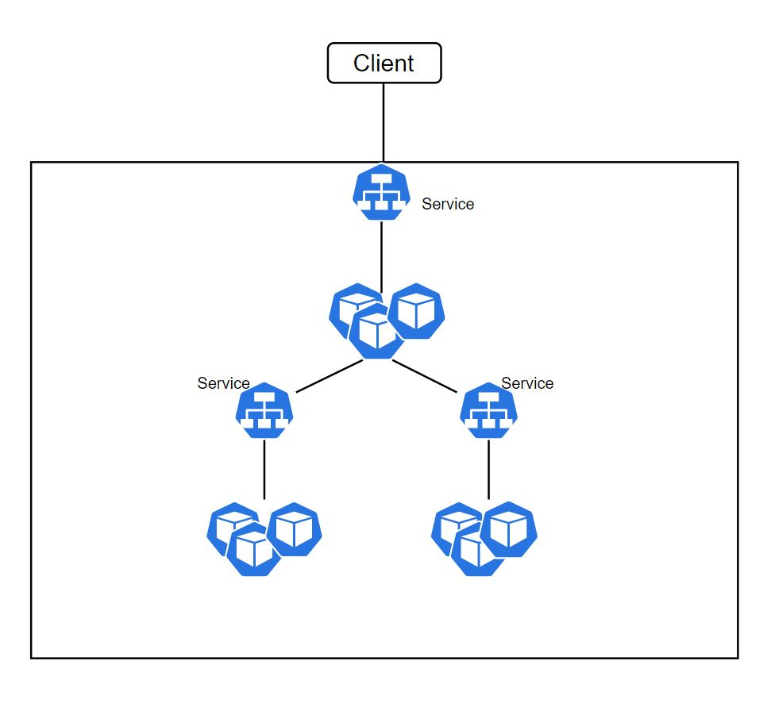

# Services

**PODs IP change when PODs restart**

* In Kubernetes cluster each POD get its internal IP address.
* When a POD restart or when die a new one is started in its place.
* The new POD get a different IP address. So it does not make sense to access POD via its own IP address because we have to adjust every time the POD get recreated.

**The solution are Services**. 

* Services enables you to communicate easily with upstream pods without the need to know the exact individual IP addresses of individual pods.
* A  Service is a Kubernetes object, which is an abstraction that defines a logical set of Pods and policy by which to access them. Together refers to as ***microservice***
* A Service is assigned a **ClusterIP** address which remains stable and we can use to access the PODs it refers to.
* A service also provide loadbalancing.  When we have PODs replicas, it dispatch a request to a microservice to one of the PODs. 
* The client call a single stable IP offered by the service and the request is forwarded by service to on of the PODS of the replica set.
* The set of pods targeted by a service is determined by a **selector** which is a label. 
* The controller continuously scan for PODS that match the selector to include them to the service endpoints.
* Service can be used inside the cluster for communication between components and also from outside the cluster.
* **kube-proxy agent**, which runs on each Kubernetes node, watches for new services and endpoints and physically implement the services.

