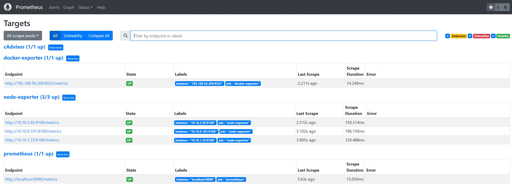
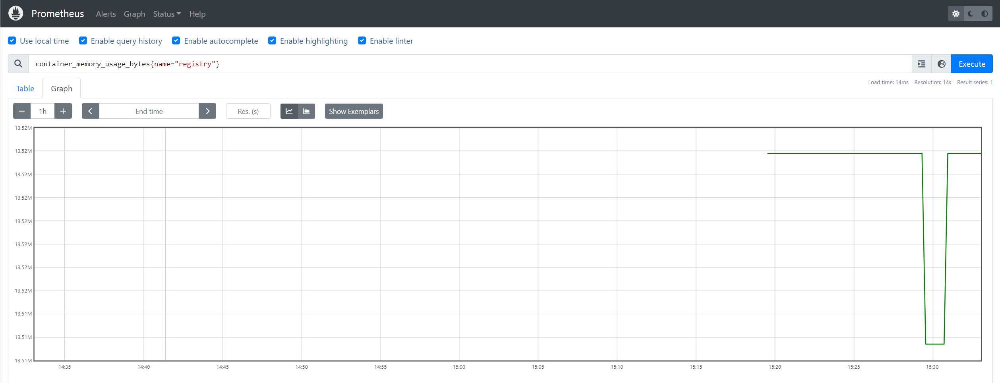

# Export Docker Daemon Metrics
Docker has built-in (experimental) ability to expose prometheus metrics.  
Our deployed docker registry can be monitored by activating this functionality. 

## Configure Docker
The activate the docker registry metrics, we need to reconfigure the docker deamon by changing ***/etc/docker/daemon.json*** file by adding the following two lines
```
    "experimental": true,                  # We activate the experimental features
    "metrics-addr": "192.168.56.200:9323   # give the address and port from where metrics could be scraped
```

On the host we setup as our own private docker registry we change the docker configuration file which should be as follow:

***/etc/docker/daemon.json*** 

```
{
    "exec-opts": ["native.cgroupdriver=systemd"],
    "log-driver": "json-file",
    "log-opts": {
     "max-size": "100m"
    },
    "storage-driver": "overlay2",

    "experimental": true,
    "metrics-addr": "192.168.56.200:9323"
}

```

We restart the docker daemon and verify that it actually export prometheus metrics:
```
$ sudo systemctl restart docker
[sudo] password for centos:

[centos@centos8s-server ~]$ sudo systemctl status docker
● docker.service - Docker Application Container Engine
   Loaded: loaded (/usr/lib/systemd/system/docker.service; enabled; vendor preset: disabled)
   Active: active (running) since Wed 2023-05-31 09:51:27 UTC; 5s ago
     Docs: https://docs.docker.com
 Main PID: 2126 (dockerd)
    Tasks: 16
   Memory: 30.2M
   CGroup: /system.slice/docker.service
           ├─2126 /usr/bin/dockerd -H fd:// --containerd=/run/containerd/containerd.sock
           └─2249 /usr/bin/docker-proxy -proto tcp -host-ip 0.0.0.0 -host-port 443 -container-ip 172.17.0.2 -container-port 443
...
...

```

Now we can verify if the docker daemon server is exporting prometheus metrics by querying it
```
curl http://192.168.56.200:9323/metrics
# HELP builder_builds_failed_total Number of failed image builds
# TYPE builder_builds_failed_total counter
builder_builds_failed_total{reason="build_canceled"} 0
builder_builds_failed_total{reason="build_target_not_reachable_error"} 0
builder_builds_failed_total{reason="command_not_supported_error"} 0
builder_builds_failed_total{reason="dockerfile_empty_error"} 0
builder_builds_failed_total{reason="dockerfile_syntax_error"} 0
builder_builds_failed_total{reason="error_processing_commands_error"} 0
builder_builds_failed_total{reason="missing_onbuild_arguments_error"} 0
...
...
```

## Configure the host firewall
The host running the the docker private registry need to be configured to accept traffic on the configured docker export. 

```
$ sudo firewall-cmd --permanent --zone=public --add-port=9323/tcp
[sudo] password for centos:
success
$ systemctl restart firewalld
==== AUTHENTICATING FOR org.freedesktop.systemd1.manage-units ====
Authentication is required to restart 'firewalld.service'.
Authenticating as: centos
Password:
==== AUTHENTICATION COMPLETE ====
$ sudo systemctl status firewalld
● firewalld.service - firewalld - dynamic firewall daemon
   Loaded: loaded (/usr/lib/systemd/system/firewalld.service; enabled; vendor preset: enabled)
   Active: active (running) since Wed 2023-05-31 11:04:01 UTC; 1h 9min ago
     Docs: man:firewalld(1)
 Main PID: 2949 (firewalld)
    Tasks: 2 (limit: 23236)
   Memory: 25.2M
   CGroup: /system.slice/firewalld.service
           └─2949 /usr/libexec/platform-python -s /usr/sbin/firewalld --nofork --nopid

```

## Configure Prometheus
To configure prometheus to scrape the docker daemon we nee to add the following configuration in the scrap_configs section of the prometheus config map. 
We could specify the registry server FQDN but we do not have DNS configured so we simply use the public IP of the host.

```
      - job_name: docker-exporter
        static_configs:
           - targets: ['192.168.56.200:9323']

```
After restarting the prometheus POD we should be able to see the docker metrics in the prometheus Dashboard. 


We can for example query for container state metrics ***engine_daemon_container_states_containers***


We can see we have 2 PODs stopped, 1 POD running and 0 POD paused.

# Export docker Container Metrics (cAdvisor)
## Run cAdvisor as a Docker Container
Docker containers can be monitored by Prometheus using cAdvisor.  
***cAdvisor*** need to be installed and running on the docker server.  
we run cAdvisor as a docker container itself.
```
# Run cAdvisor as docker image
$ docker run -d --restart always --name cadvisor -p 8080:8080 \
  -v "/:/rootfs:ro" \
  -v "/var/run:/var/run:rw" \
  -v "/sys:/sys:ro" \
  -v "/var/lib/docker/:/var/lib/docker:ro" \
  google/cadvisor:latest

Unable to find image 'google/cadvisor:latest' locally
latest: Pulling from google/cadvisor
ff3a5c916c92: Pull complete
44a45bb65cdf: Pull complete
0bbe1a2fe2a6: Pull complete
Digest: sha256:815386ebbe9a3490f38785ab11bda34ec8dacf4634af77b8912832d4f85dca04
Status: Downloaded newer image for google/cadvisor:latest
eeb401ee07a03606f9155715dacf1f57a9f01f09022c5a3e26070355cf45e0c4

# Verify cAdvisor container is running
$ docker ps
CONTAINER ID   IMAGE                    COMMAND                  CREATED          STATUS          PORTS                            NAMES
eeb401ee07a0   google/cadvisor:latest   "/usr/bin/cadvisor -…"   19 seconds ago   Up 18 seconds   0.0.0.0:8080->8080/tcp           cadvisor
996f8d775f33   registry:2.7             "/entrypoint.sh /etc…"   2 months ago     Up 3 hours      0.0.0.0:443->443/tcp, 5000/tcp   registry

# Verify Metrics are exported
$ curl localhost:8080/metrics
# HELP cadvisor_version_info A metric with a constant '1' value labeled by kernel version, OS version, docker version, cadvisor version & cadvisor revision.
# TYPE cadvisor_version_info gauge
cadvisor_version_info{cadvisorRevision="8949c822",cadvisorVersion="v0.32.0",dockerVersion="20.10.21",kernelVersion="4.18.0-448.el8.x86_64",osVersion="Alpine Linux v3.7"} 1
# HELP container_cpu_load_average_10s Value of container cpu load average over the last 10 seconds.
# TYPE container_cpu_load_average_10s gauge
container_cpu_load_average_10s{id="/",image="",name=""} 0
container_cpu_load_average_10s{id="/init.scope",image="",name=""} 0
container_cpu_load_average_10s{id="/system.slice",image="",name=""} 0
container_cpu_load_average_10s{id="/system.slice/NetworkManager-wait-online.service",image="",name=""} 0
container_cpu_load_average_10s{id="/system.slice/NetworkManager.service",image="",name=""} 0
container_cpu_load_average_10s{id="/system.slice/auditd.service",image="",name=""} 0
```

## Configure Prometheus for cAdvisor Metrics
We need to add the cadvisor config in prometheus scrape_config section of prometheus.yaml file.
Since our prometheus server is running as a POD and the configuration file prometheus.yaml is stored in a config map, 
we just need to change the configmap by adding the following lines in scrape_config and restart prometheus POD.
```
   - job_name: 'cAdvisor'
     static_configs:
     - targets: ['192.168.56.200:8080']
```
***cadvisor-prometheus-configmap.yaml***
```
---
apiVersion: v1
kind: ConfigMap
metadata:
  name: prometheus-server-conf
  labels:
    name: prometheus-server-conf
  namespace: monitoring
data:
  prometheus.rules: |-
    groups:
    - name: devopscube demo alert
      rules:
      - alert: High Pod Memory
        expr: sum(container_memory_usage_bytes) > 1
        for: 1m
        labels:
          severity: slack
        annotations:
          summary: High Memory Usage
  prometheus.yml: |-
    global:
      scrape_interval: 5s # default is every 1 minute
      scrape_timeout: 5s # default 10s
      evaluation_interval: 5s  # default is every 1 minute How frequently to evaluate rules
    rule_files:
      - /etc/prometheus/prometheus.rules
    alerting:
      alertmanagers:
      - scheme: http
        static_configs:
        - targets:
          - "aletargetsrtmanager.monitoring.svc:9093"
    scrape_configs:
      - job_name: prometheus
        static_configs:
          - targets:
             - localhost:9090

      - job_name: node-exporter
        kubernetes_sd_configs:
           - role: endpoints
        relabel_configs:
           - source_labels: [__meta_kubernetes_endpoints_name]
             regex: node-exporter
             action: keep

      - job_name: docker-exporter
        static_configs:
           - targets: ['192.168.56.200:9323']
           
      - job_name: 'cAdvisor'
        static_configs:
        - targets: ['192.168.56.200:8080']
```
##  Configure the host firewall
The host running the the docker private registry need to be configured to accept traffic on the configured docker export. 

```
$ sudo firewall-cmd --permanent --zone=public --add-port=8080/tcp
[sudo] password for centos:
success
$ stemctl restart firewalld
$ sudo systemctl status firewalld
● firewalld.service - firewalld - dynamic firewall daemon
   Loaded: loaded (/usr/lib/systemd/system/firewalld.service; enabled; vendor preset: enabled)
   Active: active (running) since Wed 2023-05-31 11:04:01 UTC; 1h 9min ago
     Docs: man:firewalld(1)
 Main PID: 2949 (firewalld)
    Tasks: 2 (limit: 23236)
   Memory: 25.2M
   CGroup: /system.slice/firewalld.service
           └─2949 /usr/libexec/platform-python -s /usr/sbin/firewalld --nofork --nopid
$ sudo firewall-cmd --list-all
public (active)
  target: default
  icmp-block-inversion: no
  interfaces: eth0 eth1
  sources:
  services: cockpit dhcpv6-client https mountd nfs rpc-bind ssh
  ports: 6443/tcp 2379-2380/tcp 10250-10252/tcp 10257/tcp 10259/tcp 30000-32767/tcp 8285/udp 8472/udp 5000/tcp 8001/tcp 9323/tcp 8080/tcp
  ...
  ...
```
##  Apply new prometheus config
After applying the new prometheus configuration and restarting the prometheus POD we verify the the containers metrics are available on the prometheus dashboard
```
$ kubectl apply -f cadvisor-prometheus-configmap.yaml
configmap/prometheus-server-conf configured
$ kubectl delete pod prometheus-deployment-55d57cf76f-nvhkl
pod "prometheus-deployment-55d57cf76f-nvhkl" deleted
```
## Verify that the metrics are visibele on the docker dashboard


We currently have 2 doker running 
```
$ docker ps
CONTAINER ID   IMAGE                    COMMAND                  CREATED          STATUS          PORTS                            NAMES
eeb401ee07a0   google/cadvisor:latest   "/usr/bin/cadvisor -…"   29 minutes ago   Up 29 minutes   0.0.0.0:8080->8080/tcp           cadvisor
996f8d775f33   registry:2.7             "/entrypoint.sh /etc…"   2 months ago     Up 4 hours      0.0.0.0:443->443/tcp, 5000/tcp   registry
```
We can see the memory usage metrics for he container with name registry:

