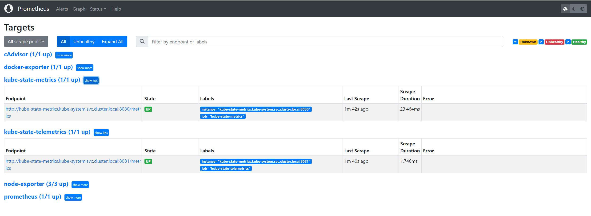

# Kube State Metrics
Kube State Metrics is a service that communicates with the Kubernetes API server to obtain information about all API objects such as deployments, pods, and DaemonSets.   
It essentially gives Kubernetes API object metrics that aren’t available via native Kubernetes monitoring components.  
Kube State Metrics allow to monitor for example:
* Nodes status, capacity such as CPU and memory usage.
* Pods status.
* Resources Requests and limits.
etc.

## Deployment 

kube-state-metrics is an open-source project and we can get its latest version by cloning the github project:

```
$ git clone https://github.com/kubernetes/kube-state-metrics.git

```
The project documentation explain how to deploy it in kubernetes and what need to be done to create a scrape_config for prometheus.

### kube-state-metrics Deployment

The cloned project contains all required playbooks for a standard deployment.   
All resource will be created un kube-system namespace :

* A cluster Role to allow access to Kubernete API
* A Service Account and Role Binding to be used by Kubernetes Metrics to autenticate to the API
* A Deplyoment with all required specs
* A service to access the PODs

```
$ kubectl apply -f kube-state-metrics/examples/standard

clusterrolebinding.rbac.authorization.k8s.io/kube-state-metrics configured
clusterrole.rbac.authorization.k8s.io/kube-state-metrics configured
deployment.apps/kube-state-metrics configured
serviceaccount/kube-state-metrics configured
service/kube-state-metrics configured

$ kubectl get pods -n kube-system
NAME                                  READY   STATUS    RESTARTS       AGE
...
...
kube-state-metrics-765f79fc58-cdwm2   1/1     Running   0              37s
...
...

```

### Verification

The service deployed is of type ClusterIP that means that can be targeted by any PODs insided the cluster.  
That is good since we installed Prometheus as Kubernetes POD. If we want to be able to access Kubernetes State Metrics from outside the cluster
We can chenge the service to a NodePort type for example.
  
We can see the service deployed ha two ports :
* Port 8080 to access Kubernetes metrics
* Port 8081 to access kube-state-metrics own general process metrics.

```
$ kubectl get service -o wide -n kube-system kube-state-metrics
NAME                 TYPE        CLUSTER-IP   EXTERNAL-IP   PORT(S)             AGE     SELECTOR
kube-state-metrics   ClusterIP   None         <none>        8080/TCP,8081/TCP   7d23h   app.kubernetes.io/name=kube-state-metrics
```

Here we try to access the metrics from a POD deployed on **monitoring** namespace, the same one where we have deployed prometheus as a PODs.
```
# Deploy curl POD for testing
$ kubectl run curl --image=radial/busyboxplus:curl -i --tty
If you don't see a command prompt, try pressing enter.
[ root@curl:/ ]$

# Verify we can lookup kube-state-metrics service from here
[ root@curl:/ ]$ nslookup kube-state-metrics.kube-system
Server:    10.96.0.10
Address 1: 10.96.0.10 kube-dns.kube-system.svc.cluster.local

Name:      kube-state-metrics.kube-system
Address 1: 10.10.1.35 10-10-1-35.kube-state-metrics.kube-system.svc.cluster.local
[ root@curl:/ ]$

# Get the metrics via the service IP
[ root@curl:/ ]$ curl http://10.10.1.35:8080/metrics
# HELP kube_certificatesigningrequest_annotations Kubernetes annotations converted to Prometheus labels.
# TYPE kube_certificatesigningrequest_annotations gauge
# HELP kube_certificatesigningrequest_labels [STABLE] Kubernetes labels converted to Prometheus labels.
# TYPE kube_certificatesigningrequest_labels gauge
# HELP kube_certificatesigningrequest_created [STABLE] Unix creation timestamp
# TYPE kube_certificatesigningrequest_created gauge
# HELP kube_certificatesigningrequest_condition [STABLE] The number of each certificatesigningrequest condition
# TYPE kube_certificatesigningrequest_condition gauge
# HELP kube_certificatesigningrequest_cert_length [STABLE] Length of the issued cert
# TYPE kube_certificatesigningrequest_cert_length gauge
# HELP kube_configmap_annotations Kubernetes annotations converted to Prometheus labels.
# TYPE kube_configmap_annotations gauge
kube_configmap_annotations{namespace="monitoring",configmap="prometheus-server-conf"} 1
...
...


# Get the metrics via the service FQDN
[ root@curl:/ ]$ curl http://10-10-1-35.kube-state-metrics.kube-system.svc.cluster.local:8080/metrics
# HELP kube_certificatesigningrequest_annotations Kubernetes annotations converted to Prometheus labels.
# TYPE kube_certificatesigningrequest_annotations gauge
# HELP kube_certificatesigningrequest_labels [STABLE] Kubernetes labels converted to Prometheus labels.
# TYPE kube_certificatesigningrequest_labels gauge
# HELP kube_certificatesigningrequest_created [STABLE] Unix creation timestamp
# TYPE kube_certificatesigningrequest_created gauge
# HELP kube_certificatesigningrequest_condition [STABLE] The number of each certificatesigningrequest condition
# TYPE kube_certificatesigningrequest_condition gauge
# HELP kube_certificatesigningrequest_cert_length [STABLE] Length of the issued cert
# TYPE kube_certificatesigningrequest_cert_length gauge
# HELP kube_configmap_annotations Kubernetes annotations converted to Prometheus labels.
# TYPE kube_configmap_annotations gauge
kube_configmap_annotations{namespace="monitoring",configmap="prometheus-server-conf"} 1
...
...

```

## Prometheus configuration

To the courrent prometheus config map we should add a new scrape_config job for eache kube-state-metrics endpoint.  
To do this we symply add the following lines to the our latest modified configmap:
```
      - job_name: 'kube-state-metrics'
        static_configs:
          - targets: ['kube-state-metrics.kube-system.svc.cluster.local:8080']

      - job_name: 'kube-state-telemetrics'
        static_configs:
          - targets: ['kube-state-metrics.kube-system.svc.cluster.local:8081']
```
***kube-state-metrics-prometheus-configmap.yaml***
```
---
apiVersion: v1
kind: ConfigMap
metadata:
  name: prometheus-server-conf
  labels:
    name: prometheus-server-conf
  namespace: monitoring
data:
  prometheus.rules: |-
    groups:
    - name: devopscube demo alert
      rules:
      - alert: High Pod Memory
        expr: sum(container_memory_usage_bytes) > 1
        for: 1m
        labels:
          severity: slack
        annotations:
          summary: High Memory Usage
  prometheus.yml: |-
    global:
      scrape_interval: 5s # default is every 1 minute
      scrape_timeout: 5s # default 10s
      evaluation_interval: 5s  # default is every 1 minute How frequently to evaluate rules
    rule_files:
      - /etc/prometheus/prometheus.rules
    alerting:
      alertmanagers:
      - scheme: http
        static_configs:
        - targets:
          - "aletargetsrtmanager.monitoring.svc:9093"
    scrape_configs:
      - job_name: prometheus
        static_configs:
          - targets:
             - localhost:9090

      - job_name: node-exporter
        kubernetes_sd_configs:
           - role: endpoints
        relabel_configs:
           - source_labels: [__meta_kubernetes_endpoints_name]
             regex: node-exporter
             action: keep

      - job_name: docker-exporter
        static_configs:
           - targets: ['192.168.56.200:9323']

      - job_name: 'cAdvisor'
        static_configs:
        - targets: ['192.168.56.200:8080']

      - job_name: 'kube-state-metrics'
        static_configs:
          - targets: ['kube-state-metrics.kube-system.svc.cluster.local:8080']

      - job_name: 'kube-state-telemetrics'
        static_configs:
          - targets: ['kube-state-metrics.kube-system.svc.cluster.local:8081']
```

```
# Apply the new configmap
$ kubectl apply -f kube-state-metrics-prometheus-configmap.yaml
configmap/prometheus-server-conf configured

# Restart Prometheus POD
$ kubectl delete pod prometheus-deployment-55d57cf76f-w65k9
pod "prometheus-deployment-55d57cf76f-w65k9" deleted

```

### Prometheus Dashboard
Now the prometheus Dashboard should also show the two Endpoints Up and running for scraping Kubernetes Metrics and the Kube State Metrics own metrics.

