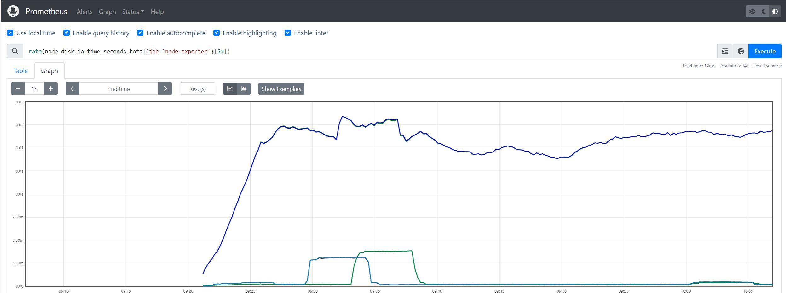
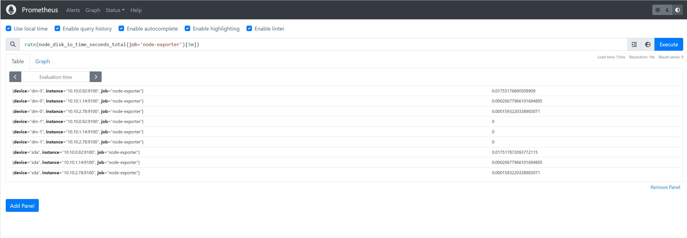

# Visualization
Visualization consist to create visual representations of our Prometheus data.
Basically to create a place where can visualize Prometheus data in form of graphs and chards etc.
For this purpose there are a variety of tools available, some alredy built in the prometheus dashboard and other provided by external projects such

## Expression browser
Available on prometheus dashboard under the Graph endpoint.

## Console Templates
Allow to create visualization consoles using go templating language. Template Console use go language templates and html.  

Console templates are served by Prometheus server and are essentially a simple way to create a web page that displays your data in a customized format.  
To use console templates we have to make sure that prometheus server is started with the **--web.console.templates** and **--web.console.libraries** options.
These option should pont to the location were console templates and libraries are locate.
The deployed prometheus POD does not have yet specified in the list of prometheus arguments, but it coome with a set examples of consoles and the relate console libreries respectively inside:  
**/usr/share/prometheus/consoles** and **/usr/share/prometheus/console_libraries**.  
Here we configure prometheus to look for conole templates inside **/prometheus/consoles** instead. /prometheus is a mounted NFS folder used by prometheus to permanently store metrics data.
This way we do not loose our templates on pod restart.

### Change Prometheus deploment config
prometheus deployment.yaml
```
apiVersion: apps/v1
kind: Deployment
metadata:
  name: prometheus-deployment
  namespace: monitoring
  labels:
    app: prometheus-server
spec:
  replicas: 1
  selector:
    matchLabels:
      app: prometheus-server
  template:
    metadata:
      labels:
        app: prometheus-server
    spec:
      serviceAccountName: prometheus
      containers:
        - name: prometheus
          image: prom/prometheus
          args:
            - "--storage.tsdb.retention.time=12h"
            - "--config.file=/etc/prometheus/prometheus.yml"
            - "--storage.tsdb.path=/prometheus/"
            - "--web.console.libraries=/usr/share/prometheus/console_libraries"
            - "--web.console.templates=/prometheus/consoles"
          ports:
            - containerPort: 9090
          resources:
            requests:
              cpu: 500m
              memory: 500M
            limits:
              cpu: 1
              memory: 2Gi
          volumeMounts:
            - name: prometheus-config-volume
              mountPath: /etc/prometheus/
            - name: prometheus-storage-volume
              mountPath: /prometheus/
      volumes:
        - name: prometheus-config-volume
          configMap:
            defaultMode: 420
            name: prometheus-server-conf

        - name: prometheus-storage-volume
          persistentVolumeClaim:
            claimName: prometheus-pvc
```
We have to redeploy prometheus pod with the new options.

Here is a simple example of console template:
***disk-io.html***
```
{{template "head" .}}
{{template "prom_content_head" .}}
<h1>Disk IO Rate</h1>
<br />
Current Disk IO: {{ template "prom_query_drilldown" (args "rate(node_disk_io_time_seconds_total{job='node-exporter'}[5m])") }}
{{template "prom_content_tail" .}}
{{template "tail"}}
```
This file should be placed on the NFS server shared folder at **/mnt/nfs_shares/cluster_nfs/Prometheus/consoles**.

Now we can have a look of the customazed way to visualize the metrics data for example by loading this URL in a browser:
```
http://prometheus.singleton.net/consoles/disk-io.html
```
Result:  


By cliking on the disk io rate value we get to the espression browser with the query that was used to obtain the metric value. 



## Console Templates Graph Library
They can be used to desplay data in form of graph directly in served web console page.  
To do that we just change the the previous example disk-io.html with this newer version. 
***disk-io-graph.html***
```
{{template "head" .}}
{{template "prom_content_head" .}}

<h1>Disk IO Rate</h1>
<br />
Current Disk IO: {{ template "prom_query_drilldown" (args "rate(node_disk_io_time_seconds_total{job='node-exporter'}[5m])") }}
<br />
<br />
<div id="diskIoGraph"> </div>
<script>
new PromConsole.Graph({
    node: document.querySelector("#diskIoGraph"),
    expr: "rate(node_disk_io_time_seconds_total{job="node-exporter"}[5m])"
})
</script>


{{template "prom_content_tail" .}}
{{template "tail" .}}
```
This file should be placed on the NFS server shared folder at **/mnt/nfs_shares/cluster_nfs/Prometheus/consoles**.

The new html console file instanciate a **PromConsole.Graph** object.  
The object requires the id of the html *div* where the graph should be displayed and the expression to be execute to retrieve data for the graph to be build.  
Here is the result : 

