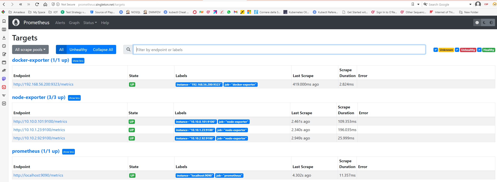
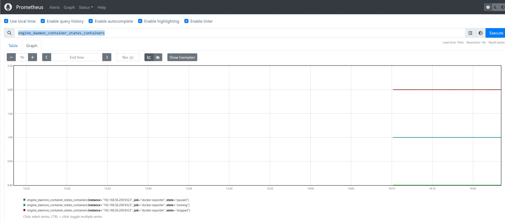

# Export Docker Daemon Metrics
Docker has built-in (experimental) ability to expose prometheus metrics.  
Our deployed docker registry can be monitored by activating this functionality. 

## Configure Docker
The activate the docker registry metrics, we need to reconfigure the docker deamon by changing ***/etc/docker/daemon.json*** file by adding the following two lines
```
    "experimental": true,                  # We activate the experimental features
    "metrics-addr": "192.168.56.200:9323   # give the address and port from where metrics could be scraped
```

On the host we setup as our own private docker registry we change the docker configuration file which should be as follow:

***/etc/docker/daemon.json*** 

```
{
    "exec-opts": ["native.cgroupdriver=systemd"],
    "log-driver": "json-file",
    "log-opts": {
     "max-size": "100m"
    },
    "storage-driver": "overlay2",

    "experimental": true,
    "metrics-addr": "192.168.56.200:9323"
}

```

We restart the docker daemon and verify that it actually export prometheus metrics:
```
$ sudo systemctl restart docker
[sudo] password for centos:

[centos@centos8s-server ~]$ sudo systemctl status docker
● docker.service - Docker Application Container Engine
   Loaded: loaded (/usr/lib/systemd/system/docker.service; enabled; vendor preset: disabled)
   Active: active (running) since Wed 2023-05-31 09:51:27 UTC; 5s ago
     Docs: https://docs.docker.com
 Main PID: 2126 (dockerd)
    Tasks: 16
   Memory: 30.2M
   CGroup: /system.slice/docker.service
           ├─2126 /usr/bin/dockerd -H fd:// --containerd=/run/containerd/containerd.sock
           └─2249 /usr/bin/docker-proxy -proto tcp -host-ip 0.0.0.0 -host-port 443 -container-ip 172.17.0.2 -container-port 443
...
...

```

Now we can verify if the docker daemon server is exporting prometheus metrics by querying it
```
curl http://192.168.56.200:9323/metrics
# HELP builder_builds_failed_total Number of failed image builds
# TYPE builder_builds_failed_total counter
builder_builds_failed_total{reason="build_canceled"} 0
builder_builds_failed_total{reason="build_target_not_reachable_error"} 0
builder_builds_failed_total{reason="command_not_supported_error"} 0
builder_builds_failed_total{reason="dockerfile_empty_error"} 0
builder_builds_failed_total{reason="dockerfile_syntax_error"} 0
builder_builds_failed_total{reason="error_processing_commands_error"} 0
builder_builds_failed_total{reason="missing_onbuild_arguments_error"} 0
...
...
```

## Configure host firewall
The host running the the docker private registry need to be configured to accept traffic on the configured docker export. 

```
$ sudo firewall-cmd --permanent --zone=public --add-port=9323/tcp

$ stemctl restart firewalld

$ sudo systemctl status firewalld
● firewalld.service - firewalld - dynamic firewall daemon
   Loaded: loaded (/usr/lib/systemd/system/firewalld.service; enabled; vendor preset: enabled)
   Active: active (running) since Wed 2023-05-31 11:04:01 UTC; 1h 9min ago
     Docs: man:firewalld(1)
 Main PID: 2949 (firewalld)
    Tasks: 2 (limit: 23236)
   Memory: 25.2M
   CGroup: /system.slice/firewalld.service
           └─2949 /usr/libexec/platform-python -s /usr/sbin/firewalld --nofork --nopid

```

## Configure Prometheus
To configure prometheus to scrape the docker daemon we nee to add the following configuration in the scrap_configs section of the prometheus config map. 
We could specify the registry server FQDN but we do not have DNS configured so we simply use the public IP of the host.

```
      - job_name: docker-exporter
        static_configs:
           - targets: ['192.168.56.200:9323']

```
After restarting the prometheus POD we should be able to see the docker metrics in the prometheus Dashboard. 


We can for example query for container state metrics ***engine_daemon_container_states_containers***

