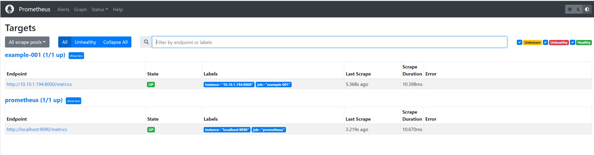

# Example 001

* Build a docker image containing a simple WEB application which make use of the prometheus python instrumentation library.
* The image is pushed in the Private Registry created in [014-PrivateRegistry](../../../014-PrivateRegistry/README.md) example.
* The ***start_http_server()*** – start the HTTP server of the exporter itself on port 8000 to export the metrics
* The ***http.server.HTTPServer()*** - start a regular HTTP server on port 8081 to respond to  '/hello'

## The Web app
***example-001.py***
```
import http.server
from prometheus_client import start_http_server

class MyHandler(http.server.BaseHTTPRequestHandler):
    def do_GET(self):
        if self.path == '/hello':
           self.send_response(200)
           self.end_headers()
           self.wfile.write(b'Hello World')
        else:
           self.send_error(404)

if __name__ == "__main__" :
    start_http_server(8000)
    server = http.server.HTTPServer(('',8001), MyHandler)
    server.serve_forever()
```
## The Dockerfile and Build and Push
***Dockerfile***
```
FROM python:3.9-alpine

WORKDIR /app
COPY ./example-001.py .

RUN python -m venv /opt/venv
ENV PATH="/opt/venv/bin:$PATH"
RUN pip install --upgrade pip
RUN pip install prometheus_client

EXPOSE 8001
EXPOSE 8000
ENTRYPOINT ["python", "example-001.py"]
```
We now build the docker image and tag it example-001. 

```
$ docker build  -t example-001 .
Sending build context to Docker daemon  3.072kB
Step 1/10 : FROM python:3.9-alpine
3.9-alpine: Pulling from library/python
63b65145d645: Pull complete
e9f9cf5029d2: Pull complete
a08ecb5f627b: Pull complete
0ee1cb01ea9e: Pull complete
709c07fb22c4: Pull complete
Digest: sha256:848701dba3434fe973fd42a413446e45c6f60ce63d059e47be1934771099b930
Status: Downloaded newer image for python:3.9-alpine
 ---> 1353482c9f85
Step 2/10 : WORKDIR /app
 ---> Running in 2ecae497b683
Removing intermediate container 2ecae497b683
 ---> e28438774bdb
Step 3/10 : COPY ./example-001.py .
 ---> 72f5a85d9417
Step 4/10 : RUN python -m venv /opt/venv
 ---> Running in aa3fe2256324
Removing intermediate container aa3fe2256324
 ---> 0008de22f1a1
Step 5/10 : ENV PATH="/opt/venv/bin:$PATH"
 ---> Running in b1299ff2a285
Removing intermediate container b1299ff2a285
 ---> 828d3b18e85b
Step 6/10 : RUN pip install --upgrade pip
 ---> Running in af5c8d82960e
Requirement already satisfied: pip in /opt/venv/lib/python3.9/site-packages (22.0.4)
Collecting pip
  Downloading pip-23.0.1-py3-none-any.whl (2.1 MB)
     ━━━━━━━━━━━━━━━━━━━━━━━━━━━━━━━━━━━━━━━━ 2.1/2.1 MB 15.3 MB/s eta 0:00:00
Installing collected packages: pip
  Attempting uninstall: pip
    Found existing installation: pip 22.0.4
    Uninstalling pip-22.0.4:
      Successfully uninstalled pip-22.0.4
Successfully installed pip-23.0.1
Removing intermediate container af5c8d82960e
 ---> 447682b4fe26
Step 7/10 : RUN pip install prometheus_client
 ---> Running in ed0773fce156
Collecting prometheus_client
  Downloading prometheus_client-0.16.0-py3-none-any.whl (122 kB)
     ━━━━━━━━━━━━━━━━━━━━━━━━━━━━━━━━━━━━━━━ 122.5/122.5 kB 2.7 MB/s eta 0:00:00
Installing collected packages: prometheus_client
Successfully installed prometheus_client-0.16.0
Removing intermediate container ed0773fce156
 ---> d69217ab5aa1
Step 8/10 : EXPOSE 8001
 ---> Running in 5044eeb24a13
Removing intermediate container 5044eeb24a13
 ---> b83ef9aeaa88
Step 9/10 : EXPOSE 8000
 ---> Running in 9d2c8a537ef2
Removing intermediate container 9d2c8a537ef2
 ---> f532bd6159be
Step 10/10 : ENTRYPOINT ["python", "example-001.py"]
 ---> Running in c1079d5cb68f
Removing intermediate container c1079d5cb68f
 ---> 83c51703e263
Successfully built 83c51703e263
Successfully tagged example-001:latest

# Verify that the docker image is present and tagged
$ docker images
REPOSITORY                                 TAG            IMAGE ID       CREATED          SIZE
example-001                                latest         5e10ca22e39e   3 minutes ago    933MB
```

Now that we have built our docker image and tagged it we need to push it to the private registry we have setup so that can be referenced and used by kubernetes.
```
$ docker tag  example-001:latest  centos8s-server.singleton.net:443/example-001
$ docker push centos8s-server.singleton.net:443/example-001
Using default tag: latest
The push refers to repository [centos8s-server.singleton.net:443/example-001]
1aba0a189451: Pushed
9637cf674e87: Pushed
b6d8f557ceb3: Pushed
b65d30014aa7: Pushed
ea9370fbf8d0: Pushed
a10c79771e86: Pushed
3f4c8c89729b: Pushed
5c813a85f7f0: Pushed
bdca38f94ff0: Pushed
faac394a1ad3: Pushed
ce8168f12337: Pushed
latest: digest: sha256:df9c987e159bad7a9a1a6d12dd9db7882a947269a4cb0aca4e57b3d72a043b2c size: 2631

# Query the catalog on the Private Registry
$ curl   -u centos:centos  https://centos8s-server.singleton.net:443/v2/_catalog
{"repositories":["alpine","busybox","example-001"]}

$ curl   -u centos:centos  https://centos8s-server.singleton.net:443/v2/example-001/tags/list
{"name":"example-001","tags":["latest"]}
```

The image is pushed and available.

## Create the Secret
To allow kubernetes nodes to pull the image from the Private Registry they need t authenticate their self to the registry.  
secrets objects have namespace scope, so we need to create the required secret in the *monitoring* namespace which is where we deploy the PODs.
We proceed in the same way describe in [SelfSignedCACertificateRegistry.md](../../../014-PrivateRegistry/gistry/SelfSignedCACertificateRegistry.md).
```
$ kubectl create secret docker-registry  centos8s-server-secret --docker-server=centos8s-server.singleton.net:443 --docker-username=centos --docker-password=centos -n monitoring
secret/centos8s-server-secret created

$ kubectl get secrets -n monitoring
NAME                     TYPE                             DATA   AGE
centos8s-server-secret   kubernetes.io/dockerconfigjson   1      79s
```

## Deployment 

***example-001-deployment.yaml***
```
apiVersion: apps/v1
kind: Deployment
metadata:
  labels:
    app.kubernetes.io/component: example-001
    app.kubernetes.io/name: example-001
  name: example-001
  namespace: monitoring
spec:
  replicas: 1
  selector:
    matchLabels:
      app.kubernetes.io/component: example-001
      app.kubernetes.io/name: example-001
  template:
    metadata:
      labels:
        app.kubernetes.io/component: example-001
        app.kubernetes.io/name: example-001
    spec:
      tolerations:
      - key: node-role.kubernetes.io/control-plane
        operator: Equal
        effect: NoSchedule
      imagePullSecrets:
      - name: centos8s-server-secret
      containers:
      - name: example-001
        image: centos8s-server.singleton.net:443/example-001:latest
        ports:
          - containerPort: 8000
            protocol: TCP
          - containerPort: 8001
            protocol: TCP
```
```
$ kubectl apply -f example-001-deployment.yaml
deployment.apps/example-001 created

$ kubectl get pods -n monitoring -o wide
NAME                                     READY   STATUS    RESTARTS      AGE   IP            NODE         NOMINATED NODE   READINESS GATES
example-001-6987bc77fc-rgkrb             1/1     Running   0             22s   10.10.1.189   k8s-node1    <none>           <none>
node-exporter-9m25d                      1/1     Running   1 (70m ago)   24h   10.10.0.38    k8s-master   <none>           <none>
node-exporter-qh2qs                      1/1     Running   1 (70m ago)   24h   10.10.1.186   k8s-node1    <none>           <none>
node-exporter-zqwg6                      1/1     Running   1 (70m ago)   24h   10.10.2.231   k8s-node2    <none>           <none>
prometheus-deployment-847b77bd49-4tms9   1/1     Running   1 (70m ago)   18h   10.10.2.234   k8s-node2    <none>           <none>

# Verify the POD is listening on ports 8000 and 8001
$ kubectl exec example-001-6987bc77fc-rgkrb -n monitoring --  netstat -tulpn
Active Internet connections (only servers)
Proto Recv-Q Send-Q Local Address           Foreign Address         State       PID/Program name
tcp        0      0 0.0.0.0:8000            0.0.0.0:*               LISTEN      1/python
tcp        0      0 0.0.0.0:8001            0.0.0.0:*               LISTEN      1/python

# Verify the application can be reached from another POD in the cluster
kubectl run curl --image=radial/busyboxplus:curl -i --tty -n monitoring
If you don't see a command prompt, try pressing enter.
[ root@curl:/ ]
[ root@curl:/ ]$ curl http://10.10.1.194:8000/metrics
# HELP python_gc_objects_collected_total Objects collected during gc
# TYPE python_gc_objects_collected_total counter
python_gc_objects_collected_total{generation="0"} 285.0
python_gc_objects_collected_total{generation="1"} 94.0
python_gc_objects_collected_total{generation="2"} 0.0
# HELP python_gc_objects_uncollectable_total Uncollectable object found during GC
# TYPE python_gc_objects_uncollectable_total counter
python_gc_objects_uncollectable_total{generation="0"} 0.0
python_gc_objects_uncollectable_total{generation="1"} 0.0
python_gc_objects_uncollectable_total{generation="2"} 0.0
# HELP python_gc_collections_total Number of times this generation was collected
# TYPE python_gc_collections_total counter
python_gc_collections_total{generation="0"} 39.0
python_gc_collections_total{generation="1"} 3.0
python_gc_collections_total{generation="2"} 0.0
# HELP python_info Python platform information
# TYPE python_info gauge
python_info{implementation="CPython",major="3",minor="9",patchlevel="16",version="3.9.16"} 1.0
# HELP process_virtual_memory_bytes Virtual memory size in bytes.
# TYPE process_virtual_memory_bytes gauge
process_virtual_memory_bytes 2.4154112e+07
# HELP process_resident_memory_bytes Resident memory size in bytes.
# TYPE process_resident_memory_bytes gauge
process_resident_memory_bytes 1.8620416e+07
# HELP process_start_time_seconds Start time of the process since unix epoch in seconds.
# TYPE process_start_time_seconds gauge
process_start_time_seconds 1.6795831692e+09
# HELP process_cpu_seconds_total Total user and system CPU time spent in seconds.
# TYPE process_cpu_seconds_total counter
process_cpu_seconds_total 0.47
# HELP process_open_fds Number of open file descriptors.
# TYPE process_open_fds gauge
process_open_fds 7.0
# HELP process_max_fds Maximum number of open file descriptors.
# TYPE process_max_fds gauge
process_max_fds 1.048576e+06

[ root@curl:/ ]$ curl http://10.10.1.194:8001/hello
Hello World
```

We create a **Deployment** with 1 replicaset to have a POD deployed only on one node of the cluster.
We also added a toleration to allow the application also to be scheduled on the master node.
So how prometheus knows how to target to application to retrieve the metrics ? on which node is it running ?
Prometheus is shipped with the Kubernetes auto-discover plugin named **kubernetes_sd_configs**.  
This plugin allow retrieving scrape targets from Kubernetes REST API. 
WE have just to add configuration in prometheus configmap.

## Change Prometheus confimap
Now that the application is deployed as a POD in the *monitoring* namespace we need to configure
Prometheus to tell how to scrap the metrics from */metrics* HTTP endpoint of the example-001 POD.
To configure prometheus to scrape  our POD metrics we need to a new section in its config map.  
***Note:*** The example-001 application pod has labels that we can use to filter metrics from our POD only.
```
$ kubectl get pod example-001-6987bc77fc-jtc6b -n monitoring --show-labels
NAME                           READY   STATUS    RESTARTS   AGE   LABELS
example-001-6987bc77fc-jtc6b   1/1     Running   0          11m   app.kubernetes.io/component=example-001,app.kubernetes.io/name=example-001,pod-template-hash=6987bc77fc
```
We can use ***relabel-configs*** in our new scrape job configuration to filter metrics.  

***Note:*** 
Prometheus changes dots . and slashes / to underscores _ during service discovery,  
so we need to replace them as follows
```
__meta_kubernetes_pod_label_app_kubernetes_io_name
```
The prefix ***__meta_kubernetes_pod_label_*** is the way to tell prometheus to take pod's label.

***example-001-config_map.yaml***
```
---
apiVersion: v1
kind: ConfigMap
metadata:
  name: prometheus-server-conf
  labels:
    name: prometheus-server-conf
  namespace: monitoring
data:
  prometheus.rules: |-
    groups:
    - name: devopscube demo alert
      rules:
      - alert: High Pod Memory
        expr: sum(container_memory_usage_bytes) > 1
        for: 1m
        labels:
          severity: slack
        annotations:
          summary: High Memory Usage
  prometheus.yml: |-
    global:
      scrape_interval: 5s # default is every 1 minute
      scrape_timeout: 5s # default 10s
      evaluation_interval: 5s  # default is every 1 minute How frequently to evaluate rules
    rule_files:
      - /etc/prometheus/prometheus.rules
    alerting:
      alertmanagers:
      - scheme: http
        static_configs:
        - targets:
          - "aletargetsrtmanager.monitoring.svc:9093"
    scrape_configs:
      - job_name: prometheus
        static_configs:
          - targets:
             - localhost:9090
             
      # Example-001 config
      - job_name: 'example-001'
        kubernetes_sd_configs:
        - role: pod
        relabel_configs:
        - source_labels: [__meta_kubernetes_pod_label_app_kubernetes_io_name]
          action: keep
          regex: example-001
        - source_labels: [__meta_kubernetes_pod_container_port_name]
          action: keep
          regex: metrics

```
The ***- job_name: 'example-001'*** configuration section does three things :
* First it tells that we are interested only in pod scraping
* Second it filter the pods we are interested in filtering by labels that should match the provided regex
* Third once the POD(s) are individuated then it filter the port we are interested to scrap.
We are not interested to scrap port 8001 because is the one that just reply to /hello.   
We keep instead the port 8000 named **metrics**,

## Apply the new configmap and restart the prometheus POD.
```
$ kubectl apply -f example-001-config_map.yaml
configmap/prometheus-server-conf configured

$ kubectle delete pod prometheus-deployment-847b77bd49-85d6j -n monitoring
```
When the POD is up and running we can browse the Prometheus UI and under Status->Targets we should see the follow:
 

