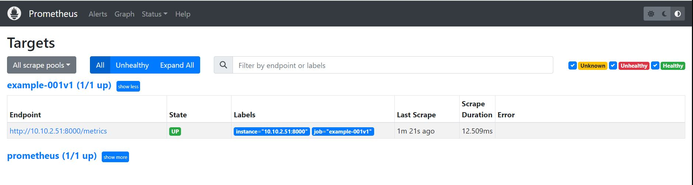
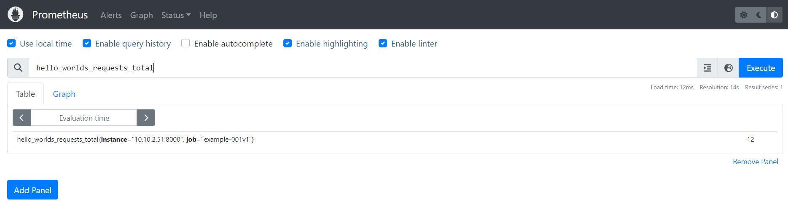
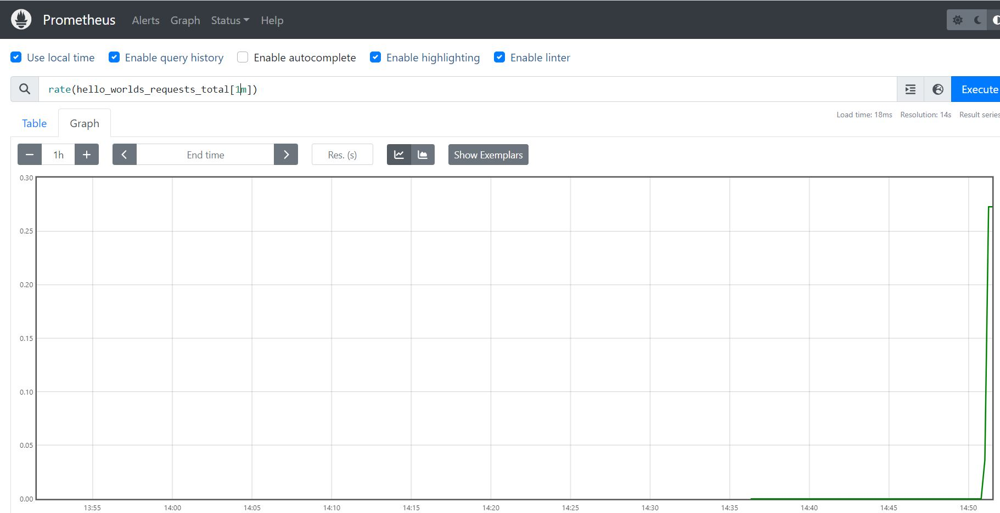

# Counter
Counters track either the number or size of events.  
Here we extend the code to add a counter on how many time '/hello' has been called.

## The Web app
***example-001.py***
```
import http.server
import random
from prometheus_client import start_http_server
from prometheus_client import Counter

# Prometheus metrics must be defined before they are used.
# Here we define a counter called hello_worlds_total.
# It has a help string of Hello Worlds requested.,
# which will appear on the /metrics page to help you understand what the metric means.

# Metrics are automatically registered with the client library in the default registry.
# A registry is a place where metrics are registered, to be exposed

REQUESTS = Counter('hello_worlds_requests',    'Hello Worlds requested.')
WRONG_REQUESTS = Counter('wrong_requests',     'Wrong Requests received.')
EXCEPTIONS = Counter('hello_world_exceptions', 'Exceptions serving Hello World.')


class MyHandler(http.server.BaseHTTPRequestHandler):
    def do_GET(self):
        if self.path == '/hello':
            # Increment metric
            REQUESTS.inc()
            self.send_response(200)
            self.end_headers()
            self.wfile.write(b'Hello World')

            with EXCEPTIONS.count_exceptions():
               if random.random() < 0.2:
                  raise Exception
        else:
            # Increment metric
            WRONG_REQUESTS.inc()
            self.send_error(404)


if __name__ == "__main__":
    start_http_server(8000)
    server = http.server.HTTPServer(('', 8001), MyHandler)
    print('Prometheus metrics available on port: 8000 /metrics')
    print('HTTP serveravailable on port 8001')
    server.serve_forever()
```
## The Dockerfile and Build and Push
```
FROM python:3.9-alpine

WORKDIR /app
COPY ./example-001.py .

RUN python -m venv /opt/venv
ENV PATH="/opt/venv/bin:$PATH"
RUN pip install --upgrade pip
RUN pip install prometheus_client

EXPOSE 8001
EXPOSE 8000
ENTRYPOINT ["python", "example-001.py"]

```

We now build the docker image and tag it "example-001:v1" 

```
$ docker build  -t example-001:v1 .

$ docker images
REPOSITORY                                 TAG          IMAGE ID       CREATED          SIZE
example-001                                v1           21e3a4af6f17   33 seconds ago   86.8MB

$ docker tag  example-001:v1  centos8s-server.singleton.net:443/example-001:v1
$ docker images
REPOSITORY                                      TAG          IMAGE ID       CREATED              SIZE
example-001                                     v1           21e3a4af6f17   About a minute ago   86.8MB
centos8s-server.singleton.net:443/example-001   v1           21e3a4af6f17   About a minute ago   8

$ docker push centos8s-server.singleton.net:443/example-001:v1
The push refers to repository [centos8s-server.singleton.net:443/example-001]
3c733ef947da: Pushed
31c16f878e29: Pushed
0dc7a55d0f25: Pushed
f6c0cfa560bf: Pushed
d2f43e9a0aef: Pushed
b0f56ca192f9: Layer already exists
59a47c329acd: Layer already exists
ea113223a18f: Layer already exists
3efb846cc795: Layer already exists
7cd52847ad77: Layer already exists
v1: digest: sha256:8494bb359df38573848c813760e1db70b4e79b0ebcf3a0d70a61d56c2f3dbf55 size: 2414
```
## Deployment
```
$ kubectl apply -f example-001v1-deployment.yaml
deployment.apps/example-001v1 created

$ k get pods -n monitoring
NAME                                     READY   STATUS    RESTARTS        AGE
curl                                     1/1     Running   1 (3h ago)      3h1m
example-001-5c5684868b-ndtnx             1/1     Running   0               105m
example-001v1-9cc6ff6c9-v4mw6            1/1     Running   0               35s
prometheus-deployment-847b77bd49-4bnnq   1/1     Running   0               88m
```
## Change Prometheus confimap
```
$ k apply -f example-001v1-configmap.yaml
configmap/prometheus-server-conf configured
$ k delete pod prometheus-deployment-847b77bd49-4bnnq -n monitoring
pod "prometheus-deployment-847b77bd49-4bnnq" deleted
```
## Verify metrics
We send some requests to the application with correct and some with incorrect URL path.  
Occasionally some random Exceptions are rised so we increment EXCEPTION counter too.
```
$ k get pods -o wide
NAME                                     READY   STATUS    RESTARTS       AGE   IP            NODE         NOMINATED NODE   READINESS GATES
curl                                     1/1     Running   2 (121m ago)   38d   10.10.2.10    k8s-node2    <none>           <none>
example-001v1-9cc6ff6c9-tnskw            1/1     Running   0              97s   10.10.1.220   k8s-node1    <none>           <none>
prometheus-deployment-847b77bd49-p9jqq   1/1     Running   0              54s   10.10.1.221   k8s-node1    <none>           <none>

# query the application pod with som http requests
$ kubectl exec curl -n monitoring -it -- /bin/sh
[ root@curl:/ ]$ curl http://10.10.1.220:8001/hello
[ root@curl:/ ]$ curl http://10.10.1.220:8001/hello
[ root@curl:/ ]$ curl http://10.10.1.220:8001/hello
[ root@curl:/ ]$ curl http://10.10.1.220:8001/hello
[ root@curl:/ ]$ curl http://10.10.1.220:8001/hello
[ root@curl:/ ]$ curl http://10.10.1.220:8001/helliss
[ root@curl:/ ]$ curl http://10.10.1.220:8001/helliss
[ root@curl:/ ]$ curl http://10.10.1.220:8001/helliss
...
...

# query the application pod to retrieve the metrics 
[ root@curl:/ ]$ curl http://10.10.2.51:8000/metrics
...
...
# HELP hello_worlds_requests_total Hello Worlds requested.
# TYPE hello_worlds_requests_total counter
hello_worlds_requests_total 12.0
# HELP hello_worlds_requests_created Hello Worlds requested.
# TYPE hello_worlds_requests_created gauge
hello_worlds_requests_created 1.6849306030837066e+09
# HELP wrong_requests_total Wrong Requests received.
# TYPE wrong_requests_total counter
wrong_requests_total 8.0
# HELP wrong_requests_created Wrong Requests received.
# TYPE wrong_requests_created gauge
wrong_requests_created 1.6849306030837271e+09
# HELP hello_world_exceptions_total Exceptions serving Hello World.
# TYPE hello_world_exceptions_total counter
hello_world_exceptions_total 2.0
# HELP hello_world_exceptions_created Exceptions serving Hello World.
# TYPE hello_world_exceptions_created gauge
hello_world_exceptions_created 1.6849306030837412e+09
```

We can see that the following counters have been incremented:
* rong_requests_total 8.0
* hello_worlds_requests_total 12.0
* hello_world_exceptions_total 2.0

## see Prometheus UI
In the Prometheus UI in Status -> Targets the example001v1 target should be visible as follow:



