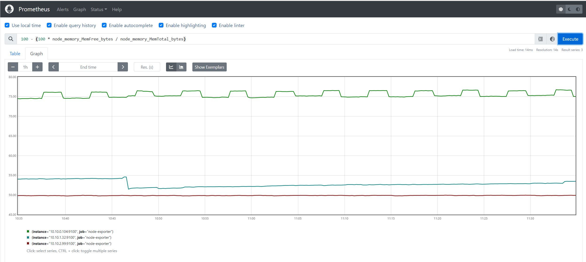
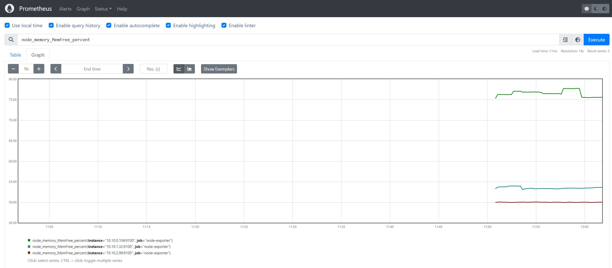

# Recording Rules
* Prometheus Recording Rules allow to pre-compile the values of expressions and queries and save the result as their own separate set of time-series data.
* They are evaluated on a schedule. at each run the execute an expression and save the result as a metric.o
* They are usefull when we need to run complex and expensive queries frequently. Instead to execute the query in the dashboard when needed a recording rule can be put in place to precalculate the value and save it as a metric. In this way we simply access a metric value.
To Setup Recording Rules are configure in yaml file pointed by the ***rules_files*** section of the prometheus YAML file.

## Recording rules YAML file syntax
Basically a recording rule file has the following elements:
* group name : All Rules are contained in groups
* interval : how often the rule evaluated
* the rule section : containing the rules
	- recording :  the name of the metric which will contains the result of the expression
          expr : the expression or query to be executed

As an example lett say we would like to perform the following calculation and expose the value as a metrics.
```
100 - (100 * node_memory_MemFree_bytes / node_memory_MemTotal_bytes)
```

if we run it inside prometheus dashboard we will obtaine the following graph


Rather than remembering and typing this query every time, we can create a recording rule that will run at a chosen interval and make the data available as a time series
The following lines should be added to the prometheus confimap.
```
groups:
  - name: custom_rules
    rules:
      - record: node_memory_MemFree_percent
        expr: 100 - (100 * node_memory_MemFree_bytes / node_memory_MemTotal_bytes)
```

***recording-rules-prometheus-configmap.yaml***

```
---
apiVersion: v1
kind: ConfigMap
metadata:
  name: prometheus-server-conf
  labels:
    name: prometheus-server-conf
  namespace: monitoring
data:
  prometheus.rules: |-
    groups:
    - name: custom_rules
      rules:
      - record: node_memory_MemFree_percent
        expr: 100 - (100 * node_memory_MemFree_bytes / node_memory_MemTotal_bytes)
    - name: devopscube demo alert
      rules:
      - alert: High Pod Memory
        expr: sum(container_memory_usage_bytes) > 1
        for: 1m
        labels:
          severity: slack
        annotations:
          summary: High Memory Usage
  prometheus.yml: |-
    global:
      scrape_interval: 5s # default is every 1 minute
      scrape_timeout: 5s # default 10s
      evaluation_interval: 5s  # default is every 1 minute How frequently to evaluate rules
    rule_files:
      - /etc/prometheus/prometheus.rules
    alerting:
      alertmanagers:
      - scheme: http
        static_configs:
        - targets:
          - "aletargetsrtmanager.monitoring.svc:9093"
    scrape_configs:
      - job_name: prometheus
        static_configs:
          - targets:
             - localhost:9090

      - job_name: node-exporter
        kubernetes_sd_configs:
           - role: endpoints
        relabel_configs:
           - source_labels: [__meta_kubernetes_endpoints_name]
             regex: node-exporter
             action: keep

      - job_name: docker-exporter
        static_configs:
           - targets: ['192.168.56.200:9323']

      - job_name: 'cAdvisor'
        static_configs:
        - targets: ['192.168.56.200:8080']

      - job_name: 'kube-state-metrics'
        static_configs:
          - targets: ['kube-state-metrics.kube-system.svc.cluster.local:8080']

      - job_name: 'kube-state-telemetrics'
        static_configs:
          - targets: ['kube-state-metrics.kube-system.svc.cluster.local:8081']
```

Apply the the new config map and restart the prometheus POD tu pick up the new config
```
$ kubectl apply -f recording-rules-prometheus-configmap.yaml
configmap/prometheus-server-conf configured

$ kubectl delete pod prometheus-deployment-55d57cf76f-d8x6r
pod "prometheus-deployment-55d57cf76f-d8x6r" deleted
```

Now in the prometheus Dashbord we should be able to see the metrics ***node_memory_MemFree_percent*** containing the values of our expression

