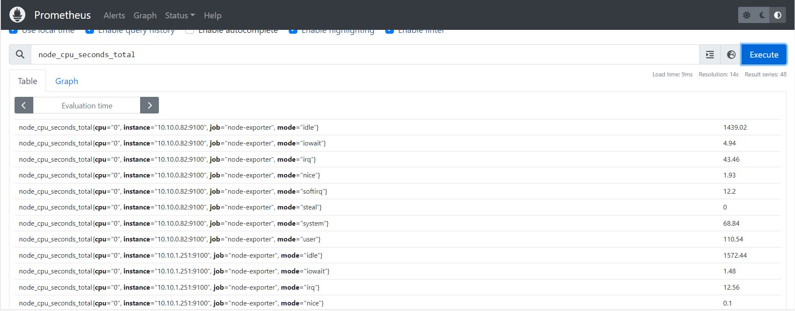
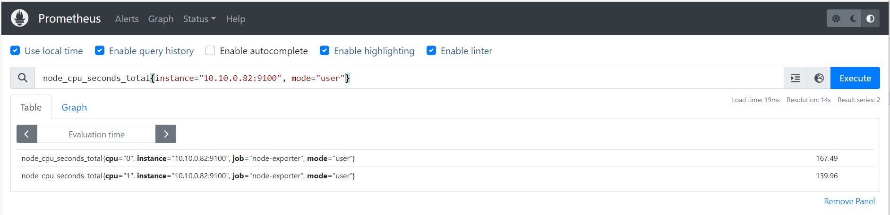
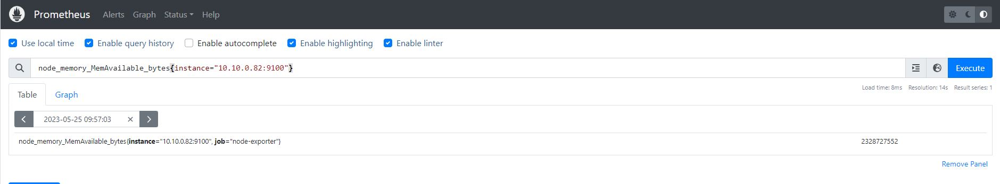
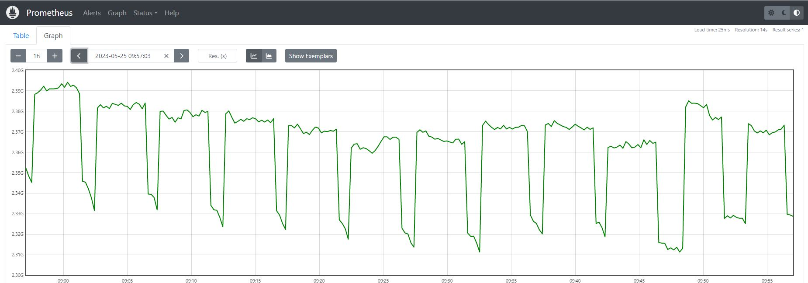

# Time Series Data
All Prometheus data is fundamentally stored in the form of a time series.  
Time Series Data consists of a series of values associated with different points in time.  
Every time series is uniquely identified by its metric name and optional key-value pairs called labels.
  
## Metrics Name
The metric name specifies the general feature of a system that is measured.  

An example of a metric name:
```
node_cpu_seconds_total
```
which mesure the total amount of CPU time usage in seconds.  

The metric name may contain ASCII letters and digits, as well as underscores and colons. It must match the regex:
```
[a-zA-Z_:][a-zA-Z0-9_:]*.
```
The metric name is very general, *node_cpu_seconds_total* metric name does not point to a specific CPU or even specifice node.
If we query prometheus using just the metric name we probably get a list of multiple set of of time series data.  
Infact quering on prometues UI for node_cpu_seconds_total we get this result : 



We can see we get different time series for differen CPU  (0 or 1), different nodes and also for differne CPU states: user, idle, system etc.  
  

## Metrics Labels
Having a look to one of the time series returned by prometheus UI when querying using the metrics name alone we that it refere to different labels: cpu, instance, job, mode.  
Those are *metrics labels*. Prometheus uses labels to provide a **dimenstional data model**.  
A unique combination of metric name and set a set of labels identify a particular set og time-series data.  
we can query again the prometheus UI by sepcifiying for example the label 
```
*node_cpu_seconds_total{instance="10.10.0.82:9100",mode="user"}*
```
to get the time series for a specific node and specific CPU state.



A particular metrics can have  mode then one label.

Label names may contain ASCII letters, numbers, as well as underscores. They must match the regex 
```
[a-zA-Z_][a-zA-Z0-9_]*. i
```
Label names beginning with **__** are reserved for internal use.

## Metric Types
The Prometheus client libraries offer four core metric types.

### Counter
A cumulative metric that represents a single monotonically increasing counter. Is a single numbert that can only increase or reset to zero. Counters cant never decrease.
  
Examples are :
* Number of exceptions occured in a code
* Number of HTTP request received
* Number of application restarts

Here for example we query for *node_cpu_seconds_total* narrowed down for a specific node, cpu and mode and for the last 5 minutes :
```
node_cpu_seconds_total{instance="10.10.0.82:9100", mode="user", cpu="0"}[5m]
```
What we obtain is a set of values over time tha always increase, and this because this metrics is a counter.  
This metrics is telling us the total amount of CPU used in user mode since the server started up.


### Gauge 
A metric that represents a single numerical value that can arbitrarily go up and down.  
  
Examples are :
* Current CPU usage
* Current memory usage
* Current active threads

Here for example we query for *node_memory_MemAvailable_bytes* narrowed down for a specific node.
```
node_memory_MemAvailable_bytes{instance="10.10.0.82:9100"}
```
What we obtain is the current value which may increase of decrease over time



In the form of graph we see the memory usage over time:



### Histogram 
A Histogram count the number of obeservations/events that fall into a set of configurable ***buckets***, each with its own time series.  
Labels are used to differentiate between buckets.
For example, we can count how many HTTP requests fall into a response time, how long an HTTP request takes to complete:
```
http_request_duration_seconds_bucket{le="0.3"}
http_request_duration_seconds_bucket{le="0.6"}
http_request_duration_seconds_bucket{le="1.0"}
```
Histogram include also :
```
http_request_duration_seconds_sum
http_request_duration_seconds_count
```
* **_count**: A counter with the total number of mesurements.
* **_sum**: A counter with the sum of the values of all measurements.

### Summary
Is similar to Histogram, but expose metrics in the form of ***quantiles*** instead of ***buckets***  
While buckets divide values based on specific boundaries, quantiles divide values base on the percentils into which the fall.  
Summary also has ***_sum*** and ***_count_***
