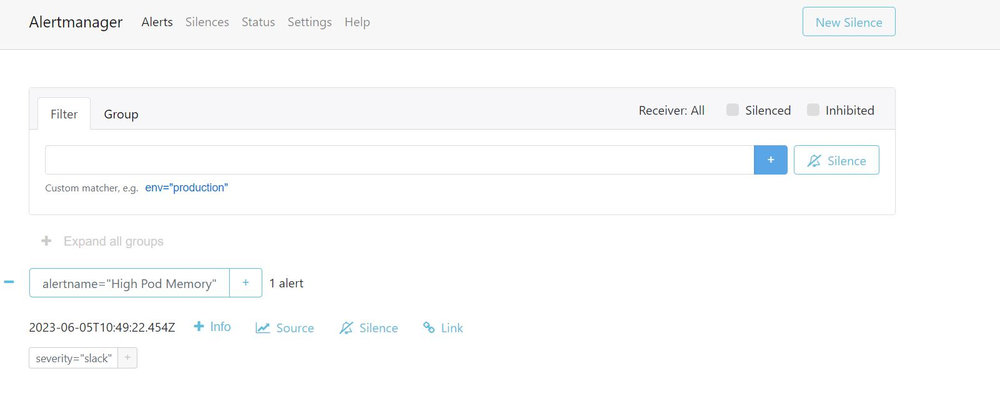
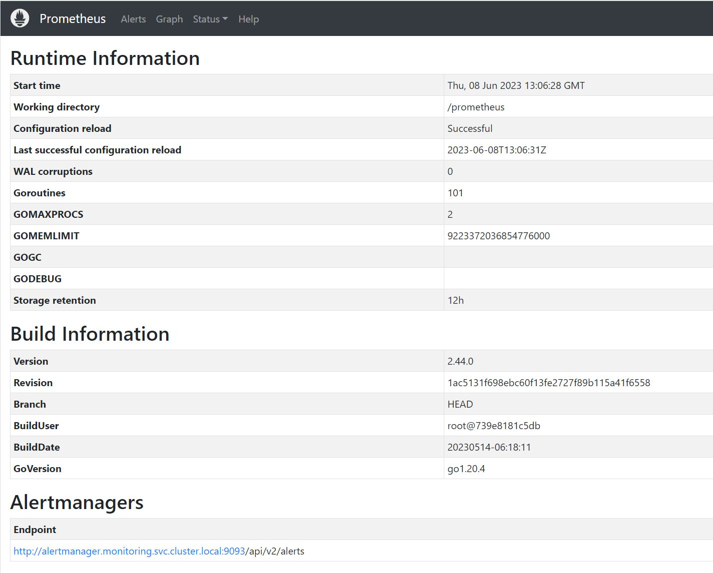
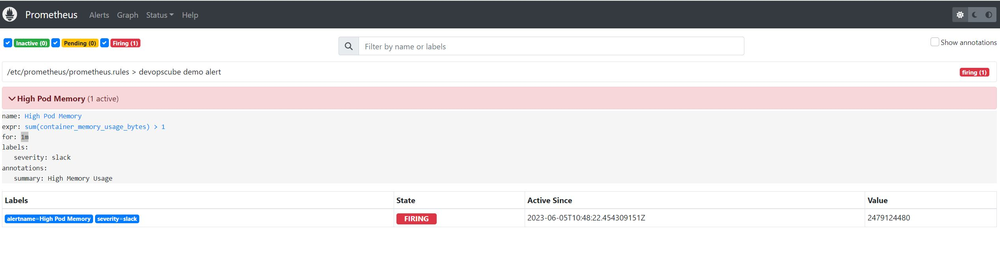
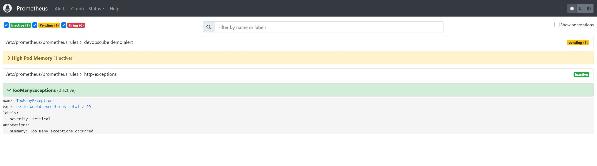
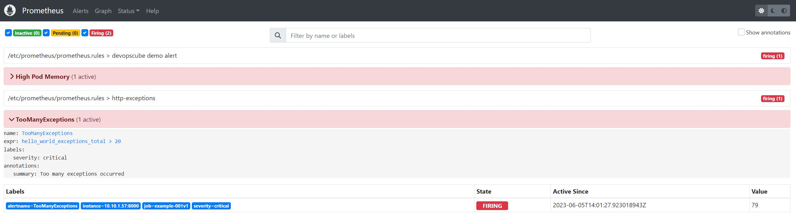
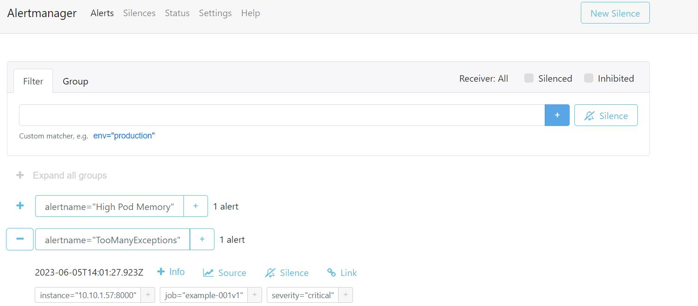

# Alerting
## Alert Manager
The alert manager is a separate opensource process that works with prometheus server.  
Is responsible for handling alerts sent to it by clients such Prometheus server.  
Alerts are sent as notification to the alert manager and triggered automatically by metric data.
AlertManager provides a rich set of integrations for the notifications. However, in real life projects, these lists are in general not enough,
therefore is recommended to implement custom notification integrations via the webhook receiver. A webhook receiver allows configuring a generic receiver.
  
In This section we create a webhook application which make use of the freemobile service notification for IOT devices.
The application will be in charge to expose a REST API to be used by the AlertManager to POST alerts.

In General what the Alert manager does:
* deduplicate alerts when multiple clients send the same alert.
* group multiple alert together when they appen around the same time.
* route the alerts to the right receiver destination such as email, SMS, chats.
* it also takes care of silencing and inhibition of alerts by muting them for a given time.

The Alert Manager **does not** create alerts and **does not** determine when alerts needs to be sent based on metrics data.   
Prometheus instead is in charge of that, and forward the alerts to the alert manager.

## SMS Webhook Application
The SMS Webhook is consists of simple python application that expose that make use of the freemobile service notification for IOT devices.  
This SMS notification services is a free service for all freemobile subscribers that allow sending SMS notifications on the personal mobile from any devices internet connected.  
The Application will be used by other kubernetes microservices and for example by Prometheus Alert Manager to notify alerts.
The implementation consistes of simple **httpd server** that listen on port **9088** for a message to be sent to the fremobile service, thhe REST API served by the application is **/send**.  
Some metrics are also exposed on port **9089** at **/metrics**

* sms_sender_received_requests
* sms_sender_wrong_requests
* sms_sender_succeeded_requests
* sms_sender_failed_requests

The deployment will consists of
* a Secret holding the credentials to connect the freemobile SMS notification service.
* a deployment with the application specifications
* a service to expose the application to the other microservices

### SMS Webhook python code

The python code can be seen here [sms-sender.py](./SMS-webhook/sms-sender.py)  
The Dokerfile is here [Dockerfile](./SMS-webhook/Dokerfile)
We need to Build, tag and push the docker image to our previously deployed private docker registry in order for the kubernetes deployment to be able to pull the image.

### SMS Webhook Secret
The SMS Webhook needs some credentials to access the freemobile SMS notification service that can be acquired on the freemobile we personal account page.
Once obtained, the credentials can be stored inside a secret so that can be used by the application to access the service.
Here is an example, id and key should be replaced that the personale and freemobile ID and the provided key for the SMS notification service.

***secret.yaml***
```
apiVersion: v1
data:
  id: 'dXNlcmlk'
  key: 'dXNlcmtleQ=='
kind: Secret
metadata:
  creationTimestamp: null
  name: sms-secret
  namespace: monitoring
```

```
$ kubectl apply -f secret.yaml
secret/sms-secret configured

$ kubectl get secret sms-secret
NAME         TYPE     DATA   AGE
sms-secret   Opaque   2      10s
```
### SMS Webhook Deployment
The Deployment expose the two container ports 9088 and 9089, it also setup two environment variables containing the credentials ID and KEY used by the python application to access freemobile SMS notification service.

```
---
apiVersion: apps/v1
kind: Deployment
metadata:
  name: sms-sender
  namespace: monitoring
spec:
  replicas: 1
  selector:
    matchLabels:
      app: sms-sender
  template:
    metadata:
      name: sms-sender
      labels:
        app: sms-sender
    spec:
      imagePullSecrets:
      - name: centos8s-server-secret
      containers:
      - name: sms-sender
        imagePullPolicy: Always
        image:  centos8s-server.singleton.net:443/sms-sender:latest
        ports:
        - name: sms-sender
          containerPort: 9088
          protocol: TCP
        - name: metrics
          containerPort: 9089
          protocol: TCP
        resources:
            requests:
              cpu: 500m
              memory: 500M
            limits:
              cpu: 1
              memory: 1Gi
        env:
        - name: ID
          valueFrom:
            secretKeyRef:
              name: sms-secret
              key: id
        - name: KEY
          valueFrom:
            secretKeyRef:
              name: sms-secret
              key: key
```
```
$ kubectl apply -f deployment.yaml
deployment.apps/sms-sender created

$ kubectl get pods
NAME                                     READY   STATUS        RESTARTS         AGE
sms-sender-76b76644b-72gb6               1/1     Running       0                10s
...
...
```

###  SMS Webhook Service
The service is used by other microservices to access the webhook application endpoints.
```
apiVersion: v1
kind: Service
metadata:
  name: sms-sender
  namespace: monitoring
  annotations:
      prometheus.io/scrape: 'true'
      prometheus.io/port:   '9089'
spec:
  selector:
    app: sms-sender
  type: ClusterIP
  ports:
    - port: 9088
      targetPort: 9088
      name: sms-sender
    - port: 9089
      name: metrics
      targetPort: 9089
```
```
$ kubectl apply -f service.yaml
service/sms-sender created

$ kubectl get services
NAME                           TYPE        CLUSTER-IP       EXTERNAL-IP   PORT(S)             AGE
sms-sender                     ClusterIP   10.110.34.105    <none>        9088/TCP,9089/TCP   7s
...
...
```

### SMS Webhook Verification
From a POD we should be able to connect to the SMS Webhook and request to send and SMS to our own freemobile number.  
For this test we use the usual ***curl*** pod.
```
$ kubectl exec curl -it -- /bin/sh
[ root@curl:/ ]$ nslookup sms-sender
Server:    10.96.0.10
Address 1: 10.96.0.10 kube-dns.kube-system.svc.cluster.local

Name:      sms-sender
Address 1: 10.110.34.105 sms-sender.monitoring.svc.cluster.local

[ root@curl:/ ]$ curl -vvv http://sms-sender.monitoring.svc.cluster.local:9088/send -d "Hello From SMS Sender"
> POST /send HTTP/1.1
> User-Agent: curl/7.35.0
> Host: sms-sender.monitoring.svc.cluster.local:9088
> Accept: */*
> Content-Length: 21
> Content-Type: application/x-www-form-urlencoded
>
< HTTP/1.0 200 OK
< Server: BaseHTTP/0.6 Python/3.9.16
< Date: Thu, 08 Jun 2023 14:04:28 GMT
< Content-type: text/html

```

If all works correctly we should soon receive the Hello message on our mobile phone.


## Deploy Alert Manager

The Alert Manager installation consist of :
* A Persitent volume and Persistent Volume Claim to store persistent data.
* A config map for AlertManager configuration
* A config Map for AlertManager alert templates
* Alert Manager Kubernetes Deployment
* Alert Manager service
* Alert Manager ingress to access the web UI

We deploy all the AlertManager resources in the same Prometheus namespace: ***monitoring*** just to group our experiments together.

### Deploy the PV and PVC

The Alert Manager need a local directory where it can store some data.  
As we did for prometheus and grafana we setup a PV and PVC to be used for this pourpose .

We create then, on NFS server, a dedicate folder for the AlertManager.  

```
$ cd /mnt/nfs_shares/cluster_nfs/
$ ll
total 4
drwxrwxrwx 6 nobody nobody   77 Jun  1 14:08 Grafana
drwxrwxrwx 8 nobody nobody 4096 Jun  1 13:00 Prometheus

# Create the directory for the alert manager
$ sudo mkdir AlertManager
$ sudo chown nobody.nobody AlertManager
$ sudo chmod 777  AlertManager


$ ll
total 4
drwxrwxrwx 2 nobody nobody    6 Jun  1 14:12 AlertManager
drwxrwxrwx 6 nobody nobody   77 Jun  1 14:08 Grafana
drwxrwxrwx 8 nobody nobody 4096 Jun  1 13:00 Prometheus
```

Now using the **nfs-storageclass** we create a **PV** pointing to the NFS server share, and a **PVC** that will be used bye the aler manager POD  
to claim a storage volume for its internal data.

***alert-manager-storage.yaml***
```
---
apiVersion: v1
kind: PersistentVolume
metadata:
  name: alert-manager-pv
  namespace: monitoring
  labels:
    app: alert-manager-deployment
spec:
  storageClassName: nfs-storageclass
  capacity:
    storage: 1Gi
  accessModes:
    - ReadWriteMany
  nfs:
    server: centos8s-server.singleton.net
    path: /mnt/nfs_shares/cluster_nfs/AlertManager
---
apiVersion: v1
kind: PersistentVolumeClaim
metadata:
  name: alert-manager-pvc
  namespace: monitoring
  labels:
    app: alert-manager-deployment
spec:
  storageClassName: nfs-storageclass
  accessModes:
    - ReadWriteMany
  resources:
    requests:
      storage: 500Mi
```

```
$ kubectl apply -f alert-manager-storage.yaml
persistentvolume/alert-manager-pv created
persistentvolumeclaim/alert-manager-pvc created

$ kubectl get pv
NAME                      CAPACITY   ACCESS MODES   RECLAIM POLICY   STATUS     CLAIM                                      STORAGECLASS       REASON   AGE
alert-manager-pv          1Gi        RWX            Retain           Bound      monitoring/alert-manager-pvc               nfs-storageclass            6s
grafana-pv                1Gi        RWX            Retain           Bound      monitoring/grafana-pvc                     nfs-storageclass            2d17h
prometheus-pv             1Gi        RWX            Retain           Bound      monitoring/prometheus-pvc                  nfs-storageclass            85d

$ kubectl get pvc
NAME                STATUS   VOLUME             CAPACITY   ACCESS MODES   STORAGECLASS       AGE
alert-manager-pvc   Bound    alert-manager-pv   1Gi        RWX            nfs-storageclass   22s
grafana-pvc         Bound    grafana-pv         1Gi        RWX            nfs-storageclass   2d17h
prometheus-pvc      Bound    prometheus-pv      1Gi        RWX            nfs-storageclass   85d
```

### Alert Manager Configmap
Here we configure the Alertmanager to send us an SMS whenever an alert reaches the firing state.
The following is an example on how we should configure the **receiver**.  
  
We also instruct the AlertManager about the location of the **templates** files.  
Templates are used to better format the sent alert to the receiver.

We define **team-X-sms-web-hook** receiver to be the default receiver as well as its configuration.  
The *team-X-sms-web-hook* receiver configuration show the service URL of the webhook application used to request SMS notifications.


***alert-manager-configmap.yaml***
```
kind: ConfigMap
apiVersion: v1
metadata:
  name: alertmanager-config
  namespace: monitoring
data:
  config.yml: |-
    global:
      resolve_timeout:  1m
    templates:
    - '/etc/alertmanager-templates/*.tmpl'

    route:
      group_by: ['alertname', 'cluster', 'service']
      group_wait: 10s
      group_interval: 5m
      repeat_interval: 30m
      receiver: team-X-sms-web-hook

      routes:
      - receiver: team-X-sms-web-hook

    receivers:
      - name: team-X-sms-web-hook
        webhook_configs:
        - url: "http://sms-sender.monitoring.svc.cluster.local:9088/send"

    inhibit_rules:
    - source_match:
        severity: 'critical'
      target_match:
        severity: 'warning'
      equal: ['alertname', 'dev', 'instance']
```

We need ***alert templates*** for all the receivers we use (email, Slack, etc).   
Alert manager will dynamically substitute the values and deliver alerts to the receivers based on the template.   
You can customize these templates based on your needs.

Here is an example of a custm template for the subject and the body of the alert email.  

### Alert template Configmap
***alert-manager-template.yaml***
```
TBD
```

### Alert Manager Deployment

In the Deployment file *args* section we specify the location of the config file and the path that the Alertmanager can use for internal storage which is where we mount our PV as NFS.
We also mount the configuration volumes int dedicate place.


***AlertManagerDeployment.yaml***

```
apiVersion: apps/v1
kind: Deployment
metadata:
  name: alertmanager
  namespace: monitoring
spec:
  replicas: 1
  selector:
    matchLabels:
      app: alertmanager
  template:
    metadata:
      name: alertmanager
      labels:
        app: alertmanager
    spec:
      containers:
      - name: alertmanager
        image: prom/alertmanager:latest
        args:
          - "--config.file=/etc/alertmanager/config.yml"
          - "--storage.path=/alertmanager"
          - "--log.level=debug"
        ports:
        - name: alertmanager
          containerPort: 9093
        resources:
            requests:
              cpu: 500m
              memory: 500M
            limits:
              cpu: 1
              memory: 1Gi
        volumeMounts:
        - name: config-volume
          mountPath: /etc/alertmanager
        - name: templates-volume
          mountPath: /etc/alertmanager-templates
        - name: alertmanager-storage-volume
          mountPath: /alertmanager
      volumes:
      - name: config-volume
        configMap:
          name: alertmanager-config
      - name: templates-volume
        configMap:
          name: alertmanager-templates
      - name: alertmanager-storage-volume
        nfs:
          server: centos8s-server.singleton.net
          path: /mnt/nfs_shares/cluster_nfs/AlertManager
```

### Alert Manager service

The service will be used to instruct prometheus on where alerts should be sent.

***alert-manager-service.yaml***
```
---
kind: Service
apiVersion: v1
metadata:
  name: alertmanager-service-ingress
  namespace: monitoring
spec:
  selector:
    app: alertmanager
  ports:
  - protocol: TCP
    port: 9093
    targetPort: 9093
    name: http
---
apiVersion: networking.k8s.io/v1
kind: Ingress
metadata:
  name: alertmanager-ui
  namespace: monitoring
spec:
  ingressClassName: nginx
  rules:
  - host: alertmanager.singleton.net
    http:
      paths:
      - path: /
        pathType: Prefix
        backend:
          service:
            name: "alertmanager-service-ingress"
            port:
              number: 9093
```

### Verification

Verify we can communicate with the alert manager from inside the cluster. 
Here we verify that a POD from inside the cluster can communicate to the alert manager as it would do prometheus by targeting port 9093.

```
$ kubectl run curl --image=radial/busyboxplus:curl -i --tty

If you don't see a command prompt, try pressing enter.
[ root@curl:/ ]$
[ root@curl:/ ]$
[ root@curl:/ ]$ nslookup alertmanager
Server:    10.96.0.10
Address 1: 10.96.0.10 kube-dns.kube-system.svc.cluster.local

Name:      alertmanager-service-ingress
Address 1: 10.99.85.39 alertmanager-service-ingress.monitoring.svc.cluster.local

[ root@curl:/ ]$ curl http://alertmanager-service-ingress.monitoring.svc.cluster.local:9093
<!DOCTYPE html>
<html lang="en">
    <head>
        <meta charset="utf-8">
        <meta name="viewport" content="width=device-width, initial-scale=1, shrink-to-fit=no">
        <link rel="icon" type="image/x-icon" href="favicon.ico" />
        <title>Alertmanager</title>
    </head>
    <body>
        <script>
            // If there is no trailing slash at the end of the path in the url,
            // add one. This ensures assets like script.js are loaded properly
            if (location.pathname.substr(-1) != '/') {
                location.pathname = location.pathname + '/';
                console.log('added slash');
            }
        </script>
        <script src="script.js"></script>
        <script>
            var app = Elm.Main.init({
                flags: {
                    production: true,
                    firstDayOfWeek: JSON.parse(localStorage.getItem('firstDayOfWeek')),
                    defaultCreator: localStorage.getItem('defaultCreator'),
                    groupExpandAll: JSON.parse(localStorage.getItem('groupExpandAll'))
                }
            });
            app.ports.persistDefaultCreator.subscribe(function(name) {
                localStorage.setItem('defaultCreator', name);
            });
            app.ports.persistGroupExpandAll.subscribe(function(expanded) {
                localStorage.setItem('groupExpandAll', JSON.stringify(expanded));
            });
            app.ports.persistFirstDayOfWeek.subscribe(function(firstDayOfWeek) {
                localStorage.setItem('firstDayOfWeek', JSON.stringify(firstDayOfWeek));
            });
        </script>
    </body>
</html>
```

### Alert Manager UI
As usuall to make the ingress to work we need to add an entry in */etc/hosts*.
***/etc/hosts***
```
`192.168.56.10  alertmanager.singleton.net
```

By accessing the configure ingress url ***alertmanager.singleton.net*** we access the dashboard 



## Hight Availabilty and Alert Manager

We can setup multiple alert manager instances creating a cluster. These instances works with one another to de-duplicate and groups alerts.  
Prometheus should be aware of each alert manager instances. This is done by adding them the the prometheus configuration.
Each Alert Manager can be installed in different namespaces and configure  with --cluster.peer parameter pointing to the other alertmanagers PDD
Example :
```
# On alert manager in default namespace
    - --cluster.peer=alertmanager.monitoring.svc.cluster.local:9094

# On alert manager in monitoring namespace
    - --cluster.peer=alertmanager.default.svc.cluster.local:9093
```

## Prometheus configuration
Prometheus should be now configured to use the correct service manager service endpoint.
```
    rule_files:
      - /etc/prometheus/prometheus.rules
    alerting:
      alertmanagers:
      - scheme: http
        static_configs:
        - targets:
          - "alertmanager-service-ingress.monitoring.svc.cluster.local:9093"
```

Note that in the prometheus configmap, ***prometheus.rules*** alredy have a demo alerting rule configured:
This rule instruct prometheus to fire an alert whenever the sum of the memory usage of all container in the cluster is greater then 1 form at least 1 mninute, basically always.
Sure enough as we start prometheus pod and the scrape intervall is passed, a *warning* alert goes in pending status. After a minute the alert is fired and notified to the AlertManager.

```
    - name: high-pod-memory-usage-rules
      rules:
      - alert: High Pod Memory
        expr: sum(container_memory_usage_bytes) > 1
        for: 1m
        labels:
          severity: warning
        annotations:
          summary: High Memory Usage
```

Reload the Prometheus configuration by restarting the prometheus POD.  
Now If we open the Prometheus dashboard under "Status->Runtime & Build Information" we see our configured alert manager is in the list of the AlertManagers.



## Alerting Rules
Are a way to define conditions and contet of Prometheus alerts.  
With alerting rules we define expressions conditions that will trigger en alert based on metrics data state.
Alerting rules are configured in the same way as recording rules. 
  
In Prometheus configuration file **prometheus.yaml** the location of the alerting rules files is defined in the **rule_files** oas we have seen for the recording rules.
There a **prometheus.rules** file is define with a rule rule alredy defined for an alert. All this can be seen inside the Prometheus config map.

Example
```
  prometheus.rules: |-
    groups:
    - name: custom_rules
      rules:
      - record: node_memory_MemFree_percent
        expr: 100 - (100 * node_memory_MemFree_bytes / node_memory_MemTotal_bytes)
    - name: devopscube demo alert
      rules:
      - alert: High Pod Memory
        expr: sum(container_memory_usage_bytes) > 1
        for: 1m
        labels:
          severity: slack
        annotations:
          summary: High Memory Usage
  prometheus.yml: |-
    global:
      scrape_interval: 5s # default is every 1 minute
      scrape_timeout: 5s # default 10s
      evaluation_interval: 5s  # default is every 1 minute How frequently to evaluate rules
    rule_files:
      - /etc/prometheus/prometheus.rules
    alerting:
      alertmanagers:
      - scheme: http
        static_configs:
        - targets:
          - "alertmanager-service-ingress.monitoring.svc.cluster.local:9093"
```

Basicaly the defined alert says that if the sum of the memory usage of the running containers is greater the 1 then an alert is fired.  
We can se this in the Prometheus dashboard under the Alert page:


## Define our Own Alert
Using the previous example application [Example1v1](../021-Observability/Example1v1/README.md) we define here an alert that is fired when the number of exception in the application is greater that 20.  
To do so we need to change prometheus configuration map to add the scrap_configs to target the aplication and we need also to define the alert as defined in the following prometheus configuration map.
```
---
apiVersion: v1
kind: ConfigMap
metadata:
  name: prometheus-server-conf
  labels:
    name: prometheus-server-conf
  namespace: monitoring
data:
  prometheus.rules: |-
    groups:
    - name: custom_rules
      rules:
      - record: node_memory_MemFree_percent
        expr: 100 - (100 * node_memory_MemFree_bytes / node_memory_MemTotal_bytes)
    - name: devopscube demo alert
      rules:
      - alert: High Pod Memory
        expr: sum(container_memory_usage_bytes) > 1
        for: 1m
        labels:
          severity: slack
        annotations:
          summary: High Memory Usage
    - name: http-exceptions
      rules: 
      - alert: TooManyExceptions
        expr: hello_world_exceptions_total > 20
        labels: 
          severity: critical
        annotations:
          summary: Too many exceptions occurred
  prometheus.yml: |-
    global:
      scrape_interval: 5s # default is every 1 minute
      scrape_timeout: 5s # default 10s
      evaluation_interval: 5s  # default is every 1 minute How frequently to evaluate rules
    rule_files:
      - /etc/prometheus/prometheus.rules
    alerting:
      alertmanagers:
      - scheme: http
        static_configs:
        - targets:
          - "alertmanager-service-ingress.monitoring.svc.cluster.local:9093"
    scrape_configs:
      - job_name: prometheus
        static_configs:
          - targets:
             - localhost:9090

      - job_name: node-exporter
        kubernetes_sd_configs:
           - role: endpoints
        relabel_configs:
           - source_labels: [__meta_kubernetes_endpoints_name]
             regex: node-exporter
             action: keep

      - job_name: docker-exporter
        static_configs:
           - targets: ['192.168.56.200:9323']

      - job_name: 'cAdvisor'
        static_configs:
        - targets: ['192.168.56.200:8080']

      - job_name: 'kube-state-metrics'
        static_configs:
          - targets: ['kube-state-metrics.kube-system.svc.cluster.local:8080']

      - job_name: 'kube-state-telemetrics'
        static_configs:
          - targets: ['kube-state-metrics.kube-system.svc.cluster.local:8081']

      - job_name: 'example-001v1'
        kubernetes_sd_configs:
        - role: pod
        relabel_configs:
        - source_labels: [__meta_kubernetes_pod_label_app_kubernetes_io_name]
          action: keep
          regex: example-001v1
        - source_labels: [__meta_kubernetes_pod_container_port_name]
          action: keep
          regex: metrics

```
As usuall to pick up the new config we need to restart prometheus. And if we open the prometheus dashboard on the alert page we will see that the **TooManyExceptions** is present.


### Testing the alert
To verify the alert get fire as we previously did for [Example1v1](../021-Observability/Example1v1/README.md) we query via **curl** the POD running the example for a time enought to have the application randonly raise the 20 exceptions we need.

```
$ kubectl get pods -o wide
NAME                                     READY   STATUS    RESTARTS        AGE     IP            NODE         NOMINATED NODE   READINESS GATES
curl                                     1/1     Running   1 (21m ago)     21m     10.10.1.62    k8s-node1    <none>           <none>
example-001v1-9c47bd5b9-82zkz            1/1     Running   0               36m     10.10.1.57    k8s-node1    <none>           <none>
...


$ kubectl exec curl -it -- /bin/sh
[ root@curl:/ ]$
[ root@curl:/ ]$ while true
> do
> curl http://10.10.1.57:8001/hello
> done
Hello WorldHello WorldHello WorldHello .. ...
```

At some point the number of raised exceptions reache the imposed treshold of 20 and the alert is fired, and we can see this on the prometheus dashboard.


If we open now the Alert Manger Dashboard we can see the prometheus as correctly sent the alert to the alert manager aswell


## Managing Alerts
Alert manager allow more soffisticated management around alerts fired bu prometheus.
* **Routing**
Alert Manager implement a ***routing tree*** which is represented in the route block of the alert manager config file.  
The routing tree control how and when alerts will be sent.
* **Grouping** 
Allow to combine multiple related alerts into a single notification. ( **group_by** )
* **Inhibition** 
Allow to suppress an alert if another alert is already firing.  ( **inhibit_rule** )
* **Silences** 
Is a way to temporarely turn off certain notifications.
