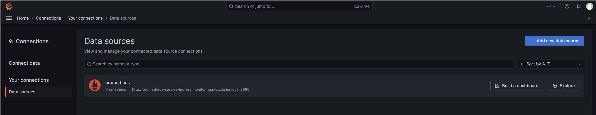
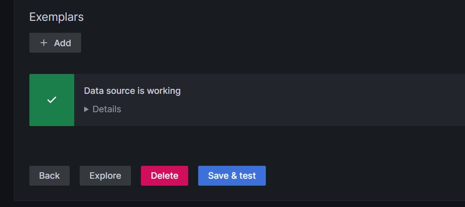
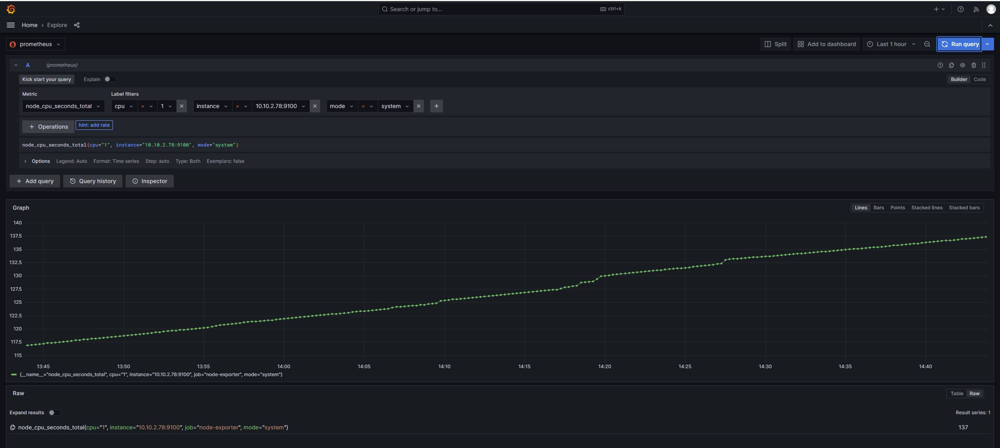

# Graphana
Using Grafana we can create dashboards from Prometheus metrics to monitor the kubernetes cluster.

Grafana is an open-source lightweight dashboard tool.

## Installation

### The confimap
A config map is needed to tell grafana about the metrics data sources. Here we define one datasource for our prometheus installation in kubernetes.  
Prometheus is reachable via the ingress that server the URL : "http://prometheus.singleton.net" but we can also directly target the services we have created in previous examples.  

``` 
$ kubectl get services
NAME                         TYPE        CLUSTER-IP      EXTERNAL-IP   PORT(S)          AGE
prometheus-service           NodePort    10.103.162.88   <none>        8080:30909/TCP   6d
prometheus-service-ingress   ClusterIP   10.110.95.79    <none>        9090/TCP         82d
```

Here we target the prometheus-service-ingress  service

***grafana-datasource-config.yml***

```
apiVersion: v1
kind: ConfigMap
metadata:
 name: grafana-datasources
 namespace: monitoring
data:
  prometheus.yaml: |-
    {
        "apiVersion": 1,
        "datasources": [
            {
               "access":"proxy",
                "editable": true,
                "name": "prometheus",
                "orgId": 1,
                "type": "prometheus",
                "url": "http://prometheus-service-ingress.monitoring.svc.cluster.local:9090"
                "version": 1
            }
        ]
    }

```

```
$ kubectl apply -f grafana-datasource-config.yml
configmap/grafana-datasources created

```

If we have different data sources we can add their yaml file in the *data* section.

### Persistent volume 
Grafana default path data is "/var/lib/grafana", this is the place whera grafana store it data. Is the place where it also store the dashboards we creates to display metrics.  
To keep data persistent, as we did for prometheus, we mount a NFS share in /var/lib/grafana via PV and PVC.

***storage.yaml***
```
---
apiVersion: v1
kind: PersistentVolume
metadata:
  name: grafana-pv
  namespace: monitoring
  labels:
    app: grafana-deployment
spec:
  storageClassName: nfs-storageclass
  capacity:
    storage: 1Gi
  accessModes:
    - ReadWriteMany
  nfs:
    server: centos8s-server.singleton.net
    path: /mnt/nfs_shares/cluster_nfs/Grafana
---
apiVersion: v1
kind: PersistentVolumeClaim
metadata:
  name: grafana-pvc
  namespace: monitoring
  labels:
    app: grafana-deployment
spec:
  storageClassName: nfs-storageclass
  accessModes:
    - ReadWriteMany
  resources:
    requests:

```

### The deployment
The deployment YAML file mount the configmap end also uses a emptyDir volume for its internal storage.

```
apiVersion: apps/v1
kind: Deployment
metadata:
  name: grafana-deployment
  namespace: monitoring
spec:
  replicas: 1
  selector:
    matchLabels:
      app: grafana
  template:
    metadata:
      name: grafana
      labels:
        app: grafana
    spec:
      containers:
      - name: grafana
        image: grafana/grafana:latest
        ports:
        - name: grafana
          containerPort: 3000
        resources:
          limits:
            memory: "1Gi"
            cpu: "1000m"
          requests:
            memory: 500M
            cpu: "500m"
        volumeMounts:
          - mountPath: /var/lib/grafana
            name: grafana-storage
          - mountPath: /etc/grafana/provisioning/datasources
            name: grafana-datasources
            readOnly: false
      volumes:
        - name: grafana-storage-volume
          nfs:
            server: centos8s-server.singleton.net
            path: /mnt/nfs_shares/cluster_nfs/Grafana
        - name: grafana-datasources
          configMap:
              defaultMode: 420
              name: grafana-datasources
```
```
$ kubectl apply -f grafana-deployment.yaml
deployment.apps/grafana created

$ kubectl get pods
NAME                                     READY   STATUS    RESTARTS        AGE
curl                                     1/1     Running   11 (174m ago)   53d
grafana-5469c64c7d-fmxw6                 1/1     Running   0               18s
node-exporter-8wpbq                      1/1     Running   4 (174m ago)    5d20h
node-exporter-jbxfh                      1/1     Running   4 (174m ago)    5d20h
node-exporter-tbtw2                      1/1     Running   4 (174m ago)    5d20h
prometheus-deployment-55d57cf76f-5zkmw   1/1     Running   1 (174m ago)    3d19h
```

### The Service

As for prometheus we create a grafana service and an ingress to access the grafana dashboard from outside the kubernetes cluster using a specific URL.
***grafana-service-.yaml***

```
---
apiVersion: v1
kind: Service
metadata:
  name: grafana-service-ingress
  namespace: monitoring
  annotations:
      prometheus.io/scrape: 'true'
      prometheus.io/port:   '3000'
spec:
  selector: 
    app: grafana
  ports:
    - protocol: TCP
      port: 3000
      targetPort: 3000
      name: http
---
apiVersion: networking.k8s.io/v1
kind: Ingress
metadata:
  name: grafana-ui
  namespace: monitoring
spec:
  ingressClassName: nginx
  rules:
  - host: grafana.singleton.net
    http:
      paths:
      - path: /
        pathType: Prefix
        backend:
          service:
            name: "grafana-service-ingress"
            port:
              number: 3000

```

```
$ kubectl apply -f grafana-ingress.yaml
service/grafana-service-ingress created
ingress.networking.k8s.io/grafana-ui created

$ kubectl get services
NAME                         TYPE        CLUSTER-IP      EXTERNAL-IP   PORT(S)          AGE
grafana-service-ingress      ClusterIP   10.111.45.239   <none>        3000/TCP         5s
node-exporter                ClusterIP   10.96.186.220   <none>        9100/TCP         5d20h
prometheus-service           NodePort    10.103.162.88   <none>        8080:30909/TCP   6d1h
prometheus-service-ingress   ClusterIP   10.110.95.79    <none>        9090/TCP         82d

$ kubectl get ingress
NAME            CLASS   HOSTS                      ADDRESS         PORTS   AGE
grafana-ui      nginx   grafana.singleton.net      192.168.56.10   80      15s
prumetheus-ui   nginx   prometheus.singleton.net   192.168.56.10   80      82d

```

For this to work, as explained for prometheus installaution, we need to add the "grafana.singleton.net" URL in /etc/hosts to point to our ingress controller.

```
192.168.56.10  fruits.singleton.net vbox-k8s.singleton.net
192.168.56.10  mars.singleton.net
192.168.56.10  saturn.singleton.net
192.168.56.10  docker-registry.singleton.net docker-registry
192.168.56.10  prometheus.singleton.net
192.168.56.10  grafana.singleton.net
```

## Verificaton
Once deployed grafana can be accessed at the following URL : grafana.singleton.net

https://github.com/cgiacomini/vagrant--kubernetes/blob/centos8stream/doc/Grafana-01.JPG
We can login as admin/admin; grafana will ask change password at first login.  
Once login the first thing to verify is the datasource configuration. We have configured grafana with configmap telling the url of the prometheus service as datasource.
From the welcomme page we can navigate to HOME -> Connections -> Your connections ad we will see that our prometheus data source is well configured.


We can click on it and at the bottom of the page we can click on ***Save & test*** button. We should see ***Data source is working***


By clicking  on the ***Explore*** button we open a page similar to the prometheus one. From there we can send some metrics queries for example : 



## Create Dashboard
There are some prebuilt dashboard we can used in grafana. These dashboard could be seen in "grafana.com/dashboards". 
We can use them instead of building a new one from scratch, some of them are built and ready to show prometheus metrics.  


