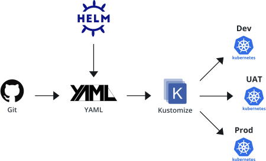

# What is Kustomize?
Kustomize is a configuration management solution that leverages layering to preserve the base settings of your applications and components by overlaying declarative yaml artifacts (called patches) that selectively override default settings without actually changing the original files.

## Some Real-World Context
Let’s say that you are using a Helm chart from a particular vendor. It’s a close fit for your use case, but not perfect, and requires some customizations. So you fork the Helm chart, make your configuration changes, and apply it to your cluster. A few months later, your vendor releases a new version of the chart you’re using that includes some important features you need. In order to leverage those new features, you have to fork the new Helm chart and re-apply your configuration changes.

At scale, re-forking and re-customizing these Helm charts becomes a large source of overhead with an increased risk of misconfigurations, threatening the stability of your product and services.



The above diagram shows a common use case of a continuous delivery pipeline which starts with a git event. The event may be a push, merge or create a new branch. In this case, Helm is used to generate the yaml files and Kustomize will patch it with environment specific values based on the events. For example: if the branch is master and tied to the production environment, then kustomize will apply the values applicable to production.

## Benefits of Using Kustomize
1. ***Reusability***: Kustomize allows you to reuse one base file across all of your environments (development, staging, production) and then overlay unique specifications for each.

2. ***Fast Generation***: Since Kustomize has no templating language, you can use standard YAML to quickly declare your configurations.

3. ***AEasier to Debug***: YAML itself is easy to understand and debug when things go wrong. Pair that with the fact that your configurations are isolated in patches, and you’ll be able to triangulate the root cause of performance issues in no time. Simply compare performance to your base configuration and any other variations that are running.

## Kubernetes Example
Let’s step through how Kustomize works using a deployment scenario involving 3 different environments: ***dev***, ***staging***, and ***production***.   
In this example we’ll use *service*, *deployment*, and *horizontal pod autoscaler resources* (***HPA***).  
For the dev and staging environments, there won't be any HPA involved. All of the environments will use different types of services:
  
+ Dev: ClusterIP
+ Staging: NodePort 
+ Production: LoadBalancer

They each will have different HPA settings. This is how directory structure looks:

```
application
  ├── base
  │   ├── deployment.yaml
  │   ├── hpa.yaml
  │   ├── kustomization.yaml
  │   └── service.yaml
  └── overlays
      ├── dev
      │   ├── hpa.yaml
      │   └── kustomization.yaml
      ├── production
      │   ├── hpa.yaml
      │   ├── kustomization.yaml
      │   ├── rollout-replica.yaml
      │   └── service-loadbalancer.yaml
      └── staging
          ├── hpa.yaml
          ├── kustomization.yaml
          └── service-nodeport.yaml
```
## Review Base Files
The base folder holds the common resources, such as the standard *deployment.yaml*, *service.yaml*, and *hpa.yaml* resource configuration files.  
We’ll explore each of their contents in the following sections.

***base/deployment.yaml***

```
---
apiVersion: apps/v1
kind: Deployment
metadata:
  name: frontend-deployment
  namespace: sandbox
spec:
  selector:
    matchLabels:
      app: frontend-deployment
  template:
    metadata:
      labels:
        app: frontend-deployment
    spec:
      containers:
      - name: app
        image: foo/bar:latest
        ports:
        - name: http
          containerPort: 8080
          protocol: TCP

```

*** base/service.yaml***

```
---
apiVersion: v1
kind: Service
metadata:
  name: frontend-service
  namespace: sandbox
spec:
  ports:
  - name: http
    port: 8080
  selector:
    app: frontend-deployment
```

***base/hpa.yaml***

```
---
apiVersion: autoscaling/v2
kind: HorizontalPodAutoscaler
metadata:
  name: frontend-deployment-hpa
  namespace: sandbox
spec:
  scaleTargetRef:
    apiVersion: apps/v1
    kind: Deployment
    name: frontend-deployment
  minReplicas: 1
  maxReplicas: 5
  metrics:
  - type: Resource
    resource:
      name: cpu
      target:
        type: Utilization
        averageUtilization: 51
```

***base/kustomization.yaml***

The kustmization.yaml file is the most important file in the base folder and it describes what resources you use.

```
---
apiVersion: kustomize.config.k8s.io/v1beta1
  kind: Kustomization
  
  resources:
    - service.yaml
    - deployment.yaml
    - hpa.yaml
```

## Define Dev Overlay Files
The overlays folder houses environment-specific overlays. It has 3 sub-folders (one for each environment).

***dev/kustomization.yaml***

This file defines which base configuration to reference and patch using patchesStrategicMerge, which allows partial YAML files to be defined and overlaid on top of the base.

```
---
apiVersion: kustomize.config.k8s.io/v1beta1
kind: Kustomization

bases:
  - ../../base
patchesStrategicMerge:
  - hpa.yaml
```

***dev/hpa.yaml***

This file has the same resource name as the one located in the base file. 
This helps in matching the file for patching. This file also contains important values, such as min/max replicas, for the dev environment.

```
---
apiVersion: autoscaling/v2
kind: HorizontalPodAutoscaler
metadata:
  name: frontend-deployment-hpa
  namespace: sandbox
spec:
  minReplicas: 1
  maxReplicas: 2
  metrics:
  - type: Resource
    resource:
      name: cpu
      target:
        type: Utilization
        averageUtilization: 90
```

If you compare the previous *hpa.yaml* file with *base/hpa.yaml*, you’ll notice differences in *minReplicas*, *maxReplicas*, and *averageUtilization* values.

### Review Patches
To confirm that your patch config file changes are correct before applying to the cluster, you can run:

```
$ kubectl kustomize application/overlay/dev/
apiVersion: v1
kind: Service
metadata:
  name: frontend-service
  namespace: sandbox
spec:
  ports:
  - name: http
    port: 8080
  selector:
    app: frontend-deployment
---
apiVersion: apps/v1
kind: Deployment
metadata:
  name: frontend-deployment
  namespace: sandbox
spec:
  selector:
    matchLabels:
      app: frontend-deployment
  template:
    metadata:
      labels:
        app: frontend-deployment
    spec:
      containers:
      - image: foo/bar:latest
        name: app
        ports:
        - containerPort: 8080
          name: http
          protocol: TCP
---
apiVersion: autoscaling/v2beta2
kind: HorizontalPodAutoscaler
metadata:
  name: frontend-deployment-hpa
  namespace: sandbox
spec:
  maxReplicas: 2
  metrics:
  - resource:
      name: cpu
      target:
        averageUtilization: 90
        type: Utilization
    type: Resource
  minReplicas: 1
  scaleTargetRef:
    apiVersion: apps/v1
    kind: Deployment
    name: frontend-deployment
    namesapce: sandbox
```

Here we verify the resuls is also accepted by kubernetes
```
$ kubectl apply -k application/overlay/dev/ --dry-run=client
service/frontend-service created (dry run)
deployment.apps/frontend-deployment created (dry run)
horizontalpodautoscaler.autoscaling/frontend-deployment-hpa created (dry run)
```

## application/base/hpa.yaml Apply Patches

Once you have confirmed that your overlays are correct, use the ***kubectl apply -k overlays/dev*** command to apply the the settings to your cluster:

```
$ kubectl apply -k  application/overlays/dev 
service/frontend-service created
deployment.apps/frontend-deployment created
horizontalpodautoscaler.autoscaling/frontend-deployment-hpa created
```
After handling the dev environment, we will demo the production environment as in our case it’s superset if staging(in terms of k8s resources).


## Define Prod Overlay Files


In our production *hpa.yaml*, let’s say we want to allow up to 10 replicas, with new replicas triggered by a resource utilization threshold of 70% avg CPU usage. 
This is how that would look:

***prod/hpa.yaml***

```
---
apiVersion: autoscaling/v2
kind: HorizontalPodAutoscaler
metadata:
  name: frontend-deployment-hpa
  namespace: sandbox
spec:
  minReplicas: 1
  maxReplicas: 10
  metrics:
  - type: Resource
    resource:
      name: cpu
      target:
        type: Utilization
        averageUtilization: 70
```

There's also a *rollout-replicas.yaml* file in our production directory which specifies our rolling strategy:

***prod/rollout-replicas.yaml***

```
---
apiVersion: apps/v1
kind: Deployment
metadata:
  name: frontend-deployment
  namespace: sandbox
spec:
  replicas: 10
  strategy:
    rollingUpdate:
      maxSurge: 1
      maxUnavailable: 1
    type: RollingUpdate

```


***prod/service-loadbalancer.yaml***

We use this file to change the service type to *LoadBalancer* (whereas in *staging/service-nodeport.yaml*, it is being patched as *NodePort*).

```
---
apiVersion: v1
kind: Service
metadata:
  name: frontend-service
  namespace: sandbox
spec:
    type: LoadBalancer
```


*** prod/kustomization.yaml ***

This file operates the same way in the production folder as it does in your base folder: it defines which base file to reference and which patches to apply for your production environment.  
In this case, it includes two more files: rollout-replica.yaml and service-loadbalancer.yaml.

```
---
apiVersion: kustomize.config.k8s.io/v1beta1
kind: Kustomization
bases:
  - ../../base
patchesStrategicMerge:
  - rollout-replica.yaml
  - hpa.yaml
  - service-loadbalancer.yaml

```
### Review Prod Patches
Verify the ouput results of the prod customization:

```
$ kubectl kustomize application/overlay/production/
apiVersion: v1
kind: Service
metadata:
  name: frontend-service
  namespace: sandbox
spec:
  ports:
  - name: http
    port: 8080
  selector:
    app: frontend-deployment
  type: LoadBalancer
---
apiVersion: apps/v1
kind: Deployment
metadata:
  name: frontend-deployment
  namespace: sandbox
spec:
  replicas: 10
  selector:
    matchLabels:
      app: frontend-deployment
  strategy:
    rollingUpdate:
      maxSurge: 1
      maxUnavailable: 1
    type: RollingUpdate
  template:
    metadata:
      labels:
        app: frontend-deployment
    spec:
      containers:
      - image: foo/bar:latest
        name: app
        ports:
        - containerPort: 8080
          name: http
          protocol: TCP
---
apiVersion: autoscaling/v2
kind: HorizontalPodAutoscaler
metadata:
  name: frontend-deployment-hpa
  namespace: sandbox
spec:
  maxReplicas: 10
  metrics:
  - resource:
      name: cpu
      target:
        averageUtilization: 70
        type: Utilization
    type: Resource
  minReplicas: 1
  scaleTargetRef:
    apiVersion: apps/v1
    kind: Deployment
    name: frontend-deployment

```

Lets see if production values are being applied by running kustomize build overlays/production

```
$ kubectl apply -k application/overlay/production/ --dry-run=client
service/frontend-service created (dry run)
deployment.apps/frontend-deployment created (dry run)
horizontalpodautoscaler.autoscaling/frontend-deployment-hpa created (dry run)
```
