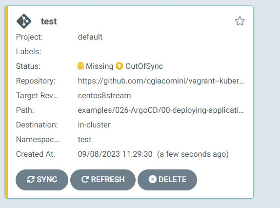
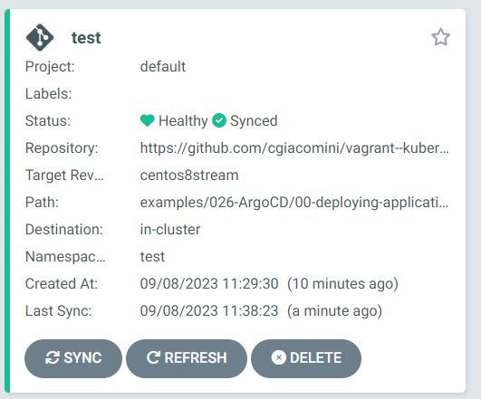
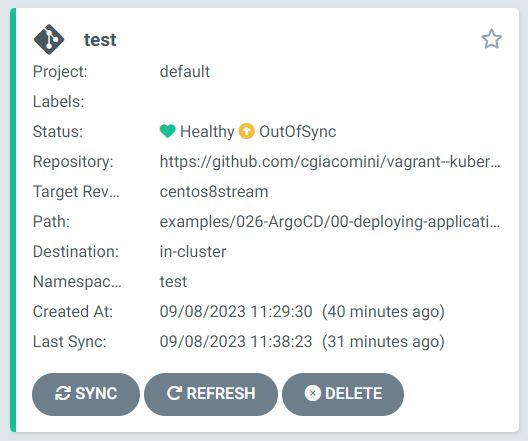
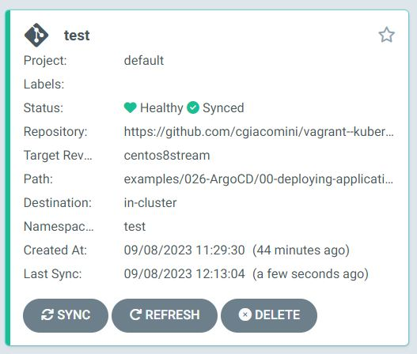

# Application teployment Example
Argo CD's primary job is to make sure that your desired state, stored in Git, matches your running state on your Kubernetes installation.  
It does this by comparing Kubernetes declarations (stored in YAML or JSON in Git) with the running state.  
Argo CD does this by treating a group of related manifests as an atomic unit.  
This atomic unit is called an Application, in Argo CD.  
An Argo CD Application is controlled by the Argo CD Application Controller via a Custom Resource.

## Application Custom Resource 

The application we are going to use is available on GitHub:
[00-deploying-application](https://github.com/cgiacomini/vagrant--kubernetes/tree/centos8stream/examples/026-ArgoCD/00-deploying-application)

The application is deployed with ArgoCD using the Application Custom Resource (CR).
The CR is created via the UI in the "New APP" window, where we need to fill all the requested field:

+ **Application Name**: test
+ **Project Name**: default
+ **SYNC POLICY**: Manual
+ **RETRY**: Enable this, and leave the defaults
+ **Cluster URL**: https://kubernetes.default.svc
+ **Namespace**: test
+ **Repository URL**: https://github.com/cgiacomini/vagrant--kubernetes
+ **Revision**: Specify the branch. here is *centos8stream*
+ **Path**: Specify the application path inside the repository (here is *examples/026-ArgoCD/00-deploying-application*)

***Note***: Cluster URL is the Argo CD's way of identifying which cluster to apply the manifests to. In this case we have only one cluster which is the one ArgoCD is running on and returned by the argocd CLI command:

```
$ argocd cluster list
SERVER                          NAME        VERSION  STATUS   MESSAGE                                                  PROJECT
https://kubernetes.default.svc  in-cluster           Unknown  Cluster has no applications and is not being monitored
```

We leave everything else as the default values, click CREATE and we get the following screen with Application as "Missing" and "OutOfSy:


We can see nothing is deployed in the **test** namespace
```
$ kubectl get all -n test
No resources found in test namespace.

$ argocd app get test
Name:               argocd/test
Project:            default
Server:             https://kubernetes.default.svc
Namespace:          test
URL:                https://argocd.singleton.net/applications/test
Repo:               https://github.com/cgiacomini/vagrant--kubernetes
Target:             centos8stream
Path:               examples/026-ArgoCD/00-deploying-application
SyncWindow:         Sync Allowed
Sync Policy:        <none>
Sync Status:        OutOfSync from centos8stream (5ef73f8)
Health Status:      Missing

GROUP  KIND        NAMESPACE  NAME  STATUS     HEALTH   HOOK  MESSAGE
       Namespace              test  OutOfSync  Missing
       Service     test       bgd   OutOfSync  Missing
apps   Deployment  test       bgd   OutOfSync  Missing
```
To Actually apply the manifests we need to click on SYNC in the Argo CD UI, then SYNCHRONIZE to apply them.  
After a while we should get the following screen:



```
# Verify the pod is running
$ kubectl get pods -n test
NAME                   READY   STATUS    RESTARTS   AGE
bgd-74dc875f9b-6rrxg   1/1     Running   0          3m4s


# Verify the application status
$  argocd app get test
Name:               argocd/test
Project:            default
Server:             https://kubernetes.default.svc
Namespace:          test
URL:                https://argocd.singleton.net/applications/test
Repo:               https://github.com/cgiacomini/vagrant--kubernetes
Target:             centos8stream
Path:               examples/026-ArgoCD/00-deploying-application
SyncWindow:         Sync Allowed
Sync Policy:        <none>
Sync Status:        Synced to centos8stream (5ef73f8)
Health Status:      Healthy

GROUP  KIND        NAMESPACE  NAME  STATUS   HEALTH   HOOK  MESSAGE
       Namespace   test       test  Running  Synced         namespace/test created
       Service     test       bgd   Synced   Healthy        service/bgd created
apps   Deployment  test       bgd   Synced   Healthy        deployment.apps/bgd created
       Namespace              test  Synced
```
## Divergence

### Repository Changes
Argo CD has the ability to visualize any divergence between the manifest files in the repository and those applied in your cluster, as well as the ability to reconcile that divergence.  
Let's introduce a change to the *test-deployment.yaml* manifest by changing the ***replicas*** of the Deployment from 1 to 3.  We commit and push the changes on the Git repository.
Now if we refresh the ArgoCD application status we will be informed that the application is out of sync:



To reconcilate it we need to click on SYNC button and then on SYNCHRONIZE. After a while the application deployment will be alligned with the changes in the repository;



```
# Verify we have 3 replicas on the cluster
$ kubectl get pods -n test
NAME                   READY   STATUS    RESTARTS   AGE
bgd-74dc875f9b-6rrxg   1/1     Running   0          37m
bgd-74dc875f9b-jqxgg   1/1     Running   0          2m47s
bgd-74dc875f9b-nx5cd   1/1     Running   0          2m47s
```

### Deployment Changes
Now we we change the replicas directly on the cluster and we set it from 3 to 1
```
 $ kubectl scale deployment/bgd --replicas=1 -n test
deployment.apps/bgd scaled

$ kubectl get pods -n test
NAME                   READY   STATUS    RESTARTS   AGE
bgd-74dc875f9b-jqxgg   1/1     Running   0          4m55s
```
Immediately ArgoCD UI tell us the application is again out of sync. This can be seen also using arogcd CLI
```
$  argocd app get test
Name:               argocd/test
Project:            default
Server:             https://kubernetes.default.svc
Namespace:          test
URL:                https://argocd.singleton.net/applications/test
Repo:               https://github.com/cgiacomini/vagrant--kubernetes
Target:             centos8stream
Path:               examples/026-ArgoCD/00-deploying-application
SyncWindow:         Sync Allowed
Sync Policy:        <none>
Sync Status:        OutOfSync from centos8stream (b4cea7a)
Health Status:      Healthy

GROUP  KIND        NAMESPACE  NAME  STATUS     HEALTH   HOOK  MESSAGE
       Namespace   test       test  Running    Synced         namespace/test unchanged
       Service     test       bgd   Synced     Healthy        service/bgd configured
apps   Deployment  test       bgd   OutOfSync  Healthy        deployment.apps/bgd configured
       Namespace              test  Synced
```
As done before we can resyncronize it and have back the 3 running replocas by clicking on SYNC and the SYNCHRONOZE or sync it with argocd client.

```
# Sychronoze the application
$ argocd app sync test
TIMESTAMP                  GROUP        KIND   NAMESPACE                  NAME    STATUS    HEALTH        HOOK  MESSAGE
2023-09-08T12:23:49+02:00          Namespace                              test    Synced
2023-09-08T12:23:49+02:00            Service        test                   bgd    Synced   Healthy
2023-09-08T12:23:49+02:00   apps  Deployment        test                   bgd  OutOfSync  Healthy
2023-09-08T12:23:49+02:00   apps  Deployment        test                   bgd  OutOfSync  Healthy              deployment.apps/bgd configured
2023-09-08T12:23:49+02:00          Namespace        test                  test   Running    Synced              namespace/test unchanged
2023-09-08T12:23:49+02:00            Service        test                   bgd    Synced   Healthy              service/bgd configured
2023-09-08T12:23:49+02:00   apps  Deployment        test                   bgd    Synced  Progressing              deployment.apps/bgd configured

Name:               argocd/test
Project:            default
Server:             https://kubernetes.default.svc
Namespace:          test
URL:                https://argocd.singleton.net/applications/test
Repo:               https://github.com/cgiacomini/vagrant--kubernetes
Target:             centos8stream
Path:               examples/026-ArgoCD/00-deploying-application
SyncWindow:         Sync Allowed
Sync Policy:        <none>
Sync Status:        Synced to centos8stream (b4cea7a)
Health Status:      Progressing

Operation:          Sync
Sync Revision:      b4cea7a815e6e072095bc833040b8d6666f0a612
Phase:              Succeeded
Start:              2023-09-08 12:23:49 +0200 CEST
Finished:           2023-09-08 12:23:49 +0200 CEST
Duration:           0s
Message:            successfully synced (all tasks run)

GROUP  KIND        NAMESPACE  NAME  STATUS   HEALTH       HOOK  MESSAGE
       Namespace   test       test  Running  Synced             namespace/test unchanged
       Service     test       bgd   Synced   Healthy            service/bgd configured
apps   Deployment  test       bgd   Synced   Progressing        deployment.apps/bgd configured
       Namespace              test  Synced

# Verify 
$ kubectl get pods -n test
NAME                   READY   STATUS    RESTARTS   AGE
bgd-74dc875f9b-8nwrn   1/1     Running   0          10s
bgd-74dc875f9b-h9lq5   1/1     Running   0          10s
bgd-74dc875f9b-jqxgg   1/1     Running   0          10m
```

## Self Heal
ArgoCd has create an **Application** Custom Resource, when we deploy an application via ArgoCD an instace Application is created for it.
We can modify the deploye instance of the application by adding to it th ***SyncPolicy*** property so that it will autosync when there are divergences beween the curret cluster application status and the one in the Git Repository.

```
# Get the name of the Applicatgion instance
$ kubectl get applications -n argocd
NAMESPACE   NAME   SYNC STATUS   HEALTH STATUS
argocd      test   Synced        Healthy

```
### Deployment Changes
Now we can edit it by adding the followin lines in the ***spec.SyncPolicy*** section:
```
spec:
  syncPolicy:
    automated:
      prune: true
      selfHeal: true
```
We can this by directly editing the application resource via an editor
```
$ kubectl edit application test -n argocd
application.argoproj.io/test edited
```
or  by apply a patch to the application 
```
$ kubectl patch application/test -n argocd --type=merge -p='{"spec":{"syncPolicy":{"automated":{"prune":true,"selfHeal":true}}}}'

```

### Verification
Now we scale down the 3 replicas to 1 directly on the cluster. Imeediately we can see that ArgoCD will reconciliate with the status of the manifests. This can be also seen on the UI.
```
# Scale down
$ kubectl scale deployment/bgd --replicas=1 -n test
deployment.apps/bgd scaled

# ArgoCD put backe the 3 replicas
$ kubectl get pods -n test
NAME                   READY   STATUS    RESTARTS   AGE
bgd-74dc875f9b-7c9x9   1/1     Running   0          5s
bgd-74dc875f9b-jqxgg   1/1     Running   0          39m
bgd-74dc875f9b-tvt8h   1/1     Running   0          5s
```
### Repository Changes
We change now ***test-deployment.yaml*** to put it back to its original state with on replica only, we commit it and push it to the github repository.
After a while ArgoCD detect the divergence and take action to aligne the deployment with the status in the repository.

```
$ kubectl get pods -n test
NAME                   READY   STATUS    RESTARTS   AGE
bgd-74dc875f9b-jqxgg   1/1     Running   0          50m
```
