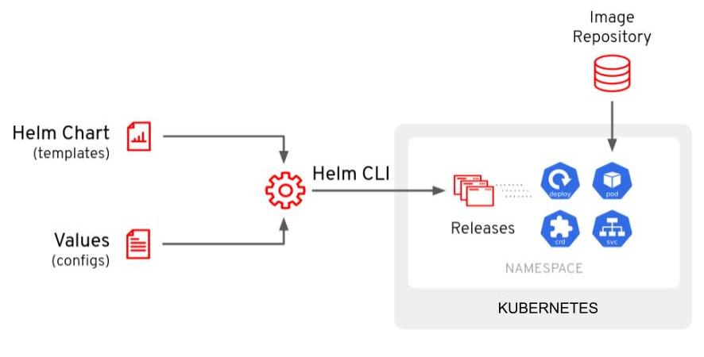

# Working With Helm
## HELM
***REF***: [https://kubebyexample.com/learning-paths/argo-cd/argo-cd-working-helm]

Helm is considered the defacto package manager for Kubernetes applications.  
You can define, install, and update your pre-packaged applications or comsume a prebuilt packed application from a trusted repository.  
This is a way to bundle up, and deliver prebuilt Kubernetes applications.

see [017-Helm](../../017-Helm)

The main components of Helm are:

* Chart - Which is a package consisting of related Kubernetes YAML files used to deploy something (Application/Application Stack/etc).
* Repository - Is a place where Charts can be stored, shared and distributed.
* Release - Is a specific instance of a Chart deployed on a Kubernetes cluster.

Helm works by the user providing parameters (most of the time via a YAML file **values.yaml**) against a Helm chart via the CLI.
These parameters get injected into the Helm template YAML to produce a consumable YAML that us deployed to the Kubernetes cluster.



## ArgoCD and Helm
Argo CD has native support for Helm built in.  
You can directly call a Helm chart repo and provide the values directly in the Application manifest.  
Also, you can interact and manage Helm on your cluster directly with the Argo CD UI or the argocd CLI. 

Here we are going to deploy quarkus appliaction from *redhat-developer.github.io/redhat-helm-charts* helm charts repository.
We use here an ArgoCD *Customer Resource* ***quarkus-app.yaml*** to instruct about which chart we want to deploy and from which helm chart repository.
***Note***: The helm chart repository should also be configured in argocd. w

```
---
apiVersion: argoproj.io/v1alpha1
kind: Application
metadata:
  name: quarkus-app
  namespace: argocd
spec:
  destination:
    namespace: demo
    server: https://kubernetes.default.svc
  project: default
  source:
    helm:
      parameters:
        - name: build.enabled
          value: "false"
        - name: deploy.route.enabled
          value: "false"
        - name: image.name
          value: quay.io/redhatworkshops/gitops-helm-quarkus
    chart: quarkus
    repoURL: https://redhat-developer.github.io/redhat-helm-charts
    targetRevision: 0.0.3
  syncPolicy:
    retry:
      backoff:
        duration: 5s
        factor: 2
        maxDuration: 3m0s
      limit: 5
    automated:
      prune: true
      selfHeal: true
    syncOptions:
    - CreateNamespace=true
```

+ ***parameters***: This section is where you'll enter the parameters you want to pass to the Helm chart. These are the same values that you'd have in your Values.yaml file.
+ ***chart***: This is the name of the chart you want to deploy from the Helm Repository.
+ ***repoURL***:  This is the URL of the Helm Repository.
+ ***targetRevision***: This is the version of the chart you want to deploy.

### Application Deployment

Add redhat helm charts repository. This will allow argocd to download the helm charts.   
Beacuse we are behind a company proxy and we fall in the man in the middle situatio we need to ignore certifications checks.  
Another possibiliyt is to add the company self signed root certificat in argocd, here we go for the quickest and easy/lazy choice by adding ***--insecure-skip-server-verification***

```
# Add RedHat Helm Charts Repository
$ argocd repo add   https://redhat-developer.github.io/redhat-helm-charts --type helm --name redhat-charts --insecure-skip-server-verification
Repository 'https://redhat-developer.github.io/redhat-helm-charts' added

$ argocd repo list
TYPE  NAME           REPO                                                   INSECURE  OCI    LFS    CREDS  STATUS      MESSAGE  PROJECT
helm  redhat-charts  https://redhat-developer.github.io/redhat-helm-charts  true      false  false  false  Successful
```

#### Deply the Application Cutom Resource which in turn will download the quarkus helm chart

```
$  kubectl apply -f https://raw.githubusercontent.com/cgiacomini/vagrant--kubernetes/centos8stream/examples/026-ArgoCD/02-working-with-helm/app/quarkus-app.yaml
application.argoproj.io/quarkus-app created

$ kubectl get applications
NAME          SYNC STATUS   HEALTH STATUS
quarkus-app   Unknown       Healthy

$ kubectl get pods -n demo
NAME                           READY   STATUS    RESTARTS   AGE
quarkus-app-69ff649b9c-mk7cl   1/1     Running   0          99s

```
This deploy the *helm chart* and looking in the Argo CD WebUI, you should see the following:


Pay special attention to the Helm (⎈) logo, indicating that it's a Helm chart being deployed with Argo CD.

# Umbrella Charts

In ArgoCD the Helm Umbrella Chart, is sort of a "meta" (empty) Helm Chart that lists other Helm Charts as a dependency. 
To put it simply, it's an emtpy Helm chart in a repo that lists other Helm Charts to install.

***NOTE***: In the next example there will only be one chart, where we can list multiple charts. This is helpful for when your Application is made up of several Helm Charts.

The example ***repo/Chart.yaml*** file is creating an "empty" Helm chart and adding the Helm chart you want to deploy as a dependency in the dependecies secion.

```
apiVersion: v2
name: quarkus-subchart
type: application
version: 1.0.0
appVersion: "1.0.0"
dependencies:
- name: quarkus
  version: 0.0.3
  repository: https://redhat-developer.github.io/redhat-helm-charts

```
The ***rep/values.yaml*** file specifies the values you want to pass to the Helm chart.

```
quarkus:
  build:
    enabled: false
  deploy:
    route:
      enabled: false
    replicas: 2
  image:
    name: quay.io/redhatworkshops/gitops-helm-quarkus
```

This time We will be deploying this Helm Chart with Argo CD using the WebUI.  
First click on the + NEW APP button on the Argo CD UI. And fill out the following.

+ ***Application Name***: quarkus-subchart
+ ***Project Name***: default
+ ***SYNC POLICY***: Automatic
+ ***SELF HEAL***: Enable this
+ ***AUTO-CREATE NAMESPACE***: Enable this as well
+ ***RETRY***: Enable this, and leave the defaults
+ ***Repository URL***: GIT and https//github.com/cgiacomini/vagrant--kubernetes
+ ***Revision***: main
+ ***Path***: examples/026-ArgoCD/02-working-with-helm/repo
+ ***Cluster URL***: https://kubernetes.default.svc
+ ***Namespace***: foobar

After a while, you should see the Application synced and healthy.
Note that this time, you will see this as a "Git" Application (denoted by the Git logo) instead of a Helm Application.


We can verify that two quarkus-app pods are running n foobar namespace on the cluster.
```
$ kubectl get pods -n foobar
NAME                           READY   STATUS    RESTARTS   AGE
quarkus-app-69ff649b9c-8lhwn   1/1     Running   0          2m46s
quarkus-app-69ff649b9c-942qv   1/1     Running   0          2m46s
```
