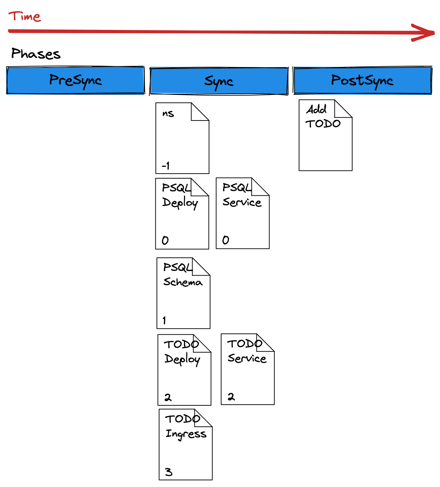
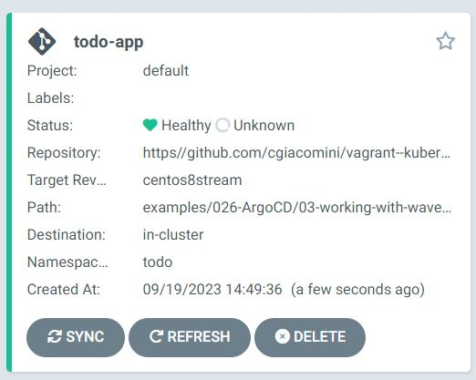

# Argo CD Syncwaves and Hooks
[**REF**: https://redhat-scholars.github.io/argocd-tutorial/argocd-tutorial/04-syncwaves-hooks.html]

*Syncwaves* are used in Argo CD to order how manifests are applied to the cluster.  
Whereas *resource hooks* breaks up the delivery of these manifests in different phases.
Using the combination of *syncwaves* and *resources hooks* we can control how an apllication is rolled out.


The sample application that we will deploy is a **todo** application with a database, syncwaves and resource hooks are used:


## SyncWave to order deployment

All manifests have a wave of zero by default, but you can set these by using the *argocd.argoproj.io/sync-wave* annotation.

Example:
```
metadata:
  annotations:
    argocd.argoproj.io/sync-wave: "2"
```

The wave can also be negative as well.

```
metadata:
  annotations:
    argocd.argoproj.io/sync-wave: "-5"
```

When Argo CD starts a sync action, the manifest get placed in the following order:

+ The **Phase** that they're in (PreSync, Sync and PostSync)
+ The wave the resource is annotated in (starting from the lowest value to the highest)
+ By kind (Namspaces first, then services, then deployments, etc ...)
+ By name (ascending order)

### todo-namespace.yaml
Here we define a **todo** namespace that have a sync-wave of -1
```
apiVersion: v1
kind: Namespace
metadata:
  name: todo
  annotations:
    argocd.argoproj.io/sync-wave: "-1"
```

### postgres-deployment.yaml
Here we define a deployment to our postgresql database giving to it a sync-wave of 0
```
---
apiVersion: apps/v1
kind: Deployment
metadata:
  name: postgresql
  namespace: todo
  annotations:
    argocd.argoproj.io/sync-wave: "0"
spec:
  selector:
    matchLabels:
      app: postgresql
  template:
    metadata:
      labels:
        app: postgresql
    spec:
      containers:
        - name: postgresql
          image: postgres:12
          imagePullPolicy: Always
          ports:
            - name: tcp
              containerPort: 5432
          env:
            - name: POSTGRES_PASSWORD
              value: admin
            - name: POSTGRES_USER
              value: admin
            - name: POSTGRES_DB
              value: todo
```

### postgres-service.yaml
The postgres service also have a sync-wave of 0.

```
---
apiVersion: v1
kind: Service
metadata:
  name: postgres
  namespace: todo
  annotations:
    argocd.argoproj.io/sync-wave: "0"
spec:
  selector:
    app: postgresql
  ports:
    - name: pgsql
      port: 5432
      targetPort: 5432
```

### postgres-create-table.yaml
Once postgresql POD is deployed along with its service we can use postgresql client to create a database. 
To do so we use a *Job* yaml file to launch a specific postgres sql command.  The job access the database via the postgres service by using the service FQDN *postgres.todo.svc.cluster.local*
This time the sync-wave is set to 1

```
---
apiVersion: batch/v1
kind: Job
metadata:
  name: todo-table
  namespace: todo
  annotations:
    argocd.argoproj.io/sync-wave: "1"
spec:
  ttlSecondsAfterFinished: 100
  template:
    spec:
      containers:
        - name: postgresql-client
          image: postgres:12
          imagePullPolicy: Always
          env:
            - name: PGPASSWORD
              value: admin
          command: ["psql"]
          args:
            [
              "--host=postgres.todo.svc.cluster.local",
              "--username=admin",
              "--no-password",
              "--dbname=todo",
              "--command=create table Todo (id bigint not null,completed boolean not null,ordering integer,title varchar(255),url varchar(255),primary key (id));create sequence hibernate_sequence start with 1 increment by 1;",
            ]
      restartPolicy: Never
  backoffLimit: 1
```

### todo-qpplication-deployment.yaml
The postgress database server is now deployed, a service is configured to acces it, and a database is created.  

Here we deploy a ServiceAccount and the application that acces the postgres database.  This time the sync-wave is set to 2

```
---
apiVersion: "v1"
kind: "ServiceAccount"
metadata:
  labels:
    app.kubernetes.io/name: "todo-gitops"
    app.kubernetes.io/version: "1.0.0"
  name: "todo-gitops"
  namespace: todo
  annotations:
    argocd.argoproj.io/sync-wave: "2"
---
apiVersion: "apps/v1"
kind: "Deployment"
metadata:
  labels:
    app.kubernetes.io/name: "todo-gitops"
    app.kubernetes.io/version: "1.0.0"
  name: "todo-gitops"
  namespace: todo
  annotations:
    argocd.argoproj.io/sync-wave: "2"
spec:
  replicas: 1
  selector:
    matchLabels:
      app.kubernetes.io/name: "todo-gitops"
      app.kubernetes.io/version: "1.0.0"
  template:
    metadata:
      labels:
        app.kubernetes.io/name: "todo-gitops"
        app.kubernetes.io/version: "1.0.0"
    spec:
      containers:
      - env:
        - name: "KUBERNETES_NAMESPACE"
          valueFrom:
            fieldRef:
              fieldPath: "metadata.namespace"
        image: "quay.io/rhdevelopers/todo-gitops:1.0.0"
        imagePullPolicy: "Always"
        name: "todo-gitops"
        ports:
        - containerPort: 8080
          name: "http"
          protocol: "TCP"
      serviceAccount: "todo-gitops"
```

### todo-application-service.yaml
The application can be reached via the followin service. Note that the sync-wave is set to 2 as per the application deploymen and service account above.
```
---
apiVersion: "v1"
kind: "Service"
metadata:
  labels:
    app.kubernetes.io/name: "todo-gitops"
    app.kubernetes.io/version: "1.0.0"
  name: "todo-gitops"
  annotations:
    argocd.argoproj.io/sync-wave: "2"
  namespace: todo
spec:
  ports:
  - name: "http"
    port: 8080
    targetPort: 8080
  selector:
    app.kubernetes.io/name: "todo-gitops"
    app.kubernetes.io/version: "1.0.0"
```

## todo-application-ingress.yaml
In front of the application service we also deploy an *ingress* to access the application from a defined FQDN  (todo singleton.net)
Note that the ingress have a sync-wave set to 3, that means it will be processed last since it has the highest sync-wave.

```
---
apiVersion: networking.k8s.io/v1
kind: Ingress
metadata:
  name: todo
  namespace: todo
  annotations:
    argocd.argoproj.io/sync-wave: "3"
spec:
  rules:
    - host: todo.singleton.net
      http:
        paths:
          - path: /
            pathType: Prefix
            backend:
              service:
                name: todo-gitops
                port:
                  number: 8080
```

We need to add ***todo.singleton.net*** to  */etc/hosts* pointing to the k8s-master node where our ingress controller runs.
```
192.168.56.10 k8s-master.singleton.net k8s-master argocd.singleton.net todo.singleton.net
```

ArgoCD will apply Namespace first since hase the lowest wave value, it make sure it is in the "*healthy*" state before moving on.
Next will apply the PostgreSQL deployment waiting for its "healthy" status as well before moving on the rest of the resources.

***NOTE***: Argo CD won’t apply the next manifest until the previous reports "healthy".

## Hooks

Controlling your sync operation can be futher redefined by using **hooks**.  These hooks can run before, during, and after a sync operation.

Hooks Types are:

+ PreSync - Runs before the sync operation. This can be something like a database backup before a schema change
+ Sync - Runs after PreSync has successfully ran. This will run alongside your normal manifests.
+ PostSync - Runs after Sync has ran successfully. This can be something like a Slack message or an email notification.
+ SyncFail - Runs if the Sync operation as failed. This is also used to send notifications or do other evasive actions.

To enable a sync, annotate the specific object manifest with ***argocd.argoproj.io/hook*** with the *type of sync* you want to use for that resource.

For example, if I wanted to use the *PreSync* hook:
```
metadata:
  annotations:
    argocd.argoproj.io/hook: PreSync
```

You can also have the hooks deleted after a successful/unsuccessful run.

+ HookSucceeded - The resource will be deleted after it has succeeded.
+ HookFailed - The resource will be deleted if it has failed.
+ BeforeHookCreation - The resource will be deleted before a new one is created (when a new sync is triggered).

You can apply these with the *argocd.argoproj.io/hook-delete-policy* annotation. For example
````
metadata:
  annotations:
    argocd.argoproj.io/hook: PostSync
    argocd.argoproj.io/hook-delete-policy: HookSucceeded
```

Although hooks can be any resource, they are usually Pods and/or Jobs

### todo-insert-data.yaml
The following is an example of *PostSync* manifest that send an HTTP request to insert a new TODO item:
This PostSync hook run in PostSync phase after the application of the manifests Sync Phase
```
---
apiVersion: batch/v1
kind: Job
metadata:
  name: todo-insert
  annotations:
    argocd.argoproj.io/hook: PostSync 
    argocd.argoproj.io/hook-delete-policy: HookSucceeded
spec:
  ttlSecondsAfterFinished: 100
  template:
    spec:
      containers:
        - name: httpie
          image: alpine/httpie:2.4.0
          imagePullPolicy: Always
          command: ["http"]
          args:
            [
              "POST",
              "todo-gitops:8080/api",
              "title=Finish ArgoCD tutorial",
              "--ignore-stdin"
            ]
      restartPolicy: Never
  backoffLimit: 1
```

The execution order can be seen in the following diagram:


### todo-application.yaml

This will instruct ArgoCD on how to deploy the application.

```
---
apiVersion: argoproj.io/v1alpha1
kind: Application
metadata:
  name: todo-app
  namespace: argocd
spec:
  destination:
    namespace: todo
    server: https://kubernetes.default.svc
  project: default
  source:
    path: examples/026-ArgoCD/03-working-with-waveshooks/todo-app
    repoURL: https://github.com/cgiacomini/vagrant--kubernetes
    targetRevision: centos8stream
  syncPolicy:
    automated:
      prune: true
      selfHeal: false
    syncOptions:
    - CreateNamespace=true
```

To create the application custom resource and deploy 
```
$ kubectl apply -f todo-app/todo-application.yaml
application.argoproj.io/todo-app created
```

On the ArgoCD UI we should now see the todo-app application :



### Using Syncwaves and Hooks

In this example, we will be deploying the sample application in the *03-working-with-waveshooks*.
You'll notice that there are various YAMLs for this application. Each manifest has been annotated with a wave.

Argo CD, using the annotations, will deploy the manifests in the following order.

presync.yaml - This will go first because it is in the "PreSync" phase since it's annotated with argocd.argoproj.io/hook: PreSync
namespace.yaml - The namespace will then go next because it's in the "Sync" phase (the default when no annotation is present), and it is in wave 0 as indicated with the annotation argocd.argoproj.io/sync-wave: "0"
deployment.yaml - The deployment will come after the deployment because it's annotated with argocd.argoproj.io/sync-wave: "1"
service.yaml - Finally, the service gets deployed as it's annotated with argocd.argoproj.io/sync-wave: "2"
To see this in action, create the Application with the argocd cli:

argocd app create wave-test \
--repo https://github.com/christianh814/kbe-apps \
--path 03-working-with-waveshooks \
--dest-namespace synctest \
--dest-server https://kubernetes.default.svc \
--self-heal \
--sync-policy automated \
--sync-option CreateNamespace=true \
--sync-retry-limit 5 \
--revision main
This should create an Application that you can see in the Argo CD UI

