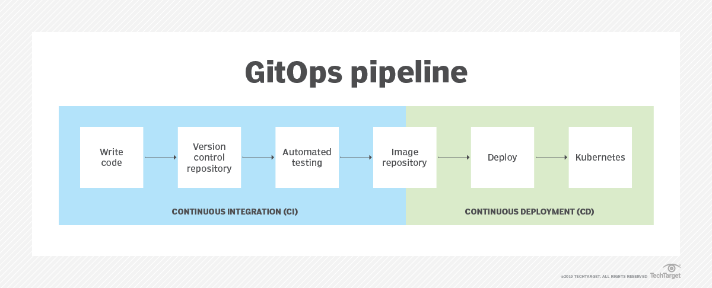

# ArgoCD

## ArgoCD Overview
***REF***:[https://kubebyexample.com/learning-paths/argo-cd/argo-cd-overview]

### GitOps

***REF***: [https://www.techtarget.com/searchitoperations/definition/GitOps]

GitOps uses Git repositories as a single source of truth to deliver infrastructure as code.
Code changes are tracked, which provides version control if a rollback is needed.  
Once declared in Git, a GitOps agent is used to apply all code configurations automatically in development, test, staging and production environments.

GitOps is based around the idea of pull requests. Once a pull request is initialized, the user can see an overview of changes in each branch in a repository base.  
The user can then add a summary of proposed changes, review changes, add labels and mention other contributors.  
After the pull request is created, a commit from a topic branch can be added where contributors can view any proposed changes. Once everyone approves the request, the changes are merged with the pull request.

Changes to an application or cluster could include updates to container images, fixes to errors in the environment or updates to specifications. 
Troubleshooting with GitOps is fast, as users can fix any issues that appear with a pull request rather than in the underlying system.

GitOps works with any CI and Git server. It can also use other tools for Git pushes, development and continuous integration. Jenkins X, for example, is an open source tool that works with GitOps to provide CI/CD as well as other automated testing tools designed for cloud-native applications -- specifically in a Kubernetes environment. Other tools, including Bitbucket, GitHub and Amazon Web Services CodeDeploy, can be used in GitOps as well.

GitOps can be used for several applications; for example, teams might use it to implement continuous deployment for Kubernetes.
GitOps can also be used to implement continuous delivery for Kubernetes. 
Continuous delivery typically enables development teams to build, test and deploy software at a fast pace through incremental updates. 
Continuous delivery for Kubernetes also enables a continuous integration and runtime pipeline, which should be able to read and write files to Git, update container repositories and load container images.

By using Git repositories as the source of truth, it allows the DevOps team to store the entire state of the cluster configuration in Git so that the trail of changes are visible and auditable.

It's important to note that GitOps doesn't "replace" DevOps at all. In fact, GitOps is DevOps actualized. DevOps is the organization's culture, while GitOps is what that culture looks like in Practice.

Argo CD was written with GitOps in mind, to deliver changes to a Kubernetes cluster at a massive scale.  
It detects and prevents drift in your Kubernetes clusters by working with raw YAML stored in a Git repository and using the application functionality in Kubernetes.  
ArgoCD can also work with Helm and Kustomize to render the YAML produced by those tools before applying them to the Kubernetes cluster.  

* [Installation](./Installation.md)
* [00-deploying-application.md](./00-deploying-application/README.md)
