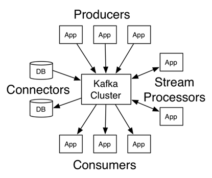
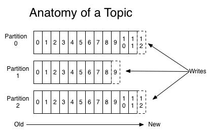
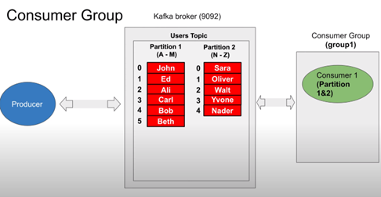
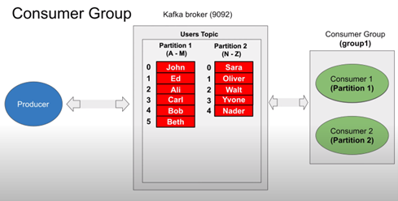
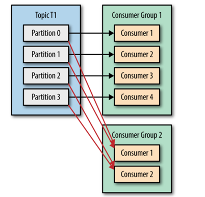
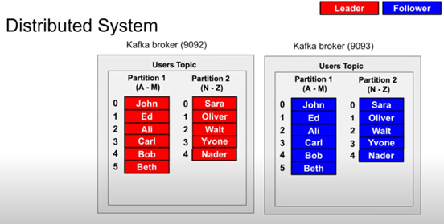

# Apache Kafka
Apache Kafka is an open-source software that enables storing and processing data streams over a distributed streaming platform. 
It provides various interfaces for writing data to Kafka clusters and reading, importing, and exporting data to and from third-party systems.
Apache Kafka was initially developed as a LinkedIn message queue. As a project of the Apache Software Foundation, the open-source software has developed into a robust streaming platform with a wide range of functions.
The system is based on a distributed architecture centered around a cluster containing multiple topics, optimized for processing large data streams in real time as shown in the picture below:

## Kafka: Basic Function
Kafka solves the problems that arise when data sources and data receivers are connected directly.
For example, when the systems are connected directly, it is impossible to buffer data if the recipient is unavailable.  
In addition, a sender can overload the receiver if it sends data faster than the receiver accepts and processes it.
## Kafka: Architecture
Kafka’s architecture consists of a cluster computer network. In this network of computers, so-called ***brokers*** store messages with a time stamp.  
This information is called ***topic***. The stored information is replicated and distributed in the cluster.

***Producers*** are applications that write messages or data to a Kafka cluster.  
***Consumers*** are applications that read data from the Kafka cluster.
In addition, a Java library called ***Kafka Streams*** reads data from the cluster, processes it, and writes the results back to the cluster.
Kafka distinguishes between “***Normal Topics***” and “***Compacted Topics***”.
+ ***Normal topics*** are stored for a certain period and must not exceed a defined storage size. If the period of storage limit is exceeded, Kafka may delete old messages.
+ ***Compacted topics*** are subject to neither a time limit nor a storage space limit.

A topic is divided into ***partitions***. The number of partitions is set when the topic is created, and it determines how the topic scales.  
The messages of a topic are distributed to the partitions. The offset is per partition. Partitions are the fundamental mechanism through which both *scaling* and *replication* work.
Writing to or reading from a topic always refers to a partition. Each partition is sorted by its ***offset***. If you write a message on a topic, you have the option of specifying a ***key***.
The hash of this key ensures that all messages with the same key end up in the same partition. Adherence to the order of the incoming messages is guaranteed within a partition.
A ***consumer group*** is a set of consumers which cooperate to consume data from some topics.  
The partitions of all the topics are divided among the consumers in the group.  
As new group members arrive and old :members leave, the partitions are re-assigned so that each member receives a proportional share of the partitions.

In this scenario Kafka act like a ***queue*** since each message written on of the partitions will be read by only and only one consumer in the group assigned to read that partition.  
The main way we scale data consumption from a Kafka topic is by adding more consumers to a consumer group.

It also possible to make Kafka working as a ***broadcaster*** by assigning a consumer to it own unique consumer group which read from the same topic.
Here consumers in Group2 will get all the messages in topic T1 inde-pendent of what Group1 is doing.

## Kafka Cluster

In the Kafka cluster, one of node is the ***master*** and the others are replicas of the partitions.  
But each node can be a master just for certain partition and at the same time the replicas of tother partitions.
> ***Note***: clients can only read from the replicas of and only write to the master of the partition.

## Zookeeper
How do we then know who is the leader and who is the Follower? The system that is responsible to tell which is the follower or the leader of the partition is ***Zookeeper*** (Controversial topics).
Every broker on a Kafka cluster is also named a *Bootstrap Server*. All brokers have the *metadata* required for the clients (producer or consumer) to discover brokers.  
When a client connects to one of the brokers (which are already configured as bootstrap servers in the Kafka configuration) it makes a "metadata request". 
The response includes information about topics, partitions, leader brokers, etc. Once the client gets this info, then, in the case of a producer, it makes the write request directly to the leader broker for that specific partition.
> So, if all the brokers maintain this metadata, then what's the role of zookeeper? 
> The use of zookeeper is that only one leader is there for a partition at any given time by using some kind of lock registry.
+ The producer sends a Metadata request with a list of topics to one of the brokers in the broker-list you supplied when configuring the producer.
+ The broker responds with a list of partitions in those topics and the leader for each partition.
+ The producer caches this information and knows where to redirect its produce messages.
+ In case of failure while producing, failed broker's data (topics and its partitions) dynamically linked to existing replica which is present on another broker via topic's replication and new leader's infor-mation is communicated to the client (producer).
In General:
+ Each Broker must be able to talk to Zookeeper - for leader election etc.
+ Each Broker must be able to talk to every other Broker - for replication etc.
+ Each Consumer/Producer must be able to talk to every Broker - for reading/writing data etc.
  
  
[Kafka cluster](./kafka-k8s/README.md)
[Kafka docker](./kafka-docker/README.md)
